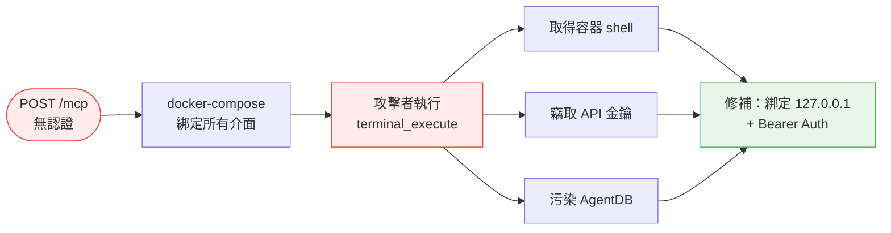
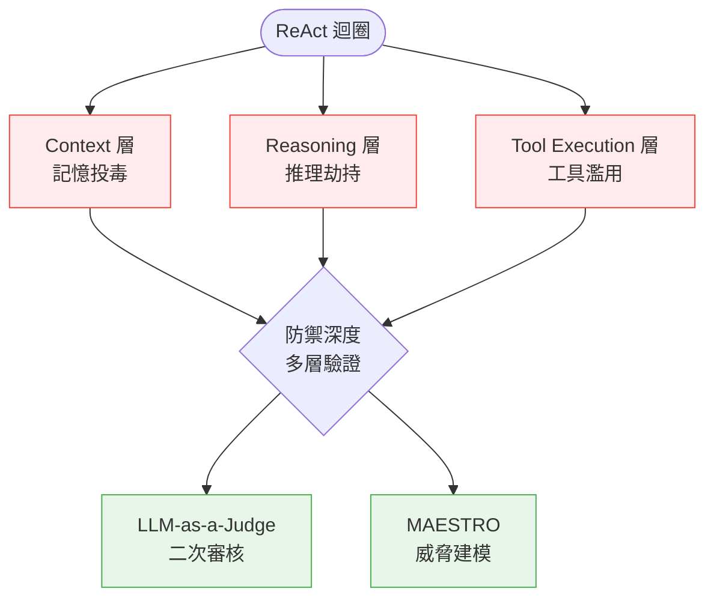

# AI Daily Digest — 2026-07-02

<!-- pipeline-generated:begin -->

## 🔥 今日 TOP 3
### 1. Sonnet 5發布：Tokenizer藏成本陷阱
Anthropic 發布 Claude Sonnet 5，效能逼近 Opus 4.8，同時導入新 tokenizer、支援 100 萬 token 上下文與 128k 最大輸出，並預設啟用 adaptive thinking，temperature 等取樣參數不再支援。

官方定價與 Sonnet 4.6 相同，但新 tokenizer 讓同樣文字實際多耗約 30% token（英文 +42%、西班牙文 +33%、Python +28%，中文幾乎不變），等於變相抵消降價優惠，對高流量英文應用影響尤其顯著。

8 月底前的折扣價 $2/$10 只是暫時性優惠，讀者應以 Simon Willison 的 Token Counter 工具，用實際文件重新估算 token 用量，再決定是否切換模型或調整 prompt 策略。

📖 [閱讀完整 insight](../10-insights/2026-06-30/inbox_321e6ea8.md) · 🔗 [原文連結](https://simonwillison.net/2026/Jun/30/claude-sonnet-5/#atom-everything)
### 2. ruflo修復MCP無認證RCE高危漏洞
ruflo v3.16.3 修補了 CVSS 9.8 的重大漏洞：MCP bridge 的 POST /mcp 端點先前無需認證，加上 docker-compose 預設綁定所有網路介面，形同對外開放。

攻擊者可藉此執行 terminal_execute 取得容器 shell、竊取 OpenAI/Google/OpenRouter/Anthropic 等所有 API 金鑰，甚至生成惡意 agent swarm、污染 AgentDB 學習資料，影響所有部署此 MCP bridge 的團隊。

修補後預設綁定 127.0.0.1 並加入 Bearer 認證，但無法回溯已外洩的金鑰或已遭污染的資料，運營者應立即防火牆隔離、輪換所有 API 金鑰，並徹底審計與清理 AgentDB。

📖 [閱讀完整 insight](../10-insights/2026-07-01/inbox_afd20f09.md) · 🔗 [原文連結](https://github.com/ruvnet/ruflo/releases/tag/v3.16.3)
### 3. AI Agent三層資安脆弱點浮現
InfoQ 講者 Sriram Madapusi Vasudevan 指出，自主 AI agent 的 ReAct 迴圈存在三層脆弱點：context 層的記憶投毒、reasoning 層的推理劫持、tool execution 層的工具濫用。

隨著 agent 被賦予更多自主權與工具存取權限，這三層弱點正成為攻擊者鎖定的主要攻擊面，尤其記憶投毒可長期潛伏、影響後續所有決策，風險比傳統 prompt injection 更難察覺。

業界正收斂到防禦深度、LLM-as-a-Judge 二次審核與 MAESTRO 威脅建模三種模式，開發或審核 agent 系統時可直接參考這套框架設計防護層，而非等到被攻破才補救。

📖 [閱讀完整 insight](../10-insights/2026-06-30/inbox_c12dd3e6.md) · 🔗 [原文連結](https://www.infoq.com/presentations/ai-development/?utm_campaign=infoq_content&utm_source=infoq&utm_medium=feed&utm_term=global)

## 📖 好文章 / 影片精選

_過去 30 天經 traffic 沉澱的高品質內容，按興趣領域分類。每篇只在 column 出現一次。_
### 🛠 工具版本追蹤 / Release
- **claude-code** · **[v2.1.198](../10-insights/2026-07-01/inbox_f141c225.md)**
  Claude Code v2.1.198 帶來多項重要功能與修復。Chrome 支持正式上線，Background agents 現可在工作完成時自動 commit、push 並開啟 draft PR，無需停止等待確認。新增 /dataviz 技能提供圖表與儀表板設計指導。Gateway 側添加 Claude Platform on AWS 作為上游提供者，
- **ruflo** · **[v3.16.3 — Security release (GHSA-c4hm-4h84-2cf3, ADR-166 MCP bridge RCE)](../10-insights/2026-07-01/inbox_afd20f09.md)**
  ruflo v3.16.3 是重大安全發布，修復 CVSS 9.8 critical 漏洞（GHSA-c4hm-4h84-2cf3、ADR-166）。MCP bridge 先前暴露 POST /mcp 端點無認證，配合預設綁定所有介面的 docker-compose，攻擊者可執行 terminal_execute 獲取容器 shell、竊取所有 API 密鑰
  _+ 3 個近期版本（v3.16.2 → v3.16.0，僅顯示最新）_
- **claude-mem** · **[v13.9.2](../10-insights/2026-07-01/inbox_f5d6a95a.md)**
  claude-mem v13.9.2 修正 OpenAICompatibleProvider 中的客户端上下文截断漏洞。该 bug 對對話历史施加硬編碼的 20 條訊息和 100k 令牌上限，但實際在約 12k 令牌時就誤觸發，導致悄無聲息地破壞會話歷史，卻被誤標為「成本控制」。本次更新完全移除了客户端截断邏輯（truncateHistory()、相關常數定
  _+ 2 個近期版本（v13.9.1 → v13.9.0，僅顯示最新）_
- **superpowers** · **[v6.1.0](../10-insights/2026-06-30/inbox_4b6424fd.md)**
  superpowers v6.1.0 聚焦單次會話令牌成本最佳化。using-superpowers bootstrap 注入每個會話，固定成本極高，本版本壓縮 bootstrap 本體和工具對應表，移除 graphviz 技能流圖改為純文本敘述、折疊獨立指令優先級章節、刪除平台特定的「技能訪問」逐步指南，保留紅旗識別表與優先級規則不變。Codex 側修復：
### 📚 AI 知識管理
- **infoq-ai-ml** · **[Presentation: Graph RAG: Building Smarter Retrieval Workflows with Knowledge Graphs](../10-insights/2026-07-01/inbox_8044336b.md)**
  InfoQ演講介紹GraphRAG架構演進。演講者Cassie Shum說明傳統向量RAG在全局上下文、多跳推理和溯源上的不足，對比知識圖語義結構化方案如何將編排邏輯推向資料層。這是從純向量檢索邁向企業語義架構的重要演進模式。
- **medium-towards-data-science** · **[Context Engineering for RAG : The Four Typed Inputs Behind Every RAG Answer](../10-insights/2026-06-30/inbox_9ba19f6d.md)**
  Context Engineering 是 RAG 系統的新興框架，於 2025 年由 Tobi Lütke 和 Andrej Karpathy 正式命名。該框架將 RAG 輸入組織為四種類型的上下文，每個文檔的各類型輸入獨立生成，最終聚合到單一 LLM 呼叫以提升效率與精確度。此框架提供系統化思考方式，後續工作涵蓋語料庫層級、對話延續與工具整合。
- **infoq-main** · **[Elastic Open-Sources Atlas Agent Memory Based on Cognitive Science](../10-insights/2026-06-30/inbox_d414fd4c.md)**
  Elastic 開源了 Atlas，一個基於 Elasticsearch 的代理記憶系統，由認知科學啟發設計。Atlas 維護三層記憶架構（短期、中期、長期），透過 MCP（Model Context Protocol）與代理整合，並實現逐用戶隔離的多租戶安全。在標準問答任務評估中達到 0.89 Recall@10，為長期代理對話提供實用級的記憶檢索精度。
### 🏢 企業導入 AI / 團隊實踐
- **substack-eng-leadership** · **[How Anthropic Builds AI-Native Engineering Teams](../10-insights/2026-07-01/inbox_2a3bb01b.md)**
  作者與 Anthropic 平台工程負責人 Katelyn Lesse 進行訪談，探討 Anthropic 如何建構 AI-native 工程團隊。AI-native 指從架構到工作流程全方位考慮 AI 的工程實踐。文章分享了 Anthropic 內部構建此類團隊的最佳實踐案例。此洞察對想要轉向 AI-native 開發的團隊和組織具有重要參考價值。Anth
- **medium-tag-claude** · **[Claude on AWS vs Bedrock vs Direct in 2026: The Real Bill](../10-insights/2026-06-29/inbox_cabf958b.md)**
  Anthropic 透過三種渠道銷售相同的 Claude 模型：直接、AWS Platform（5 月 11 日上市）和 Amazon Bedrock。雖然所有三者使用相同的模型權重，但文章強調「單位令牌成本」是三者差異中最無趣的部分，真正區別在於數據駐留位置、功能可用性、發票流程和計費關係。AWS Platform 優勢在於無需額外認證、合約或計費關係，簡
### 🎓 AI 使用技巧 / 心法
- **simon-willison** · **[Have your agent record video demos of its work with shot-scraper video](../10-insights/2026-06-30/inbox_55e0db82.md)**
  shot-scraper 1.10 推出 `shot-scraper video` 命令，可透過 YAML storyboard 檔案使用 Playwright 自動錄製 web 應用演示影片。該工具解決了 Playwright 1.61.0 之前影片品質問題（如白框和寬度固定），整個功能設計與程式碼由 GPT-5.5 xhigh 在 Codex Deskt
- **medium-tag-claude** · **[Claude Code Plugins: The Complete Guide to Extending Your AI Dev Environment](../10-insights/2026-06-29/inbox_7da921fe.md)**
  Claude Code 外掛是可安裝的 `.plugin` ZIP 檔案，整合三大核心元件：MCP servers（與外部系統的連接器）、skills（Markdown 指令文件）和 hooks（自動化 shell 腳本）。一次安裝後在所有會話中自動持續。MCP servers 使 Claude 能以原生工具形式與資料庫、API 和檔案系統互動。Skills
- **medium-towards-data-science** · **[Stop Choosing Between Local and Cloud LLMs: A Field Guide to Hybrid Patterns](../10-insights/2026-06-30/inbox_0de36629.md)**
  Towards Data Science 發布混合本地-雲端 LLM 工作流教學，展示如何同時使用本地模型 Gemma 4 和雲端 API GPT-5.4，各取所長。混合策略結合開源的成本效益與商業模型的能力優勢。教學涵蓋推理任務和結構化輸出兩大應用場景，每個場景都提供實踐代碼示例。適合尋求在成本和性能之間找到平衡點的開發者，完全避免本地與雲端二選一的困境。
- **medium-tag-llm** · **[Stop Using Your Smartest AI Model for Everything:](../10-insights/2026-07-01/inbox_72aff3c8.md)**
  Medium 文章提出實踐建議：不應對所有任務都使用最強大的 AI 模型，而應根據任務複雜度和成本需求靈活選擇合適的模型。教導讀者如何制定實踐工作流，在保證任務品質的前提下大幅降低 token 消耗。優化後的工作流不僅減少成本，還能加快軟體開發週期。文章提供分級選型的方法論，幫助工程團隊在精度和成本間找到最優平衡點。適合關注 LLM 成本優化的團隊和獨立開發
### 🔐 AI 安全 / 濫用
- **infoq-main** · **[Presentation: Trustworthy Productivity: Securing AI-Accelerated Development](../10-insights/2026-06-30/inbox_c12dd3e6.md)**
  講者 Sriram Madapusi Vasudevan 揭示自主 AI 代理在生產環境中的安全隱患。ReAct 迴圈的三層關鍵脆弱性（context 層的記憶投毒、reasoning 層的推理劫持、tool execution 層的工具濫用）成為主要攻擊面。演講介紹防禦深度（defense-in-depth）、LLM-as-a-Judge 評判器和 MAE
- **medium-tag-llm** · **[Deconstructing the “Genuine Ambiguity” Vulnerability: How I Bypassed Claude’s Safety Guardrails...](../10-insights/2026-07-01/inbox_817905d0.md)**
  文章分析了 Claude LLM 中一個稱為「真正歧義性」(Genuine Ambiguity) 的安全漏洞。作者展示了如何利用該漏洞繞過 Claude 的安全保護機制。預告詞暗示文章將探討為什麼網絡安全業在 LLM 防護方面持續面臨挑戰。原文內容預告缺乏技術細節和漏洞複現步驟，但標題表明這是一個具體、經過驗證的攻擊向量。該漏洞對 Claude 用戶及依賴其
### 🛤️ AI Flow 導入心得 / 技術分享
- **substack-lennys-newsletter** · **[Sonnet 5 review: I ran 64 generations to find out if it&#39;s worth it](../10-insights/2026-06-30/inbox_eb8f1989.md)**
  作者使用 Claude Code 構建了 How I AI Bench 評測框架，對 5 個前沿模型進行 64 次盲評測試。測試涵蓋三個維度：原型生成、產品規格文件（PRD）和 agent voice 測試。此評測提供了當前 AI 模型性能的全面量化比較，涵蓋 Claude Sonnet 5 與其他領先模型。測試結果出人意料，為 AI 模型選擇決策提供了科學
- **medium-tag-claude** · **[Claude Fable 5 Is Back: I Just Built My First Simple App (It Was Surprisingly Expensive)](../10-insights/2026-07-01/inbox_83a5acb3.md)**
  Anthropic 已完全恢復 Claude Fable 5 模型的可用性。作者在該模型恢復後立即使用它開發了一個簡單應用，但在短時間內消耗了數千個 token，成本遠超預期。標題直言該經驗「令人意外地昂貴」，暗示 Fable 5 的 token 定價或效率與作者預期存在較大差距。該報告對關注成本控制和 token 預算規劃的 Claude 用戶具有參考價值

## 💡 今日 Takeaway

_讀完今日所有內容後，可帶走的知識點_
### 1. Tokenizer 改版可能推升實際成本
模型定價不變，不代表使用成本不變——新 tokenizer 可能讓同樣文字多耗 20-40% token。規劃預算時應以「token inflation factor」實測校正，而非只看官方報價。

_類型：data-point_

**參考來源**：
- [What&#39;s new in Claude Sonnet 5](../10-insights/2026-06-30/inbox_321e6ea8.md) · [原文](https://simonwillison.net/2026/Jun/30/claude-sonnet-5/#atom-everything)
### 2. Agent工具預設值決定資安邊界
MCP/agent 工具若預設對外開放且無認證，等同把 RCE 風險內建進系統。secure-by-default（預設綁定 localhost、危險操作需顯式 opt-in）應是所有 agent 基礎設施的最低標準，而非事後修補項目。

_類型：framework_

**參考來源**：
- [v3.16.3 — Security release (GHSA-c4hm-4h84-2cf3, ADR-166 MCP bridge RCE)](../10-insights/2026-07-01/inbox_afd20f09.md) · [原文](https://github.com/ruvnet/ruflo/releases/tag/v3.16.3)
### 3. ReAct迴圈的三層攻擊面模型
自主 agent 的風險可拆成 context（記憶投毒）、reasoning（推理劫持）、tool execution（工具濫用）三層，逐層檢視比單點防護更有效。搭配防禦深度、LLM-as-a-Judge 二次審核與 MAESTRO 威脅建模，是目前業界收斂的評估起點。

_類型：framework_

**參考來源**：
- [Presentation: Trustworthy Productivity: Securing AI-Accelerated Development](../10-insights/2026-06-30/inbox_c12dd3e6.md) · [原文](https://www.infoq.com/presentations/ai-development/?utm_campaign=infoq_content&utm_source=infoq&utm_medium=feed&utm_term=global)
### 4. 集中狀態層可解事件驅動一致性難題
純事件驅動架構在大規模下常在狀態同步、去重、消費者級聯故障上出問題；導入 Redis 等集中式緩存層做狀態管理與冪等去重，能在不放棄事件驅動優點下修補這些破口，此模式可遷移到任何以 Kafka 為主的實時系統。

_類型：pattern_

**參考來源**：
- [Article: Scaling Java-Based Real-Time Systems: The Hidden Tradeoffs of Event-Driven Design](../10-insights/2026-06-30/inbox_682312e9.md) · [原文](https://www.infoq.com/articles/tradeoffs-event-driven-design/?utm_campaign=infoq_content&utm_source=infoq&utm_medium=feed&utm_term=global)
### 5. 多跳推理場景該用GraphRAG而非純向量
向量 RAG 在全局上下文、多跳推理與答案溯源上有結構性瓶頸；把編排邏輯下沉到知識圖譜等語意結構化的資料層，能讓檢索工作流本身就具備推理能力，是企業級 RAG 系統升級的重要方向。

_類型：framework_

**參考來源**：
- [Presentation: Graph RAG: Building Smarter Retrieval Workflows with Knowledge Graphs](../10-insights/2026-07-01/inbox_8044336b.md) · [原文](https://www.infoq.com/presentations/graph-rag-llm/?utm_campaign=infoq_content&utm_source=infoq&utm_medium=feed&utm_term=AI%2C+ML+%26+Data+Engineering)

<!-- pipeline-generated:end -->

<!-- user-notes -->
<!-- Write your own notes below; pipeline never touches this section. -->