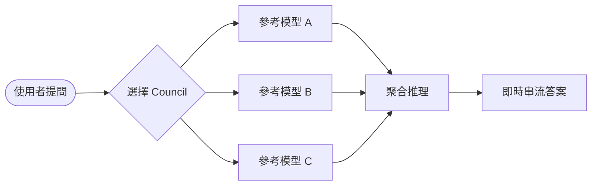
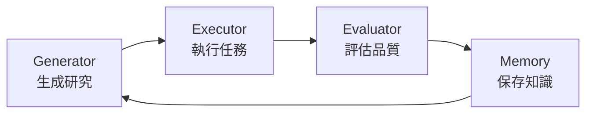

# AI Daily Digest — 2026-07-03

<!-- pipeline-generated:begin -->

## 🔥 今日 TOP 3
### 1. Hermes Agent 清零全部 P0/P1
Hermes Agent 發布 v0.18.0，12 天內清空 696 個最高優先項目（3 個 P0、493 個 P1 issues），達成零開放 P0/P1 里程碑；Mixture-of-Agents 也升級為一級模型，推理過程即時可見。

這代表 agent 系統已具備接近工程團隊的自我維運能力，新增 completion contracts 讓任務完成度由實際檢查驗證，而非模型自陳，大幅提升自主執行可信度。

可觀察此驗收機制能否成為業界標準，並參考其背景並行設計，思考自身 agent 流程能否異步化。

📖 [閱讀完整 insight](../10-insights/2026-07-01/inbox_f2e45596.md) · 🔗 [原文連結](https://github.com/NousResearch/hermes-agent/releases/tag/v2026.7.1)
### 2. Apple 首次外部機房佈建私有雲運算
Apple 首次在 Google Cloud 外部資料中心運行 Private Cloud Compute；硬體採用 NVIDIA Blackwell GPU、Intel TDX 與 Google Titan 晶片，AWS、Azure 並未參與。

此舉顯示 Apple 為擴充 AI 算力跨出自有基礎設施，並以獨立唯讀硬體帳冊與雙供應商證明根維持可稽核性，守住隱私與安全承諾，是雲端信任模型的一次實測。

可觀察此模式是否延伸到 AWS 或 Azure，雙證明根稽核機制能否成為多雲 AI 基礎設施的安全範本。

📖 [閱讀完整 insight](../10-insights/2026-07-02/inbox_29f9c883.md) · 🔗 [原文連結](https://www.infoq.com/news/2026/07/apple-pcc-google-cloud/?utm_campaign=infoq_content&utm_source=infoq&utm_medium=feed&utm_term=global)
### 3. Karpathy 推出本地 LLM 自動研究系統
Andrej Karpathy 分享 Autoresearch 系統可在本地 LLM 運行，由 generator（生成）、executor（執行）、evaluator（評估）、memory（記憶）四模塊組成，供研究者在個人機器快速構建與測試。

此架構把原本依賴雲端 API 的研究迭代流程搬回本地，降低成本與延遲，也讓開發者更容易調整每個環節行為，對想自建 agent 實驗環境的工程師是可直接複用的範例。

可關注此拆分能否成為開源標準模板，實務上可先用小規模任務驗證 evaluator 判準，再擴大應用。

📖 [閱讀完整 insight](../10-insights/2026-07-02/inbox_2e36f06d.md) · 🔗 [原文連結](https://generativeai.pub/karpathys-autoresearch-for-a-local-llm-d5b47e838970?source=rss------large_language_models-5)

## 📖 好文章 / 影片精選

_過去 30 天經 traffic 沉澱的高品質內容，按興趣領域分類。每篇只在 column 出現一次。_
### 🛠 工具版本追蹤 / Release
- **superpowers** · **[v6.1.1](../10-insights/2026-07-02/inbox_8f330dc8.md)**
  superpowers v6.1.1 發佈修復 Codex SessionStart hook 重新註冊問題。v6.1.0 移除 Codex hook config 後，manifest 缺少 hooks 欄位導致系統自動尋找 hooks/hooks.json（Claude Code SessionStart hook），最終重複註冊；新版本明確聲明 hoo
- **hermes-agent** · **[Hermes Agent v0.18.0 (2026.7.1) — The Judgment Release](../10-insights/2026-07-01/inbox_f2e45596.md)**
  Hermes Agent v0.18.0「The Judgment Release」發佈，在 12 天內解決 696 個最高優先級項目（3 P0 issues、493 P1 issues、8 P0 PRs、188 P1 PRs），達成並保持零開放 P0/P1 的里程碑。Mixture-of-Agents 升級為一級模型，可直接從選擇器中選擇命名集合（如「my
### 📚 AI 知識管理
- **infoq-main** · **[Presentation: Graph RAG: Building Smarter Retrieval Workflows with Knowledge Graphs](../10-insights/2026-07-01/inbox_a1adb8b8.md)**
  Cassie Shum 討論 GraphRAG 架構演進，強調資料基礎對先進 AI 工作流的關鍵作用。傳統向量 RAG 在處理全局上下文、多步推理、溯源等方面存在局限。企業應構建語意結構化的知識圖譜，將編排邏輯下沉到資料層，以支持更智能的檢索工作流。GraphRAG 代表著從向量中心到圖譜中心的架構轉變。
- **infoq-ai-ml** · **[Pinecone Brings AI Agents Directly to Enterprise Data with Microsoft OneLake Integration](../10-insights/2026-06-12/inbox_d99f3ae6.md)**
  Pinecone 宣佈其 Nexus 知識引擎與 Microsoft OneLake 的集成，使企業 AI agents 能直接訪問和推理企業數據。這一集成消除了傳統的數據提取、轉換、加載（ETL）步驟，使 AI agents 原生連接企業數據湖，簡化了企業級 AI 系統的數據管道。該集成加速了企業將 AI 功能部署到關鍵業務流程的時間，降低了企業 AI 採
### 🏢 企業導入 AI / 團隊實踐
- **infoq-ai-ml** · **[Terraform MCP Server Enables AI Assistants to Interact with Terraform Infrastructure](../10-insights/2026-06-13/inbox_59e72150.md)**
  HashiCorp 正式推出開源 Terraform MCP Server，讓 AI agent 可整合 Terraform Registry API，用於自動化基礎設施任務。此舉旨在減輕基礎設施工程師的重複工作，提升團隊生產力。MCP（Model Context Protocol）作為 agent 與外部系統互動的標準協議，這是 Terraform 官方首
- **infoq-architecture** · **[Cloudflare Ships Agent Skills for Zero Trust Deployment and Migration](../10-insights/2026-06-25/inbox_dbfd30c8.md)**
  Cloudflare 發布開源的 Cloudflare One Stack，一套面向 Zero Trust 環境規劃、部署與管理的代理技能庫。該技能庫包含針對 Zscaler 和 Palo Alto Networks 的自動化遷移邏輯，與 Cloudflare 的 Descaler 計畫採用相同邏輯，該計畫已將企業客戶的遷移時間從數月縮短至數小時。開源化這些
### 🎓 AI 使用技巧 / 心法
- **simon-willison** · **[Understand to participate](../10-insights/2026-07-02/inbox_b24fb3be.md)**
  Geoffrey Litt 在 AIE 2026 會議提出「Understand to Participate」框架，強調與 AI 編碼代理協作的核心要求：開發者必須維持對代碼的足夠深度理解，才能有效與代理進行創意互動。理解不足導致的被動執行會累積認知技術債，最終限制開發者的參與能力與創新空間。開發者需掌握豐富的概念模型以思考創意方向移動，否則淪為自動化執行
- **medium-tag-claude** · **[The Real Price of a Slide Deck: What LLM Pay-As-You-Go Actually Costs](../10-insights/2026-07-02/inbox_74df49c5.md)**
  本文深入分析 LLM 按量付費（Pay-As-You-Go）模式的實際成本。文章以製作投影片這一日常 AI 應用為例，詳細展示隱藏在 $20 月訂背後的 token 成本計算。作者強調在即將到來的按量計費時代，使用者必須理解 token 成本的數學原理，以便準確預估真實支出。文章的核心洞察是：訂閱制下的固定成本掩蓋了實際的邊際成本，轉換到 metered p
- **medium-tag-claude** · **[Learn Claude Code: /autofix-pr](../10-insights/2026-06-11/inbox_863bcff5.md)**
  Claude Code 推出 /autofix-pr 功能，允許開發者將 PR 交由 Claude Code 的 web session 自動監視、審查和修復。該功能持續監控 CI 構建結果並執行代碼審查，在開發者離線時自動推送修復提交。這個工具將 PR 審查從同步阻塞轉變為異步自動化，適合分佈式團隊和持續交付工作流，加速 feedback loop 和代碼
### 💳 支付 / Fintech
- **medium-tag-llm** · **[Harness Engineering: How to Train Your AI Dragon](../10-insights/2026-07-02/inbox_3ee7363e.md)**
  文章提出 AI 工程的三層遞進模型，逐步深化對 AI 系統的控制與優化。第一層 Prompt Engineering 教導 AI『什麼』任務要做，第二層 Context Engineering 提供『地圖』讓 AI 理解背景，第三層 Harness Engineering 則教導 AI『如何』自我約束與驗證。該框架暗示傳統 prompt 優化不足，需要更高階
### 📒 帳務架構 / Ledger
- **infoq-main** · **[Apple Extends Private Cloud Compute to Google Cloud for the First Time](../10-insights/2026-07-02/inbox_29f9c883.md)**
  Apple 首次在 Google Cloud 外部數據中心運行私有雲計算（Private Cloud Compute），支持其 AI 功能。基礎設施採用 NVIDIA Blackwell GPU、Intel TDX（可信執行環境）和 Google Titan 芯片。Apple 維護獨立的附加唯讀硬體帳冊（hardware ledger）和雙供應商證明根確保安
### 🔐 AI 安全 / 濫用
- **infoq-ai-ml** · **[Presentation: Trustworthy Productivity: Securing AI-Accelerated Development](../10-insights/2026-06-30/inbox_da0cc58b.md)**
  InfoQ演講探討自主AI agent生產環保的安全威脅與防禦策略。演講者Sriram Madapusi Vasudevan剖析ReAct迴圈內的三大脆弱點（上下文、推理、工具執行），分享記憶中毒、惡意工具執行等實際威脅，並提出防禦架構包括縱深防禦、LLM-as-judge評審機制、MAESTRO威脅模型框架。該分析為AI agent安全提供產業匯聚的可行威
### 🛤️ AI Flow 導入心得 / 技術分享
- **medium-tag-llm** · **[Reinforcement Learning for Large Reasoning Models: A Complete Technical Deep-Dive](../10-insights/2026-06-02/inbox_9bb5ced1.md)**
  調查報告總結強化學習用於大型推理模型的技術進展，標誌著 AI 後訓練從「對齊為主的 RLHF」向「推理優先」系統 (DeepSeek-R1、o1 系列) 轉移。核心方法論：(1) MDP 框架化 LLM、(2) 四類獎勵系統 (verifiable/generative/dense/unsupervised)、(3) 20+ 政策最佳化演算法 (含 GRPO
- **medium-tag-llm** · **[Long-Term Agentic Memory With LangGraph: Building AI Agents That Remember](../10-insights/2026-06-02/inbox_3ed1a0d2.md)**
  LangGraph 透過三層記憶系統 (短期 context、長期偏好與歷史、檢索層) 實現 agent 跨會話持久化記憶。架構設計將圖節點對應推理步驟、工具執行、記憶操作、決策流程。執行流：用戶請求 → agent 查詢記憶庫 → 檢索相關資訊注入推理 → 執行動作 → 關鍵結果存回記憶。區分語義 (事實)、情節 (經驗)、程序性 (學習過程) 三類記憶，
- **medium-tag-llm** · **[Agents Will Read the Web. Humans Will Watch It.](../10-insights/2026-06-02/inbox_7f61e8b1.md)**
  網頁未死，而是分裂成兩個世界。AI 代理將專注於資訊檢索（摘要、比較、監控價格），人類則轉向體驗式內容（遊戲、直播、社交互動）。Pew Research 數據顯示，當搜尋引擎顯示 AI 摘要時，使用者點擊原始結果的比率從 15% 降至 8%，證明流量已遭重新導向。具名作者的內容、個性化文章、真實人類參與的社群將存活；泛用文字內容則面臨被 AI 摘要取代的風險
- **medium-tag-claude** · **[7 Claude AI Prompts Every Digital Marketer Should Steal Right Now](../10-insights/2026-06-03/inbox_d862a192.md)**
  作者提供 7 個實戰 Claude 提示樣板供數位行銷人員套用：(1) 品牌聲調提取器——分析文稿建立一致的品牌語調指南；(2) 策略壓力測試——讓 Claude 扮演懷疑的首席行銷官，挑出假設與風險；(3) 受眾心理檔案——生成心理側寫含挫折點、隱性慾望、信任因子；(4) 競爭對手缺口探測——發現未被佔領的市場位置；(5) 創意角度生成——對飽和主題產生 
- **medium-tag-claude** · **[Observing Claude Code: How I Built a Local Telemetry Stack to Track Costs, Tokens, and Sessions in...](../10-insights/2026-06-02/inbox_5207e31c.md)**
  Medium文章介绍作者为Claude Code构建的本地遥测栈。Claude Code用户关闭长session时往往对消费成本缺乏清晰认知。该遥测栈通过本地部署追踪成本、Token使用量与session数据，建立对Claude Code实际消费的可见性。这对需要精确成本控制的团队或关注AI工具经济性的个人开发者有实际价值。解决了「用了很多但不知道花了多少」

## 💡 今日 Takeaway

_讀完今日所有內容後，可帶走的知識點_
### 1. 完成契約取代主觀判斷驗收任務
傳統上 agent 是否『做完』常憑模型自陳，容易高估進度。用可執行的檢查（如跑測試、驗證輸出）作為完成契約，才能確保任務真正達標。此模式可套用在任何需要驗收 AI 產出的流程，例如 code review 或報告生成。

_類型：framework_

**參考來源**：
- [Hermes Agent v0.18.0 (2026.7.1) — The Judgment Release](../10-insights/2026-07-01/inbox_f2e45596.md) · [原文](https://github.com/NousResearch/hermes-agent/releases/tag/v2026.7.1)
### 2. 先理解程式碼才能與 AI 代理創意協作
若開發者對代碼缺乏足夠理解，只能被動接受 agent 產出，長期會累積『認知技術債』並喪失參與創新的能力。要維持與 coding agent 的有效協作，必須主動維護豐富的概念模型，而非把理解外包給代理。

_類型：framework_

**參考來源**：
- [Understand to participate](../10-insights/2026-07-02/inbox_b24fb3be.md) · [原文](https://simonwillison.net/2026/Jul/2/understand-to-participate/#atom-everything)
### 3. Schema 列欄位名避免 agent 亂猜迴圈
只提供表名而缺乏欄位清單時，AI 容易對欄位名稱（如 page_count）進行猜測並陷入錯誤重試迴圈。任何要求 agent 執行結構化查詢的系統提示，都應完整列出可用欄位，以降低幻覺與重試成本。

_類型：technique_

**參考來源**：
- [Using DSPy to evaluate and improve Datasette Agent&#39;s SQL system prompts](../10-insights/2026-07-02/inbox_550a746e.md) · [原文](https://simonwillison.net/2026/Jul/2/dspy-datasette-agent-prompts/#atom-everything)
### 4. Sidecar 優先序負載脫落保護核心
在 sidecar（如 Envoy）層依流量優先級動態脫落非關鍵請求，能讓使用者發起的關鍵流量在尖峰時搶奪後台任務的容量。這是應對突發流量、避免核心服務被非關鍵批次任務拖垮的通用架構技巧。

_類型：technique_

**參考來源**：
- [Presentation: Enhancing Reliability Using Service-Level Prioritized Load Shedding at Netflix](../10-insights/2026-07-02/inbox_23630049.md) · [原文](https://www.infoq.com/presentations/service-level-prioritized-load-shedding/?utm_campaign=infoq_content&utm_source=infoq&utm_medium=feed&utm_term=global)
### 5. 訂閱制掩蓋邊際成本，按量計費要算 token 數學
固定月費會隱藏單次任務的真實 token 開銷，一旦轉向按量計費，日常任務（如做投影片）的實際成本可能遠超直覺。提前用 token 成本模型估算重度使用情境的預算，才能避免未來帳單震驚。

_類型：data-point_

**參考來源**：
- [The Real Price of a Slide Deck: What LLM Pay-As-You-Go Actually Costs](../10-insights/2026-07-02/inbox_74df49c5.md) · [原文](https://medium.com/@frederic.auguste/the-real-price-of-a-slide-deck-what-llm-pay-as-you-go-actually-costs-9dcd69dc3407?source=rss------claude-5)

<!-- pipeline-generated:end -->

<!-- user-notes -->
<!-- Write your own notes below; pipeline never touches this section. -->