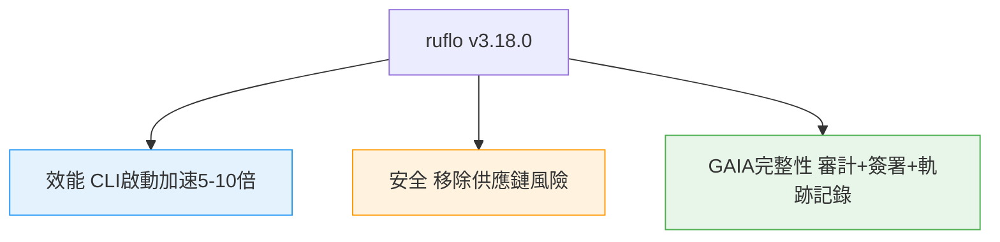
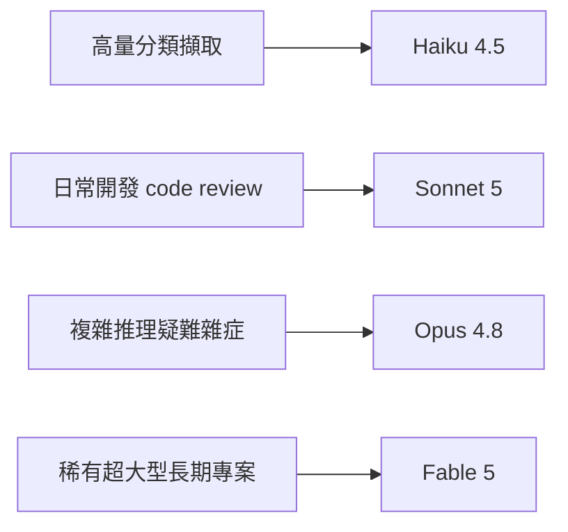

# AI Daily Digest — 2026-07-04

<!-- pipeline-generated:begin -->

## 🔥 今日 TOP 3
### 1. ruflo v3.18.0 效能安全完整性升級
ruflo 發布 v3.18.0，經四輪專家審視完成三項升級：CLI 啟動加速 5–10 倍、移除第三方套件依賴使漏洞歸零、並新增 GAIA 完整性框架（執行前審計、簽署證明、軌跡記錄）。

GAIA 讓 agent 執行結果首度可驗證、可稽核，供應鏈與啟動效能改善則直接降低企業導入風險，是 agent runtime 走向生產治理的關鍵一步。

後續觀察 ADR-167/168/169 是否成為業界標準；已用 ruflo 的團隊可先檢查簽署證明流程是否相容既有 CI。

📖 [閱讀完整 insight](../10-insights/2026-07-03/inbox_793a827e.md) · 🔗 [原文連結](https://github.com/ruvnet/ruflo/releases/tag/v3.18.0)
### 2. OpenAI 推出 Agent RFT 微調平台
OpenAI 推出 Agent RFT 平台，讓推理模型能透過即時工具互動與自訂獎勵信號進行強化學習微調，在 context window 內解決複雜的信用分配問題。

此法能消除長尾 token 迴圈，讓推理效率大幅提升，多家企業案例已驗證其成效；相較傳統微調僅調整輸出風格，Agent RFT 直接優化工具使用決策的品質。

值得追蹤該平台何時開放更多開發者使用、定價策略，以及其他 lab（如 Anthropic、Google）是否推出對應的 agentic RL 微調服務。

📖 [閱讀完整 insight](../10-insights/2026-07-03/inbox_41a955b7.md) · 🔗 [原文連結](https://www.infoq.com/presentations/rft-openai-model/?utm_campaign=infoq_content&utm_source=infoq&utm_medium=feed&utm_term=global)
### 3. Claude 一問揪出25年睡眠呼吸中止症
印度一名 62 歲長期洗腎患者受頭痛困擾 25 年、遍尋專科未果，家屬將病史輸入 Claude，模型追問「他打鼾嗎？」意外揪出被忽視 25 年的重度睡眠呼吸中止症。

睡眠研究證實診斷：每晚 119 次呼吸暫停、血氧降至 78%，CPAP 治療後頭痛完全消失；顯示 AI 對話式追問能補足傳統問診遺漏的關鍵交叉症狀，對高風險共病族群尤其重要。

此個案已由印度多家主流媒體報導，值得觀察是否推動醫療體系將 AI 問診輔助納入常規流程，讀者也可留意：AI 對話有時比專科問診更擅長串連被忽略的細節。

📖 [閱讀完整 insight](../10-insights/2026-07-03/inbox_ac1b3102.md) · 🔗 [原文連結](https://medium.com/@jamilxt/25-years-of-headaches-zero-doctors-found-the-cause-one-ai-conversation-did-0803f1b15053?source=rss------claude-5)

## 📖 好文章 / 影片精選

_過去 30 天經 traffic 沉澱的高品質內容，按興趣領域分類。每篇只在 column 出現一次。_
### 🛠 工具版本追蹤 / Release
- **ruflo** · **[v3.19.0 — neural train routes through the native TrainingPipeline (#2549 arc complete)](../10-insights/2026-07-04/inbox_fc9433cd.md)**
  ruflo v3.19.0 完成 #2549 核心改進：神經訓練現在透過 @ruvector/ruvllm 原生 TrainingPipeline 路由執行，而非僅依賴 WASM。新增 `--backend auto|native|wasm` 選項自動選路，原生路徑支援真實 epoch、損失歷史、早期停止；檢查點改進為儲存實際訓練權重（而非新建未訓練 ada
  _+ 4 個近期版本（v3.18.2 → v3.17.0，僅顯示最新）_
- **claude-code** · **[v2.1.201](../10-insights/2026-07-03/inbox_a3e447ab.md)**
  Claude Code v2.1.201 修復了 Claude Sonnet 5 會話中的系統角色處理問題。此前，在中間對話中（mid-conversation），系統角色會包含 harness reminders，可能導致提示詞污染。新版本改變了此行為，Claude Sonnet 5 會話不再在 mid-conversation system role 中
  _+ 2 個近期版本（v2.1.200 → v2.1.199，僅顯示最新）_
- **repowise** · **[v0.26.0](../10-insights/2026-07-03/inbox_ed35e1a2.md)**
  Repowise 發布 v0.26.0，主要新增 VS Code 擴展與架構可視化功能。新版本包含編輯器原生信號（診斷、風險評分、重構提示）、持續縮放的架構圖構建器、決策嵌入的批次優化，以及機器可讀界面和死代碼偵測。VS Code 擴展已支援伺服器生命週期管理、MCP 註冊、側邊欄儀表板、主題切換，並修復了高度依賴項安全漏洞。此版本為 Repowise 與 
  _+ 1 個近期版本（v0.2.0，僅顯示最新）_
- **claude-mem** · **[v13.9.3](../10-insights/2026-07-03/inbox_f2c81d66.md)**
  Claude Mem v13.9.3 發布，重點改進包括消除全部 331 個錯誤處理反模式、實施 repo 級別的過度設計清理（ponytail 審計第 1、2 波），移除死代碼與未使用的 cmem-sdk 客戶端接口。此版本專注於代碼質量優化與技術債務清償，無新功能增加。
### 📚 AI 知識管理
- **medium-towards-data-science** · **[LLM Wikis Are Over-Engineered — I Replaced Mine With a Pure Python Compiler](../10-insights/2026-07-03/inbox_471bcc3b.md)**
  指出多數 LLM Wiki 系統過度工程化，依賴 agents、embeddings 與重複模型調用。作者改用純 Python 編譯器替代——通過標準庫把無序 markdown 組織為連接、linted 的 wiki，無需任何 LLM 調用。實現中修復兩個實際 bug、跨兩個 OS 基準測試，論證編譯器方法對機械文本組織往往優於 agent 方案，成本零、確
- **medium-towards-data-science** · **[The Untaught Lessons of RAG Retrieval: Cosine Is Not the Foundation](../10-insights/2026-07-03/inbox_af7d7737.md)**
  本文挑戰 RAG（檢索增強生成）系統中關於使用餘弦距離作為檢索基礎的主流假設。作者透過「企業文檔智能」系列提出六個不同的檢索策略位置，質疑業界慣用的「cosine-first」反射。核心洞察是單純依賴餘弦相似度不足以構成高效的 RAG 檢索磚，應考慮多維度的檢索方法與架構選擇，改變對 RAG 最佳實踐的理解。
### 🏢 企業導入 AI / 團隊實踐
- **infoq-main** · **[Cloudflare Details Unified Data Platform Where Billing Workloads Account for 53% of Queries](../10-insights/2026-07-03/inbox_03017f0b.md)**
  Cloudflare 公开了内部统一数据平台 Town Lake。该平台基于 lakehouse 架构，集成了 Trino、Iceberg、R2 和 DataHub 等技术栈，支持跨多个数据域的统一查询。配套推出了 Skipper，一个 AI 分析 agent，能够通过自然语言接口统一访问 operational、billing、security 和 bus
### 🎓 AI 使用技巧 / 心法
- **simon-willison** · **[Fable&#39;s judgement](../10-insights/2026-07-03/inbox_ba672506.md)**
  Simon Willison 引述 Claude Code 團隊的關鍵建議：賦予 Fable/Opus 自主判斷權勝於規定工作方式。例如測試策略，應告知模型「僅為大功能自動化測試，小改動無需測試」，讓其自主決策，而非設立嚴格規則。進一步地，可委派小型任務給低階模型（Sonnet/Haiku），由 Fable 自主判斷模型選擇，藉此節省寶貴的 Fable to
- **medium-tag-claude** · **[Fable, Opus or Sonnet?](../10-insights/2026-07-03/inbox_05105bcb.md)**
  文章提出「一個思考，兩個構建」的多模型協調策略：Fable 5 負責規劃與架構設計（產生書面規格），Opus 4.8 和 Sonnet 5 各自處理複雜與標準編碼工作。核心論點是分離思考與執行階段能避免單一模型導致的設計漂移，提升代碼一致性與交付速度。作者強調人類判斷依舊中心，AI 只是按既定計畫執行。
- **medium-tag-claude** · **[How to Set Up Claude Design and Hand Your Prototype Straight to Claude Code](../10-insights/2026-07-03/inbox_62735020.md)**
  文章介紹如何設置 Claude Design 並將原型無縫交接給 Claude Code 進行開發。作者指出過去兩年發布的 AI 設計工具都解決了「簡單問題」（設計生成）但迴避了「難題」（設計到代碼的自動化轉換）。Claude 此舉填補了這個空白，提供從原型到可執行代碼的端到端工作流。這個集成消除了設計師和開發者之間的手工轉換環節，顯著提升開發效率。用戶無需
- **medium-tag-claude** · **[Which Claude Should You Actually Ship With? A Solo Builder’s Model Map](../10-insights/2026-07-03/inbox_6d0c8550.md)**
  為獨立開發者提出四層模型選型框架：Haiku 4.5 用於高量重複任務（分類、提取），Sonnet 5 作主要工作馬（開發、code review、文檔），Opus 4.8 處理複雜推理與大型代碼庫漏洞，Fable 5 保留稀有超大型長期項目。核心原則：complexity → model，杜絕「追新」心理。強調「中間座位」（Sonnet）的槓桿效應優於追逐
- **medium-tag-llm** · **[Karpathy’s Autoresearch, for a Local LLM](../10-insights/2026-07-02/inbox_2e36f06d.md)**
  本文介紹 Andrej Karpathy 的自動研究（Autoresearch）系統在本地 LLM 上的應用。該系統由四個核心模塊組成：生成器（generator）負責生成研究/推論、執行器（executor）執行任務、評估器（evaluator）檢驗結果品質、記憶模塊（memory）保存歷史知識。整個系統設計用於在個人機器上構建、測試和測量性能，支援研究人
### ⛓️ 區塊鏈 / Web3
- **medium-tag-llm** · **[LLMs (Part-05): After the Decoder Stack](../10-insights/2026-07-03/inbox_bb9de8f5.md)**
  這是 LLM 系列文章的第五部分，深入探討 Transformer 解碼層之後的關鍵組件。文章解釋了 un-embedding layer（反嵌入層）、SoftMax 函數和 de-tokenization 的作用與原理，幫助讀者理解從隱向量到最終 token 輸出的完整轉換過程。這些層是 LLM 將內部表示轉換為可讀文本的決定性環節。
### 📒 帳務架構 / Ledger
- **infoq-ai-ml** · **[Apple Extends Private Cloud Compute to Google Cloud for the First Time](../10-insights/2026-07-02/inbox_5231b9c1.md)**
  Apple 首次在 Google Cloud 外部數據中心運行私有雲計算（Private Cloud Compute），支持其 AI 功能。基礎設施採用 NVIDIA Blackwell GPU、Intel TDX（可信執行環境）和 Google Titan 芯片。Apple 維護獨立的附加唯讀硬體帳冊（hardware ledger）和雙供應商證明根確保安
### 🔐 AI 安全 / 濫用
- **medium-tag-llm** · **[From 1.7M Security Events to 114 Daily Incidents: Building a Hallucination-Aware AI SOC Platform](../10-insights/2026-06-28/inbox_c7e715c2.md)**
  文章展示如何用確定性事件關聯 (deterministic event correlation)、MITRE 框架驅動的 AI agents，與生產環境遙測資料，將 170 萬安全事件自動分類為 114 日常事件（淨化率 >99.9%），自動化 L1/L2 SOC 工作流。完整實現細節被截斷。
- **infoq-main** · **[Article: Virtual panel: Security in the Machine Age: Expert Insights on AI Threat Evolution](../10-insights/2026-06-29/inbox_37b3ed33.md)**
  一場由 AI 安全專家主持的虛擬論壇探討 AI 驅動威脅的演進，涵蓋 prompt injection、data poisoning、agent abuse 和 AI 驅動的社交工程等新型攻擊模式。專家們討論了這些新興威脅的事件應對挑戰，以及安全團隊在面對日益自主、深度整合到關鍵業務流程的 AI 系統時所需進行的組織調整。反映出傳統安全範疇需要擴展以應對 A
- **infoq-main** · **[Microsoft Brings AI-Powered Vulnerability Remediation to Azure DevOps with Copilot Autofix](../10-insights/2026-06-30/inbox_5308d4b1.md)**
  Microsoft 宣布在 Azure DevOps 中推出 Copilot Autofix 有限公開預覽，將 AI 驅動的漏洞修復能力從 GitHub Advanced Security 擴展至 Azure Repos 用戶。此舉統一了 Microsoft 開發平台的 AI 安全工具策略，為 Azure 生態開發者帶來自動化修復建議。
- **medium-tag-claude** · **[Why Learning Claude Is More Valuable Than Another Cybersecurity Cert (If Your Goal Is Getting...](../10-insights/2026-07-01/inbox_5c1cd6e5.md)**
  職業發展文章論證在 2026–2027 年間學習 Claude AI 比申請傳統網安認證（如 CompTIA Security+）更能提升求職競爭力。文章主張投資工作技能與實踐工具優於紙本認證體系。針對想進入資安領域的求職者與自由工作者而言，掌握 AI 工具能更快轉化為專案經驗與收入增長。該觀點反映了當前 AI 技能快速升值的現象。對資安從業者而言，這意味著
### 🛤️ AI Flow 導入心得 / 技術分享
- **simon-willison** · **[llm-coding-agent 0.1a0](../10-insights/2026-07-02/inbox_fd7c4daf.md)**
  Simon Willison 基於 Fable 5 開發了 llm-coding-agent v0.1a0，一個 Python 編碼 agent 框架。該專案使用 Claude Code 風格迭代，依賴 llm 最新 alpha 版本，實現 6 個核心工具：edit_file、execute_command、list_files、read_file、sear

## 💡 今日 Takeaway

_讀完今日所有內容後，可帶走的知識點_
### 1. 給模型自主權勝過死板規則
與其硬性規定測試策略等工作方式，不如告知模型判斷原則（如：大功能才寫自動化測試），讓其自主決策；同理，可讓高階模型自行判斷何時把小任務委派給 Sonnet、Haiku 等低階模型，兼顧品質與 token 成本。

_類型：framework_

**參考來源**：
- [Fable&#39;s judgement](../10-insights/2026-07-03/inbox_ba672506.md) · [原文](https://simonwillison.net/2026/Jul/3/judgement/#atom-everything)
### 2. 機械式文本整理用編譯器免用 Agent
當任務是確定性的機械轉換（例如把散亂 markdown 組成 wiki）時，用純程式語言標準庫寫編譯器就能達成，不必動用 agents、embeddings 或重複模型調用；編譯器方案零成本、結果可預測，效能與可靠度往往優於 agent 方案。

_類型：pattern_

**參考來源**：
- [LLM Wikis Are Over-Engineered — I Replaced Mine With a Pure Python Compiler](../10-insights/2026-07-03/inbox_471bcc3b.md) · [原文](https://towardsdatascience.com/llm-wikis-are-over-engineered-i-replaced-mine-with-a-pure-python-compiler/)
### 3. 速度不等於理解，AI 會掩蓋淺薄
用 AI 加快輸出後，一句簡單追問「為何在此情境成立？」就可能暴露自己其實沒真正理解內容；AI 帶來的真正優勢不是省時交差，而是用來深化學習，否則省下的時間只是被挪去做別的事，能力落差終究會在被挑戰時現形。

_類型：pattern_

**參考來源**：
- [You Won’t Become a Hero Using Claude](../10-insights/2026-07-03/inbox_f46d50f6.md) · [原文](https://medium.com/@stephane.cuenat/you-wont-become-a-hero-using-claude-71e09af9b275?source=rss------claude-5)
### 4. 病毒式 AI 統計數字先查實驗設計
看到「AI 有 96% 機率說謊」這類聳動數字時，要先確認原始實驗是否刻意設計出誘發特定行為的極端情境（如稀缺資源、生存威脅）；模型能力具有「鋸齒狀」特性，單一窄化測試的結論不能直接推廣到日常使用場景。

_類型：data-point_

**參考來源**：
- [Does Claude Lie 96% of the Time? What the Viral Test Misses](../10-insights/2026-07-03/inbox_65cd87f5.md) · [原文](https://medium.com/@hardik.goel214/does-claude-lie-96-of-the-time-what-the-viral-test-misses-e3c27dc97660?source=rss------claude-5)
### 5. 依任務複雜度分層選模型而非追新
把模型選擇綁定在任務複雜度而非能力排名：高量重複的分類/擷取用 Haiku 等級、日常開發與 code review 用中階主力模型、真正困難的複雜推理才動用旗艦模型，稀有的超大型長期專案才保留給最頂級模型；中間層級模型的成本效益往往比追逐性能上限更能提升日常產出。

_類型：framework_

**參考來源**：
- [Which Claude Should You Actually Ship With? A Solo Builder’s Model Map](../10-insights/2026-07-03/inbox_6d0c8550.md) · [原文](https://blog.startupstash.com/which-claude-should-you-actually-ship-with-a-solo-builders-model-map-cf4f5fe60e6b?source=rss------claude-5)

<!-- pipeline-generated:end -->

<!-- user-notes -->
<!-- Write your own notes below; pipeline never touches this section. -->