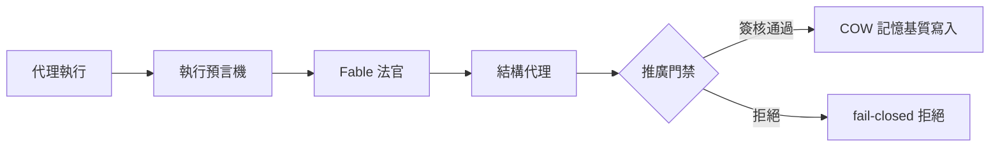

# AI Daily Digest — 2026-07-05

<!-- pipeline-generated:begin -->

## 🔥 今日 TOP 3
### 1. RuFlo 推出代理治理學習框架
RuFlo v3.21.0 發布 agenticow 治理學習循環框架，以 COW（Copy-on-Write）記憶基質搭配 9 個 MCP 動詞（分支、檢查點、回滾、推廣/攝取、查詢、差分、譜系、狀態），每分支僅 162 位元組開銷，並採原生 Rust 快速路徑與單一共用載入器。

此框架的關鍵在於三級預言機架構——執行預言機→Fable 法官→結構代理——為每個代理決策標註可追溯的 resolvedBy 來源，且推廣門禁一經代理簽核便無法清除；同時 Fable 顧問透過批量化把單項評估成本從 $1.56 壓低至約 $0.02，證明治理層可規模化落地，而非只是紙上設計。

對正在評估 agent 系統可稽核性的團隊，這套三級預言機＋fail-closed 設計，以及低成本評估批量化模式，值得作為下一代 governance 架構的參考藍本。

📖 [閱讀完整 insight](../10-insights/2026-07-04/inbox_0acce01e.md) · 🔗 [原文連結](https://github.com/ruvnet/ruflo/releases/tag/v3.21.0)
### 2. 美國政府核准制暫停 Fable 5
美國自 2026 年 7 月起對前沿 AI 模型實施政府核准制，商務部曾將 Anthropic 的 Fable 5 暫停 19 天，直到發現越獄漏洞並修補後才恢復上線；恢復後的版本已非原產品，新增專門阻擋越獄技術的安全分類器，計費規則也改為僅限每週有限使用層級的超額積分制。

此事件首度具體揭露前沿模型的供應鏈監管風險：模型可能遭政府突然暫停、重構或改變商業條款；同時也帶來實驗室集中風險，主動配合監管的實驗室可能取得企業信譽優勢；而新安全分類器又可能誤判，連帶阻擋合理的除錯與編碼查詢。

對重度依賴單一前沿模型的團隊，建議及早建立模型抽象層、保留可替換的開源備援方案，並在效能與成本規劃上預留 30–50% 緩衝；治理框架預計於 2026 年 8 月 1 日定案，後續規範細節值得持續追蹤。

📖 [閱讀完整 insight](../10-insights/2026-07-04/inbox_8a17784a.md) · 🔗 [原文連結](https://medium.com/@kankit570/why-every-ai-model-release-now-requires-government-approval-and-what-it-means-for-your-team-3dd866a5bfa4?source=rss------claude-5)
### 3. 文本崩潰與模型崩潰本質相同
一篇 2026 年的論文以 1930 年代的鞅論（martingale theory）證明「文本崩潰」與「模型崩潰」其實是同一數學現象：前者指模型生成約 4,000 tokens 後推理開始偏離、8,000 tokens 時開始重複自身；後者指模型在合成資料上訓練數代後，稀有事件與尾部分布逐漸消失。

這是首次為兩個看似獨立的 AI 劣化問題提供統一理論基礎，說明無論是單次生成過長、或是遞迴使用合成資料訓練模型，本質上都源自同一種分布退化機制，而不是各自獨立的工程瑕疵，對理解 AI 系統的內在限制有重要意義。

實務上可將 4,000／8,000 tokens 當作生成任務的品質警戒線，超過時應主動截斷或重新生成而非依賴模型自我修正；訓練合成資料時，也應監控尾部分布是否持續萎縮，作為模型崩潰的早期預警指標。

📖 [閱讀完整 insight](../10-insights/2026-07-04/inbox_6334b03f.md) · 🔗 [原文連結](https://swarnenduiitb2020i.medium.com/your-model-degrades-at-token-4-000-2b12cfaae350?source=rss------large_language_models-5)

## 📖 好文章 / 影片精選

_過去 30 天經 traffic 沉澱的高品質內容，按興趣領域分類。每篇只在 column 出現一次。_
### 🛠 工具版本追蹤 / Release
- **ruflo** · **[v3.22.0 — memory distillation loop + page-agent intent + signed hook auto-refresh](../10-insights/2026-07-04/inbox_44f9204f.md)**
  RuFlo v3.22.0 推出四大新功能，重點聚焦代理自學習與執行安全。首先，ADR-174 記憶蒸餾自學習循環將記憶項目分析轉化為集節點、推理模式及弱關係圖譜，訓練本地 SONA/MoE 模型，成本零起點且非破壞性。其次，失敗信號捕捉改進執行追蹤：hook 過往固定輸出 success:true（898/898 成功），現改讀取 Claude Code 
  _+ 3 個近期版本（v3.21.1 → v3.20.0，僅顯示最新）_
- **claude-mem** · **[v13.10.1](../10-insights/2026-07-04/inbox_95247c36.md)**
  Claude Mem v13.10.1 修復了 Codex SessionStart hook 在啟動時的失敗問題。當 hook 執行前發生錯誤（缺少 session_id、無效 cwd 或遺失 transcript path）時，原本會回退至格式不正確的 JSON 導致 Codex 嚴格驗證器拒絕；本版本改為返回有效的 hookSpecificOutput
  _+ 1 個近期版本（v13.10.0，僅顯示最新）_
### 📚 AI 知識管理
- **medium-towards-data-science** · **[Stop Returning Text from RAG: The Typed Answer Contract That Prevents Hallucination](../10-insights/2026-07-04/inbox_253e83d6.md)**
  《Stop Returning Text from RAG：Typed Answer Contract 防止幻覺》探討防止 RAG 幻覺的方法論。核心概念是以 schema 作為契約，每個字段代表向模型提出的一個問題。每個答案都可被驗證，形成可查證的承諾。此方法論屬「Enterprise Document Intelligence」系列內容。在企業文檔處理中
- **medium-tag-llm** · **[How Open Knowledge Format (OKF) Changes RAG: From Chunk Retrieval to Knowledge Retrieval](../10-insights/2026-07-04/inbox_9d64426a.md)**
  開放知識格式 (OKF) 改變了 RAG 系統從「區塊檢索」到「知識檢索」的典範。文章指出，RAG 系統大多失敗的根本原因並非檢索演算法不足，而是資料攝入 (ingestion) 階段的問題。OKF 透過改進知識表示與組織方式，得以解決傳統 chunk-based retrieval 的瓶頸，提高知識檢索的精度與語義關聯性。
### 🏢 企業導入 AI / 團隊實踐
- **medium-tag-claude** · **[Why Every AI Model Release Now Requires Government Approval — And What It Means for Your Team](../10-insights/2026-07-04/inbox_8a17784a.md)**
  美國政府自 2026 年 7 月起對前沿 AI 模型實施政府核准制，美國商務部曾將 Anthropic 的 Fable 5 暫停 19 天，發現越獄漏洞後才恢復上線。Fable 5 恢復時已非原產品：新增「特定設計的安全分類器以阻止越獄技術」，計費方式改為「超標準方案外的積分，僅限每週有限使用層級」。三項基礎設施風險隨之浮現：(1) 供應鏈監管風險—模型可遭
### 🎓 AI 使用技巧 / 心法
- **medium-tag-claude** · **[How to Master Claude Thinking Frameworks](../10-insights/2026-07-04/inbox_975e8f19.md)**
  文章提出四個 Claude 思考框架：(1) ELI5（簡化複雜議題供利益相關者理解，但不應替代深入分析）；(2) Premortem（想像計劃已失敗，羅列失敗原因，比事前辯論更快找到風險）；(3) Steelman（構建最強、最公平的反對論點，測試決策真正價值）；(4) Red Team（從安全、成本、倫理、品牌、法律等多角度攻擊計劃）。文中建議依序堆疊這
- **medium-tag-claude** · **[Routing : Haiku, Sonnet, Opus, or Fable? A Practical Routing Table for 23 Real Developer Tasks](../10-insights/2026-07-04/inbox_5cbe61b1.md)**
  文章提出 Claude 四層模型路由框架，以成本效益匹配開發任務：Haiku 4.5 用於低複雜度機械工作（變數搜尋、查詢、應用初始化）；Sonnet 4.6 中等工作量用於日常除錯、部署修復、文本清理和明確定義的概念問題；Sonnet 4.6 高推理工作搭配網路搜尋以應對時間敏感內容；Opus 4.8 與 Fable 5 用於最複雜任務。核心原則：避免高階
- **medium-tag-llm** · **[Which Claude Should You Actually Ship With? A Solo Builder’s Model Map](../10-insights/2026-07-03/inbox_8d850c41.md)**
  針對獨立開發者和小型產品團隊，本文提供 Claude 模型選擇指南。雖然 Claude 家族定期更新（Haiku、Sonnet、Opus、Fable），但模型選擇的決策原則保持一致。文章為不同的使用場景（延遲敏感度、推理複雜度、成本預算）推薦相應的模型版本，幫助開發者在 AI 能力與運營成本間取得平衡。
- **medium-tag-llm** · **[Your Context Window Is the Bug, Not the Model](../10-insights/2026-07-04/inbox_a18b7a95.md)**
  本文揭示 LLM agent 在不同 context window 大小下的性能差異：Agent 在 8K tokens 時表現正常，但當 context 增長至 60K tokens 時，開始出現工具呼叫幻覺 (hallucinating tool calls) 與上下文遺忘現象。文章主張問題的根源不在模型本身，而在於 context window 的管理
- **medium-tag-claude** · **[The Best Coding-Agent Upgrade This Year Is Not a Plugin](../10-insights/2026-07-04/inbox_81f753bc.md)**
  文章指出年度最佳代碼代理升級並非外掛，而是對代理行為的根本改造。核心問題：代理傾向過度工程，超額交付。例如被要求在支付 webhook 添加重試邏輯時，代理可能併帶新增設定物件、自訂例外層級、日誌重寫等不曾要求的內容，導致「審查時一半時間在撤銷未要求的工作」。根本差距在於：高資深工程師做任務是有聚焦的、最小化的、有標靶的；無監督代理則是擴張的、過度準備的、自
### 💳 支付 / Fintech
- **infoq-main** · **[Cycle Introduces EU Control Plane as Sovereignty Debate Continues](../10-insights/2026-07-04/inbox_087678bc.md)**
  Cycle 推出歐盟專屬控制平面。該平面允許歐洲客戶將管理數據及遙測保留在歐洲境內。此舉改善合規性、強化運營隔離、提升對歐洲組織的響應性。該設計滿足 GDPR 等歐洲法規要求。整體反映全球雲平台在資料主權保護上日益增長的需求。
### ⛓️ 區塊鏈 / Web3
- **medium-tag-claude** · **[How I use AI, EP.1: Building My Own Wealth Tracker](../10-insights/2026-07-04/inbox_fe96d0e9.md)**
  泰國投資者 Kan 利用 Claude API 開發個人財務追蹤應用，解決資產分散問題（基金、股票、加密貨幣、黃金、保險無統一視圖）。應用支援 Thai-specific 資產（96.5% 純度黃金、本地稅優基金如 ESG/RMF）、即時金價/加密/外匯行情、統一淨值計算、稅務減扣規劃、Claude API 驅動的財務健康分析。技術棧：Cloudflare 
### 📒 帳務架構 / Ledger
- **infoq-architecture** · **[Apple Extends Private Cloud Compute to Google Cloud for the First Time](../10-insights/2026-07-02/inbox_5d197381.md)**
  Apple 首次在 Google Cloud 外部數據中心運行私有雲計算（Private Cloud Compute），支持其 AI 功能。基礎設施採用 NVIDIA Blackwell GPU、Intel TDX（可信執行環境）和 Google Titan 芯片。Apple 維護獨立的附加唯讀硬體帳冊（hardware ledger）和雙供應商證明根確保安
### 🔐 AI 安全 / 濫用
- **infoq-ai-ml** · **[Microsoft Brings AI-Powered Vulnerability Remediation to Azure DevOps with Copilot Autofix](../10-insights/2026-06-30/inbox_d9174cc4.md)**
  微軟宣布GitHub Advanced Security for Azure DevOps的Copilot Autofix限定公開預覽。該工具將AI驅動的漏洞自動修復能力擴展至Azure Repos團隊，降低開發人員手動修復安全漏洞的工作量。
### 🛤️ AI Flow 導入心得 / 技術分享
- **latent-space** · **[Reality: The Final Eval — Lukas Petersson and Axel Backlund of Andon Labs](../10-insights/2026-06-04/inbox_6cb781b3.md)**
  Latent Space 播客邀請 VendingBench 的開發者 Lukas Petersson 和 Axel Backlund（Andon Labs）做客，進行深度訪談。他們探討了 Claude 系列模型的評估方法論，涵蓋從輕量型 Haiku 到頂級 Mythos 的全系列。討論焦點包括如何從零開始構建領先的 frontier evals，確保評估的
- **infoq-main** · **[How a Culture of Data-Driven Conversations Can Support Platform Engineering](../10-insights/2026-06-04/inbox_296cab1e.md)**
  一個組織通過建立 SRE 卓越中心，導入聯邦 SRE、生產經理和技術部落帶領人等角色，打造數據驅動對話文化，將 SLO 和 SLA 民主化，以支援平台工程服務。核心策略包括持續簡化架構，在設計決策中內嵌主權性（sovereignty）和彈性（resilience），以應對認知負荷增長。
- **infoq-main** · **[Presentation: Architecting a Centralized Platform for Data Deletion at Netflix](../10-insights/2026-06-04/inbox_4c3dff19.md)**
  Netflix 分享中央化數據刪除平台的架構設計，重點解決分散式資料存儲中的安全刪除挑戰。講者討論如何在保持耐久性、可用性和正確性間取得平衡，實現跨多個系統的刪除傳播，同時不影響線上流量。關鍵經驗包括控制墓碑（tombstone）積累、建立連續審計迴圈、以及通過中央化平台獲得組織信任。
- **infoq-main** · **[Article: Architectural Change Cases: A Practical Tool for Evolutionary Architectures](../10-insights/2026-06-04/inbox_fa2c11f0.md)**
  提出「架構變更案例」（Architectural Change Cases）概念，擴展傳統 ADR（架構決策記錄）思維。通過評估決策如何隨時間演進，暴露隱藏假設，幫助團隊估算變更的可逆性和成本，為演進式架構提供實踐工具。
- **medium-towards-data-science** · **[FPN Paper Walkthrough: Leveraging the Internal Pyramid](../10-insights/2026-06-04/inbox_8ea7cea8.md)**
  本文詳細解說 FPN（特徵金字塔網絡）論文，著重於該架構如何讓深度學習模型有效偵測影像中的小物體。FPN 的核心創新在於建立多層級的特徵融合機制，透過 top-down 路徑和橫向連接，在不同尺度上同時保留高語義信息與空間精度。該框架藉此成為多尺度目標偵測的關鍵架構。文章不僅闡述 FPN 的理論基礎與設計原理，並提供完整的實現指南，讓讀者能從零開始構建相關模

## 💡 今日 Takeaway

_讀完今日所有內容後，可帶走的知識點_
### 1. 模型供應鏈監管風險緩解框架
當政府對前沿 AI 模型實施核准制時，模型可能遭突然暫停、重構或改變計費規則，形成供應鏈風險。建議建立可替換的模型抽象層、保留開源備援方案，並在效能與成本規劃上預留 30–50% 緩衝，降低對單一供應商的依賴。

_類型：framework_

**參考來源**：
- [Why Every AI Model Release Now Requires Government Approval — And What It Means for Your Team](../10-insights/2026-07-04/inbox_8a17784a.md) · [原文](https://medium.com/@kankit570/why-every-ai-model-release-now-requires-government-approval-and-what-it-means-for-your-team-3dd866a5bfa4?source=rss------claude-5)
### 2. 四框架堆疊決策法
面對重大決策可依序套用 ELI5（簡化溝通）、Steelman（構建最強反方論點）、Premortem（想像失敗找風險）、Red Team（多角度攻擊計畫），整套約需 1 小時即可大幅提升決策品質。其中 Premortem 特別有效，因為人類想像失敗情境時比爭論可能性更快識別風險，適用於任何上線、定價或政策決策。

_類型：framework_

**參考來源**：
- [How to Master Claude Thinking Frameworks](../10-insights/2026-07-04/inbox_975e8f19.md) · [原文](https://intelligentcxconsultingllc.medium.com/how-to-master-claude-thinking-frameworks-a43cc3e734a7?source=rss------claude-5)
### 3. 無監督代理易過度工程化
無監督 coding agent 在被要求做簡單修改時，常額外加上未被要求的設定物件、例外處理層級、日誌重寫等內容，導致審查者須花大量時間撤銷多餘工作。根本原因是代理被優化成「看起來周全」而非「聚焦目標」，用具體的行為約束規則來限制範圍，會比外掛或架構層修改更有效。

_類型：pattern_

**參考來源**：
- [The Best Coding-Agent Upgrade This Year Is Not a Plugin](../10-insights/2026-07-04/inbox_81f753bc.md) · [原文](https://medium.com/@learn-simplified/the-best-coding-agent-upgrade-this-year-is-not-a-plugin-a5d84228b087?source=rss------claude-5)
### 4. Benchmark 高分不代表實務可靠
模型在標準 benchmark 上的高分常因資料洩漏、標註錯誤或模型針對測試條件優化而失真，落差在實務部署中可達 30% 以上。評估模型或功能上線前，應採用自動檢查、AI 輔助評分與專家人工審查的分層評估法，而非只信賴單一 benchmark 分數。

_類型：pattern_

**參考來源**：
- [Every AI Model Aces Its Test Now. So Why Do They Still Fail At Work?](../10-insights/2026-07-04/inbox_510d4790.md) · [原文](https://medium.com/@roshni_k06/every-ai-model-aces-its-test-now-so-why-do-they-still-fail-at-work-50edc4926d06?source=rss------claude-5)
### 5. Schema 化 RAG 輸出防幻覺
把 RAG 系統輸出定義成一份 typed schema，讓每個欄位對應一個對模型提出的具體問題，使每筆答案都能被獨立驗證，而非任由模型自由生成整段文字。這種「契約式」設計能大幅降低幻覺率，特別適用於需要結構化、可稽核輸出的企業知識抽取場景。

_類型：technique_

**參考來源**：
- [Stop Returning Text from RAG: The Typed Answer Contract That Prevents Hallucination](../10-insights/2026-07-04/inbox_253e83d6.md) · [原文](https://towardsdatascience.com/stop-returning-text-from-rag-the-typed-answer-contract-that-prevents-hallucination/)

<!-- pipeline-generated:end -->

<!-- user-notes -->
<!-- Write your own notes below; pipeline never touches this section. -->