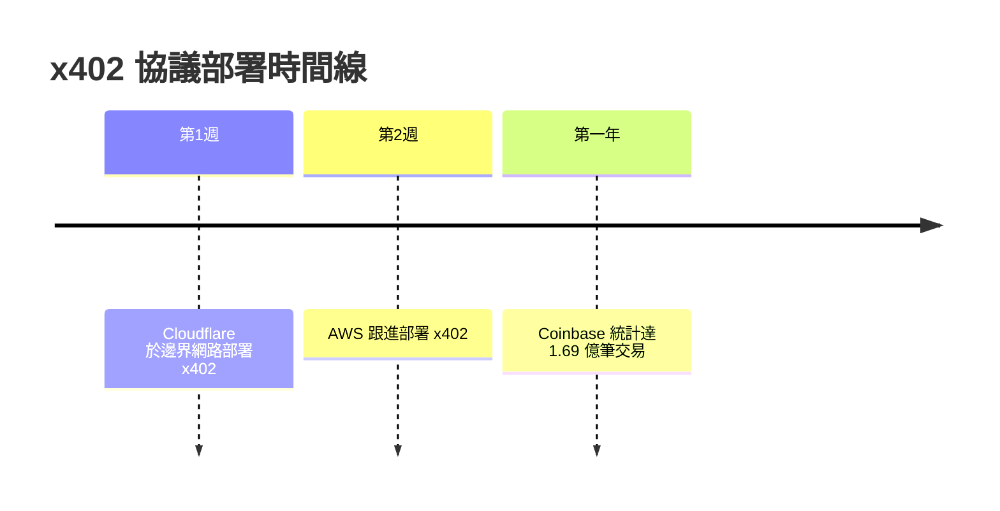
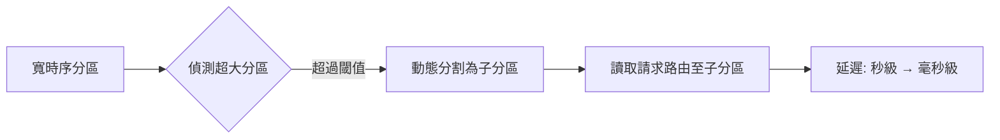

# AI Daily Digest — 2026-07-07

<!-- pipeline-generated:begin -->

## 🔥 今日 TOP 3
### 1. x402穩定幣支付登陸雲端邊界網路
Cloudflare 與 AWS 在兩週內相繼於全球邊界網路部署 x402 穩定幣微支付協議，此開放協議由 Linux Foundation 支持，復活 HTTP 402 狀態碼作為代理間點對點支付機制，單筆交易成本低於 1 美分。

相較於傳統支付需人工介入且手續費高昂，x402 讓 AI 代理能自主完成高頻小額交易；Coinbase 數據顯示第一年已達 1.69 億筆交易，證明市場需求真實存在，標誌著 Web3 支付能力正式進入主流雲基礎設施，為「代理經濟」奠定基礎建設。

企業導入前仍需留意稅務與發票流程尚未整合的合規缺口；開發者可觀察 Coinbase 交易量成長趨勢，並評估是否在自有 agent 系統中預留 x402 支付端點，銜接未來自主經濟生態。

📖 [閱讀完整 insight](../10-insights/2026-07-06/inbox_5bdef9f9.md) · 🔗 [原文連結](https://www.infoq.com/news/2026/07/cloudflare-aws-x402-micropayment/?utm_campaign=infoq_content&utm_source=infoq&utm_medium=feed&utm_term=global)
### 2. Claude Code推出Loops新框架
Anthropic Claude Code 團隊發布名為「Loops」的新框架，重新定義開發者該如何使用 AI 編碼代理，並直指多數人目前的用法其實是錯的。

這對每天仰賴 coding agent 的工程師影響直接：若沿用舊有「下指令、等結果」的單輪模式，很可能持續浪費 token 與時間卻拿不到理想產出；Loops 提出的迭代式互動範式，與過去的用法有本質上的差異。

建議工程團隊近期追蹤 Anthropic 官方文件，理解 Loops 具體操作步驟，並在下次處理複雜任務時改採迭代式 loop 而非一次性長 prompt，觀察產出品質是否提升。

📖 [閱讀完整 insight](../10-insights/2026-07-06/inbox_29f205fc.md) · 🔗 [原文連結](https://medium.com/@shriprasanna32/anthropic-just-dropped-a-banger-on-loops-and-it-quietly-changes-how-you-should-use-your-coding-3ce79ebc395f?source=rss------claude-5)
### 3. Netflix優化Cassandra寬分區延遲
Netflix 工程師為 Apache Cassandra 導入動態分割分區技術，針對時序資料常見的「寬分區」問題，以元數據驅動方式自動偵測超大分區並分割為子分區，跨子分區路由讀取請求。

部署後讀取延遲從秒級降至毫秒級、逾時大幅減少、叢集穩定性提升，且完全不需修改上層業務程式碼；相較於過去需人工介入重新設計 schema 或手動分片，這套自動化機制大幅降低維運成本，對任何管理大規模時序資料的團隊都有直接參考價值。

若團隊也面臨 Cassandra 寬分區延遲問題，可關注 Netflix 是否釋出實作細節或開源工具，並優先評估自身資料模型中是否存在類似的時序寬分區風險點。

📖 [閱讀完整 insight](../10-insights/2026-07-06/inbox_fae9a2a7.md) · 🔗 [原文連結](https://www.infoq.com/news/2026/07/netflix-cassandra-partition/?utm_campaign=infoq_content&utm_source=infoq&utm_medium=feed&utm_term=global)

## 📖 好文章 / 影片精選

_過去 30 天經 traffic 沉澱的高品質內容，按興趣領域分類。每篇只在 column 出現一次。_
### 🛠 工具版本追蹤 / Release
- **ruflo** · **[v3.25.2 — AgentDB atomic flushes + backup auto-restore (#2584)](../10-insights/2026-07-06/inbox_93a123b0.md)**
  Ruflo 3.25.2 修復了 AgentDB（sql.js 資料庫）在併發全映像刷新時導致磁碟映像損壞的問題。核心改進包括原子寫入機制（temp → fsync → rename），透過 writeFileAtomic 和 writeFileRestricted 防止中途中斷或併發寫入造成半寫入狀態。備份自動恢復功能則在本地重建無法修復時，自動從 .sw
- **claude-mem** · **[v13.10.2](../10-insights/2026-07-05/inbox_ce51ba39.md)**
  Claude Mem 13.10.2 著重跨平台穩定性和 worker/runtime 正確性修復。關鍵改進包括：Worker 主機正確解析 CLAUDE_MEM_WORKER_HOST 環境變數，IPv6 位址在健康檢查和顯示 URL 中正確加括號；統一 worker bundle 防止多個建置造成版本偏差；Windows 下移除 shell:true 漏
### 📚 AI 知識管理
- **medium-towards-data-science** · **[Validating the RAG Answer Before the User Sees It: Spans, Quotes, and the Feedback Loop](../10-insights/2026-07-06/inbox_9f8c7020.md)**
  本文為《企業文件智能》專欄第 8 期，提出 RAG 系統驗證的新框架。作者關鍵主張：「結構化輸出只是驗證的起點，不是終點」。系統需在答案展示給用戶前，透過提取 span 與引用文本（quotes）來追蹤證據來源，並透過反饋迴路機制持續改進驗證邏輯。該方法特別適合需要可追溯性與透明度的企業應用。相比單純返回結構化 JSON，這套框架將驗證責任往前推進，從答案生
- **infoq-ai-ml** · **[Elastic Open-Sources Atlas Agent Memory Based on Cognitive Science](../10-insights/2026-06-30/inbox_5614cbd9.md)**
  Elastic開源Atlas，一套建基於Elasticsearch的agent記憶系統。該系統分為三層記憶架構，透過MCP與agent整合，並在逐用戶隔離記憶以支援多租戶安全性。在問答評測中達到0.89的Recall@10分數，表現出良好的記憶檢索有效性。
- **infoq-ai-ml** · **[AI Coding Agents Get a Stack Overflow of Their Own](../10-insights/2026-06-16/inbox_7c789c9f.md)**
  Stack Overflow 宣布推出 Stack Overflow for Agents，這是一個針對 AI coding agents（而非人類開發者）的 API-first 知識交換平台，目前處於測試版。該服務旨在解決「Ephemeral Intelligence Gap」問題：即 AI agents 經常孤立地重複發現相同的程式碼修復和設計模式，而不
### 🏢 企業導入 AI / 團隊實踐
- **infoq-main** · **[Cloudflare Identifies Query Planning Bottleneck in ClickHouse](../10-insights/2026-06-06/inbox_7eb2a3d9.md)**
  Cloudflare 在其計費管道中發現 ClickHouse 查詢規劃階段存在性能瓶頸，根源為查詢規劃鎖的爭用。團隊通過性能分析實施了三項優化：(1) 將獨占鎖替換為共享鎖以減少爭用，(2) 移除每個查詢的 parts list 副本以降低內存開銷，(3) 改進 part filtering 邏輯。這些改變直接解決了計費管道的性能下降，展示了在高併發查詢場
- **medium-tag-llm** · **[The Alchemist codes no more. Now He writes the SPECs that makes the SOFTWARE.](../10-insights/2026-06-06/inbox_b99e321b.md)**
  文章論述大語言模型與 Agent 組合如何改變軟體開發範式，從傳統編寫代碼轉向撰寫規格文件。LLM+Agent 系統根據高層規格自動生成、測試與優化程式碼，完成原本需人手實現的工作。開發者角色演變為「規格工程師」而非傳統「代碼工匠」，聚焦於需求定義、驗證與高層設計。這一轉變對軟體工程流程、QA、文檔與知識轉移都有深遠影響，同時改變了團隊協作與代碼審查方式。
- **hackernews** · **[Ask HN: Why is the HN crowd so anti-AI?](../10-insights/2026-06-06/inbox_5d349dbd.md)**
  HN 討論探討為什麼技術社群對 AI 持批評態度。提問者作為 20 年編程經驗的工程師，主張 AI 輔助編程（特別是 Claude Code）相比手動開發快 10 倍。用戶只關心產品功能而非代碼來源，執行速度應優先於代碼優雅性。AI 版本能更快部署 v1.0、收集真實市場反饋，再用 Claude Code 快速修復升級到 v2.0，形成更快的開發迴圈。這反映
- **medium-tag-llm** · **[LLM 基礎設施化下的產品設計新範式](../10-insights/2026-06-07/inbox_18d1ed63.md)**
  本文探討大型語言模型（LLM）逐步演變為技術基礎設施時，產品設計範式的根本轉變。文章對比了硬體與軟體兩種截然不同的設計邏輯：傳統硬體採「自下而上」方式，先定義硬體規格，再配備相應軟體以展露能力；而現代雲端軟體則採「自上而下」方式，始於用戶場景需求，將算力與儲存視為可動態調用的底層資源。隨著 LLM 逐步演變成技術基礎設施的一部分，這種「以需求決定資源、資源隨
- **medium-tag-llm** · **[Anatomy of a skill that works: deconstructing a debugging orchestrator](../10-insights/2026-06-07/inbox_ca18440e.md)**
  本文以調試編排器（debugging orchestrator）為案例，剖析了什麼構成一個「有效的技能」（working skill）。文章的核心設計洞察是「不求系統全知，聚焦核心職責」：該編排器不試圖理解或掌握整個系統的每一個細節，而是集中精力做好三個核心事項。這種「聚焦而非廣泛」的設計哲學反映了優秀系統架構的普遍原則。該思想對構建可維護的 AI work
### 🎓 AI 使用技巧 / 心法
- **medium-tag-claude** · **[Anthropic Just Dropped a Banger on “Loops” and It Quietly Changes How You Should Use Your Coding...](../10-insights/2026-07-06/inbox_29f205fc.md)**
  Anthropic Claude Code 團隊發布了名為「Loops」的新框架，重新定義了開發者應如何使用 AI 編碼代理。作者指出大多數人目前仍在錯誤地使用編碼 agent，而此框架改變了實踐方式。該發布對編碼工作流程帶來隱含但重要的影響。
- **medium-towards-data-science** · **[Persistent Latent Memory for Multi-Hop LLM Agents: How a 6G Handover Paper Closes the Agent Cold-Start](../10-insights/2026-07-01/inbox_77e921fa.md)**
  本文介紹 ILCP（歸納潛在上下文持久性）技術，解決多智能體管線中的冷啟動問題。傳統的智能體交接需要重新標記化上游上下文，造成高昂的計算成本；ILCP 透過傳輸壓縮隱態讓下游智能體無需重建相同內容。關鍵轉變是：智能體組合不再需要完整重新處理，而是複用潛在表示。對多跳推理和分佈式智能體系統有直接實務應用價值。
- **medium-tag-llm** · **[I Simulated 100 Indians Debating AI and Jobs for 20 Rounds](../10-insights/2026-06-20/inbox_974341f2.md)**
  作者用多個 AI 角色模擬 100 位印度人進行 20 輪辯論討論「AI 對工作的影響」。實驗結果：模擬參與者從未達成全員共識，但在辯論中途出現一個轉折點，幾乎瞬間改變了大多數角色的立場——關鍵發現是這個轉折不源於新數據，而是論證框架的轉變。
### 💳 支付 / Fintech
- **infoq-main** · **[Cloudflare and AWS Embed x402 Agent Payments at the Edge](../10-insights/2026-07-06/inbox_5bdef9f9.md)**
  Cloudflare 與 AWS 在兩週內相繼在全球邊界網路部署 x402 穩定幣微支付協議。該開放協議（由 Linux Foundation 支持）復活 HTTP 402 Payment Required 狀態碼，用於代理間點對點支付，交易成本低於 1 美分。Coinbase 數據顯示第一年達 1.69 億筆交易，驗證市場需求。然而企業級稅務與發票流程尚未
### 🔐 AI 安全 / 濫用
- **hackernews** · **[Cybersecurity researchers aren&#39;t happy about the guardrails on Anthropic&#39;s Fable](../10-insights/2026-06-10/inbox_a640d49a.md)**
  安全研究人員對 Anthropic Fable 模型的防護欄杆提出批評。Fable 對網路安全與生物相關請求設置廣泛的關鍵字過濾，導致正當工作被誤判。例如：安全研究人員 Valentina Palmiotti 指出即使是「閱讀一篇部落格文章」這類無害任務若涉及網路安全詞彙也會被拒絕；專家 Matt Suiche 指出系統基於關鍵字觸發，任何網路安全相關詞彙都
### 🛤️ AI Flow 導入心得 / 技術分享
- **medium-tag-llm** · **[Between Pattern and Understanding](../10-insights/2026-06-06/inbox_badc3caa.md)**
  哲學性論文探討機器智能的認識論基礎，核心問題在於：機器學習究竟是在學習 pattern（統計規律）還是在建立 understanding（理解）？文章梳理了 pattern matching 與真正理解的根本區別，質疑當前 LLM 是否具有語義理解或只是高階統計模型。LLM 可能擅長捕捉文本中的統計關聯，但缺乏因果推理或真實世界模型。這一詰問觸及 AI 能力
- **medium-tag-llm** · **[The Engineering Trade-offs of FlashAttention-3 vs FlashAttention-2 in Production](../10-insights/2026-06-06/inbox_29cf2cdb.md)**
  文章標題表明內容涵蓋 FlashAttention-3 與 FlashAttention-2 在生產環境中的工程權衡。作者開場提及「attention is the ultimate bottleneck」與 context window 相關議題，暗示性能、記憶體與實現複雜度的權衡討論。然而 RSS 摘要內容在此截斷，無法取得完整分析、具體性能數據或建議結
- **substack-lennys-newsletter** · **[Father of the iPod and iPhone on building taste, judgment, and creativity in the AI era | Tony Fadell](../10-insights/2026-06-07/inbox_541f50da.md)**
  Tony Fadell（iPod、iPhone、Nest 創造者）接受 Lenny's Newsletter 訪談。他探討了在 AI 時代如何建立品味、判斷力與創意。訪談涵蓋意見驅動 vs. 數據驅動決策的權衡、行銷對產品成功的重要性，以及貫穿其所有產品背後的「三代規則」——一個用於評估產品長期生命力的框架。Fadell 認為即使在 AI 普及的時代，螢幕仍
- **medium-tag-claude** · **[Interactive LangGraph UIs with MCP Apps: Serving Inline Cards for Human-in-the-Loop Agents](../10-insights/2026-06-07/inbox_63c5efc3.md)**
  本文介紹利用 MCP 應用為 LangGraph 代理提供交互式使用者介面的技術方案。實現採 Python-first 開發，支援圖表顯示、審核按鈕、代理狀態持久化，並可在 Claude Desktop 或任何 MCP 相容主機中即時呈現。此方案展示了 MCP 在 Human-in-the-Loop 代理場景中的實踐應用，將複雜的代理邏輯與互動 UI 整合，
- **medium-tag-claude** · **[From Hindi Speech to UI Actions](../10-insights/2026-06-07/inbox_89afa17b.md)**
  作者針對全球 12 億印地語使用者長期被語音介面忽視的現象，開發支援印地語的語音轉 UI 操作系統。這是對非英語使用者無障礙訪問的實踐案例，雖然是週末專案規模有限，卻突顯了多語言 AI 介面在全球新興市場的重要性。該工作展示了如何用 AI 與語音技術跨越語言障礙，改進使用者體驗。

## 💡 今日 Takeaway

_讀完今日所有內容後，可帶走的知識點_
### 1. RAG驗證要追蹤證據不只看格式
結構化輸出（如 JSON）只是驗證的起點而非終點，系統應進一步提取答案的 span 與引用文本以追蹤證據來源。當找不到明確依據時，「承認找不到」優於硬塞答案或產生幻覺，並可搭配反饋迴路在使用者看到答案前持續修正。

_類型：framework_

**參考來源**：
- [Validating the RAG Answer Before the User Sees It: Spans, Quotes, and the Feedback Loop](../10-insights/2026-07-06/inbox_9f8c7020.md) · [原文](https://towardsdatascience.com/validating-the-rag-answer-before-the-user-sees-it-spans-quotes-and-the-feedback-loop/)
### 2. Token消耗應納入系統設計成本模型
在 LLM 時代，token 消耗已成為與 CPU 時間、記憶體、資料庫查詢同等重要的成本維度，工程師在設計架構與定價策略時，必須把 token 經濟學納入資源分配的核心考量，而非僅視為附加開銷。

_類型：framework_

**參考來源**：
- [The Economy of Tokens: The New Cost Layer of Software](../10-insights/2026-07-06/inbox_0107204c.md) · [原文](https://naggelidis.medium.com/the-economy-of-tokens-the-new-cost-layer-of-software-fced153f413a?source=rss------large_language_models-5)
### 3. 用MaxDiff與Plackett-Luce取代平均分排名
評估 agent 配置優劣時，平均分數容易在樣本量小或分佈不均時失真；改用最佳-最差比較法與 Plackett-Luce 效用分數模型，能更準確揭示配置間的相對優劣，直接提升「上線/裁切/路由」決策品質。

_類型：framework_

**參考來源**：
- [Stop Ranking Agent Configs by Average Score](../10-insights/2026-07-06/inbox_f2f9077c.md) · [原文](https://towardsdatascience.com/stop-ranking-agent-configs-by-average-score/)
### 4. 編碼agent卡關時應問「我漏了什麼」
當 AI 編碼 agent 遇到困難或不確定時，讓它暫停並詢問另一個模型「我遺漏了什麼？」，能借助外部視角發現自身盲點。這種多模型協作的驗證者角色，往往優於單一 agent 持續向前硬推的自洽性。

_類型：framework_

**參考來源**：
- [AI Ajanınıza Beyin Fırtınası Yapacak Birini Verin](../10-insights/2026-07-06/inbox_77c1bc3f.md) · [原文](https://yildizozan.medium.com/ai-ajan%C4%B1n%C4%B1za-beyin-f%C4%B1rt%C4%B1nas%C4%B1-yapacak-birini-verin-f6ee0892dbc5?source=rss------claude-5)
### 5. 以Spite-Driven心態主動修補有缺陷的抽象
面對業界對基礎設施「這就是現狀」的放任態度，工程師應主動針對真實痛點構建替代方案，而非被動接受設計不良的系統。這種主動、有意圖的工程哲學，在 AI-Native 架構快速演進的當下特別具實踐機會。

_類型：framework_

**參考來源**：
- [Podcast: Spite-Driven Engineering: A New Blueprint for Cloud Security in the AI Native Era](../10-insights/2026-07-06/inbox_5d2f3080.md) · [原文](https://www.infoq.com/podcasts/new-blueprint-cloud-security/?utm_campaign=infoq_content&utm_source=infoq&utm_medium=feed&utm_term=global)

<!-- pipeline-generated:end -->

<!-- user-notes -->
<!-- Write your own notes below; pipeline never touches this section. -->