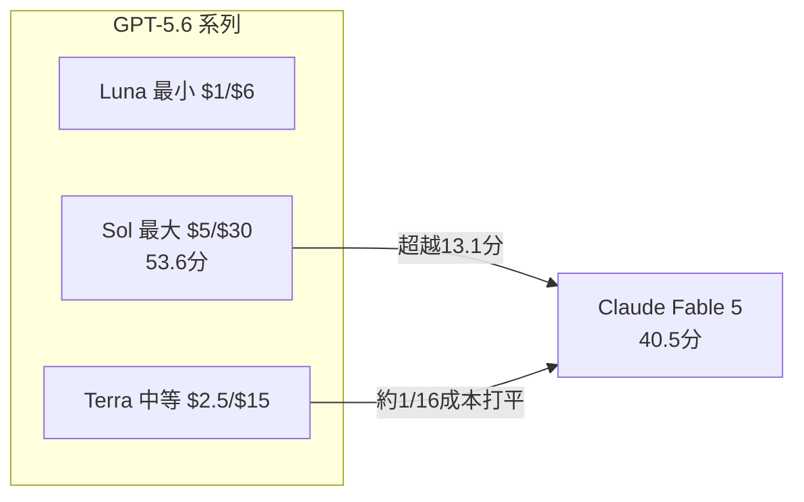
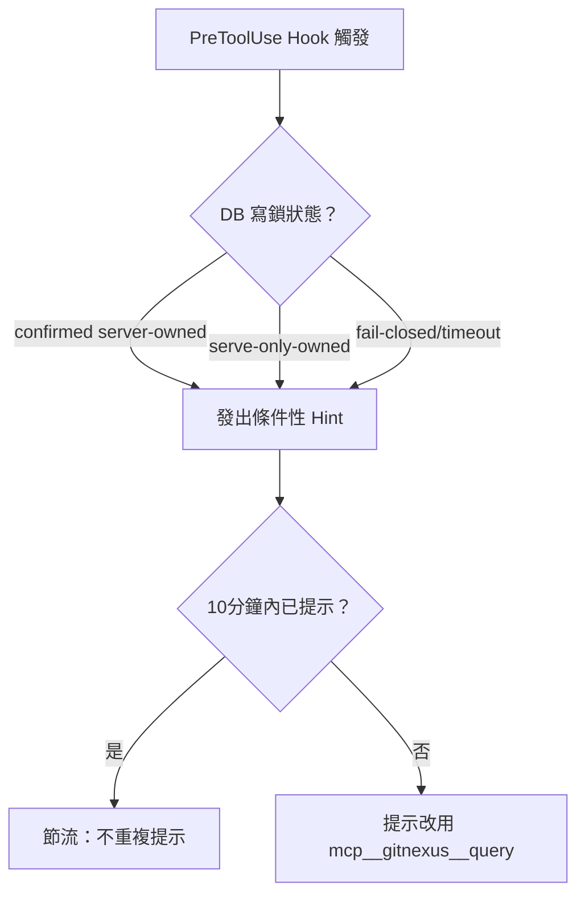

# AI Daily Digest — 2026-07-10

<!-- pipeline-generated:begin -->

## 🔥 今日 TOP 3
### 1. Bun 用 AI Agent 完成 Zig→Rust 全面重寫
Bun 團隊用 Claude Code（Mythos/Fable）agents 完成 Bun 從 Zig 到 Rust 的全面重寫，耗用 5.9 億 uncached input token、6.9 億 output token 及 720 億 cached token，成本約 $165,000。

這打破「大規模程式碼重寫是團隊禁忌」的舊觀念——同等工作傳統小型工程團隊通常要花一整年。更關鍵的是驗證機制：TypeScript 測試套件當 conformance suite 跑百萬級 assertion、加上對抗性人工 review，讓 AI 生成代碼達到可上線品質，Claude Code v2.1.181+ 已用 Rust 版跑了近一個月，Linux 啟動快 10%。

對工程團隊而言，重點不是要不要用 AI 重寫代碼，而是有沒有足夠的 conformance test 覆蓋率與對抗審查流程來把關；明天可以先盤點自己專案的測試覆蓋率是否撐得起類似的 agentic 重構。

📖 [閱讀完整 insight](../10-insights/2026-07-08/inbox_204e08d6.md) · 🔗 [原文連結](https://simonwillison.net/2026/Jul/8/rewriting-bun-in-rust/#atom-everything)
### 2. GPT-5.6 Sol 在 Agents' Last Exam 超越 Fable
Simon Willison 分析 OpenAI 新發布的 GPT-5.6 系列（Luna/Terra/Sol），定價從 $1/$6 到 $5/$30 不等；在 Agents' Last Exam 基準上，Sol 以 53.6 分超越 Claude Fable 5 的 40.5 分，Terra、Luna 更以約 1/16 成本打平其性能。

這場競賽的重點不只是分數領先，而是 token 效率——用更少 token 達成同等表現，對高頻呼叫 API 的企業成本結構影響可能大於單純的 benchmark 名次。但 OpenAI 同時承認 SWE-Bench Pro 約 30% 題目有問題，而 Claude Fable 5 在該基準仍以 80% 遠勝 64.6%。

下一步該看的是實務體感而非單一分數：Willison 本人認為 Sol 在複雜編碼任務上仍不如 Fable，選型時務必交叉比對多個 benchmark，並先確認基準本身的信度再下結論。

📖 [閱讀完整 insight](../10-insights/2026-07-09/inbox_96516d51.md) · 🔗 [原文連結](https://simonwillison.net/2026/Jul/9/gpt-5-6/#atom-everything)
### 3. GitNexus 用條件性 Hint 取代無聲降級解鎖衝突
GitNexus 團隊發布 MCP query hint 機制設計文件：當 MCP server 持有 LadybugDB 寫鎖、PreToolUse hook 無法做本地圖增強時，過去是無聲跳過，新機制改為在 confirmed-owner、serve-only-owned、fail-closed 三路徑上都主動發出提示，引導 agent 改呼叫 mcp__gitnexus__query。

這對所有依賴本地知識圖 + MCP server 雙軌架構的工具開發者有直接參考價值：無聲失敗會讓 agent 誤判功能正常卻拿不到資料；同時新增 per-repo 節流（10 分鐘窗口內最多一次），避免提示風暴造成 ~2x query 放大與 context 膨脹。

值得借鏡的實務作法是它的三副本 byte-identity 同步驗證與 fail-closed 設計；可以把「明確告知不可用 + 給替代路徑 + 節流」這套模式，直接套用在自己 MCP 工具的資源競爭或降級提示設計上。

📖 [閱讀完整 insight](../10-insights/2026-07-08/inbox_9b2d5d5b.md) · 🔗 [原文連結](https://github.com/abhigyanpatwari/GitNexus/releases/tag/rc%2F1408bfbffe69422e7db3f004d1cbc556b1634c41)

## 📖 好文章 / 影片精選

_過去 30 天經 traffic 沉澱的高品質內容，按興趣領域分類。每篇只在 column 出現一次。_
### 🛠 工具版本追蹤 / Release
- **claude-mem** · **[v13.10.3-community-edge.0 community edge](../10-insights/2026-07-09/inbox_ecc16ed1.md)**
  Claude Mem v13.10.3-community-edge.0 是社區邊緣發佈版本，集成 batches 4-9。詳細資訊參見 PR #3172 和計畫文件 plans/2026-07-07-community-edge-batches-4-9-integration.md。
- **ruflo** · **[v3.25.6 — main-red unblock + Cursor hook + #2612 heal](../10-insights/2026-07-09/inbox_b63fbf52.md)**
  Ruflo v3.25.6 修復了 Cursor 第三方 hook import 導致 Bash/Edit 工具呼叫失敗的問題（#2613），hooks.json PreToolUse 命令現發出有效的 {\"permission\":\"allow\"} 判決供 Claude Code 和 Cursor 接納。修正 @claude-flow/plugin-
  _+ 3 個近期版本（v3.25.5 → v3.25.3，僅顯示最新）_
- **repowise** · **[v0.29.0](../10-insights/2026-07-09/inbox_58fd38ea.md)**
  Repowise v0.29.0 發布，包含代碼健康檢測器的大規模準確性改進與架構重構。核心修正包括複雜度指標重新計算（elif nesting、參數、推導式、NLOC 計數方式調整）、針對閉包/作用域/worker pool 場景的假陽性削減，以及引入 NLOC-weighting 和 per-file leverage 指標提升評分精度。同時改善了 MC
  _+ 1 個近期版本（v0.28.1，僅顯示最新）_
- **hermes-agent** · **[Hermes Agent v0.18.2 (2026.7.7.2)](../10-insights/2026-07-08/inbox_bcc19b4a.md)**
  Hermes Agent v0.18.2（版本 2026.7.7.2）是 v0.18.1 上的當日補丁（2026-07-08 發布）。核心修正：WhatsApp Baileys 依賴解除 git commit pin（#60643），改用已發布的 npm 版本 7.0.0-rc13，使 npm install 和 Docker 鏡像構建可靠化。詳細更新說明（
  _+ 1 個近期版本（v0.18.1，僅顯示最新）_
### 📚 AI 知識管理
- **medium-towards-data-science** · **[Loop Engineering for Hierarchical Retrieval: Reading a Long Document by Its Table of Contents](../10-insights/2026-07-09/inbox_1cb17da5.md)**
  本篇介紹企業文檔智能系列（Vol.1 #7quater）的檢索工程技巧。面對超長文檔（如 492 頁含 358 項目錄）的檢索問題，傳統 top-k 檢索易產生「答案混雜於鄰近段落」的噪音。提出方案：構造「有界循環」（bounded loop）層級檢索機制，先通過目錄（TOC）路由查詢至相關章節，再進行精細檢索。效果：顯著節省 token 消耗、提升檢索精度
### 🏢 企業導入 AI / 團隊實踐
- **codex** · **[0.139.0](../10-insights/2026-06-09/inbox_904750b5.md)**
  OpenAI Codex 0.139.0 發布。Code mode 新增 standalone web search 能力（包括嵌套 JavaScript tool calls），返回純文本搜索結果。Tool 和 connector input schemas 現保留 oneOf 和 allOf，大型 schemas 在 compaction 時保留更多淺層
- **deepmind-blog** · **[Measuring the impact of learning with AI in Sierra Leone and beyond](../10-insights/2026-06-08/inbox_f4a4225a.md)**
  DeepMind 發表隨機對照實驗（RCT）研究成果，驗證 Gemini 的 Guided Learning 功能對學習成效的影響。實驗在 Sierra Leone 進行，結果表明該功能有潛力提升學生參與度並加速學習進度，為 AI 教育應用提供跨區域實證基礎，驗證 AI 輔助學習的實務價值。
- **simon-willison** · **[Quoting Andrej Karpathy](../10-insights/2026-06-09/inbox_b1d5eda6.md)**
  Andrej Karpathy 對 Claude Fable 5 發表評論，指出隨著優質軟體供給趨向零邊際成本（「tap 出來的軟體」），傑文斯悖論啟動——當生產變得非常便宜，人們的需求也大幅增長。他強調開發者現在可以快速索取任何一次性應用：解釋器、視覺化、儀表板、超客製化研究工具等，軟體民主化使得個人與團隊的生產力潛力大幅提升。
- **medium-tag-llm** · **[Claude Fable 5: A Developer’s Look at Anthropic’s First Mythos-Class Model](../10-insights/2026-06-09/inbox_b18d782d.md)**
  Anthropic 於 2026 年 6 月 9 日發佈 Claude Fable 5，這是公司推出的首個 Mythos-Class（神話級）模型層級的產品。該級別代表模型性能與能力的新臺階，區別於先前的 Claude 模型世代。Mythos-Class 標誌著 Anthropic 在模型架構和推理能力上的重大演進。本文作者以開發者視角，深入分析 Fable
- **medium-tag-llm** · **[What Really Happens When You Talk to an LLM](../10-insights/2026-06-09/inbox_c65548f8.md)**
  該系列文章開篇「AI 基礎設施工程」系列，第一週聚焦 LLM 核心概念。文章分解講解訓練（training）與推理（inference）兩個不同階段的計算特性與資源成本。深入解釋 Token 的定義、Prefill 階段（模型處理提示詞）與 Decode 階段（逐個生成回應 token）的機制。文章旨在系統化介紹 LLM 運作的底層原理，幫助開發者與基礎設施
### 🎓 AI 使用技巧 / 心法
- **medium-towards-data-science** · **[The Threshold Is a Price, Not a Percentage](../10-insights/2026-07-08/inbox_aacd6fda.md)**
  傳統 AI agent 決策常使用固定信心閾值（如 confidence ≥ 0.95）來判斷是否自主執行。本文提出重要觀點：決策閾值應基於『成本非對稱性』（cost asymmetry）而非比例式信心值。例如誤判代價高時應提高閾值、低風險操作應降低閾值，成本結構直接決定最優決策邊界。這一框架將 agent 決策從靜態規則轉為動態成本感知。作者展示了如何針對
- **medium-towards-data-science** · **[Survival Analysis for Data Drift and ML Reliability](../10-insights/2026-07-07/inbox_6c988d80.md)**
  Towards Data Science 發表《生存分析用於數據漂移與 ML 可靠性》，提出將機器學習模型退化現象建模為「時間到失敗」（time-to-failure）問題。該方法引入統計學中的生存分析（survival analysis）框架來預測模型性能下降的時間點與風險等級，有助於產品團隊提前介入維護決策。這一框架將質量保證從被動響應轉為主動預測，對長
### 🔐 AI 安全 / 濫用
- **openai-blog** · **[Our approach to government and national security partnerships](../10-insights/2026-07-08/inbox_767e6e96.md)**
  OpenAI 公開其與政府和國家安全部門的合作方針。該方針強調負責任的 AI 使用、民主問責制與公共安全作為核心原則，反映了 OpenAI 對 AI 治理的積極態度。這一聲明表明 OpenAI 正式確立了與政府機構合作的政策框架。具體的政策細節、合作案例與實施機制在現有摘要中未提供。
### 🛤️ AI Flow 導入心得 / 技術分享
- **simon-willison** · **[Rewriting Bun in Rust](../10-insights/2026-07-08/inbox_204e08d6.md)**
  Jarred Sumner 詳述 Bun 從 Zig 用 AI agents（Claude Mythos/Fable）重寫為 Rust 的全過程。核心洞察：現代 frontier models 使過去視為禁忌的大規模代碼重寫成為可行。成功的三層驗證機制：(1) TypeScript 測試套件作為 conformance suite 自動檢驗百萬個 asser
- **substack-lennys-newsletter** · **[What a harness is and how to build one with Claude Agent SDK](../10-insights/2026-07-08/inbox_d04084ba.md)**
  Lenny's Newsletter 介紹了如何使用 Anthropic Claude Agent SDK 構建自訂 harness，來自動化軟體開發中的重複性任務。作者實現了一個具體案例：用 harness 自動化 Sentry 錯誤平台的 bug 分類流程，完全避免了每次都編寫「親愛的 Agent，請修復這個」式樣提示詞的繁瑣工作。Harness 是一種
- **hackernews** · **[Show HN: Getting GLM 5.2 running on my slow computer](../10-insights/2026-07-09/inbox_65c5b1d9.md)**
  開發者利用 int4 量化技術和 MoE 動態激活機制，成功在 32GB RAM 的普通筆記本上運行 GLM 5.2 模型，並創建了開源專案 Colibrì。該 744B 參數的模型設計巧妙，每個 token 僅激活約 40B 參數，顯著降低推理所需內存。模型架構分三層存儲：密集部分 (~17B 參數) 以 int4 格式驻留 RAM 中 (~9.9GB)，

## 💡 今日 Takeaway

_讀完今日所有內容後，可帶走的知識點_
### 1. Agent 決策閾值應依成本不對稱而非固定信心值
傳統做法用固定信心閾值（如 ≥0.95）判斷 agent 是否可自主執行，但更優做法是依誤判的實際代價動態調整：高風險誤判把閾值拉高、低風險操作則放寬。設計自動化流程前，應先評估 false positive 與 false negative 各自的業務成本，再回推最適閾值，而非套用單一全域信心分數。

_類型：framework_

**參考來源**：
- [The Threshold Is a Price, Not a Percentage](../10-insights/2026-07-08/inbox_aacd6fda.md) · [原文](https://towardsdatascience.com/the-threshold-is-a-price-not-a-percentage/)
### 2. AI 大規模重寫靠三層驗證而非逐行審查
面對 agent 生成的大規模程式碼變更，比逐行看 diff 更有效的是：(1) 用既有測試套件當 conformance suite 做百萬級 assertion 驗證，(2) 安排對抗性人工 review 專挑 agent 輸出的錯，(3) 發現系統性問題時修「生成流程」而非逐個手工補丁。這套框架讓 agentic rewrite 從賭博變成可控工程。

_類型：framework_

**參考來源**：
- [Rewriting Bun in Rust](../10-insights/2026-07-08/inbox_204e08d6.md) · [原文](https://simonwillison.net/2026/Jul/8/rewriting-bun-in-rust/#atom-everything)
### 3. 長文檔 RAG 先查目錄路由再精細檢索省 token
對超長文檔（數百頁）做 RAG 時，直接對全文做 top-k 向量檢索容易讓答案混雜在鄰近段落的噪音中。更有效的做法是先用目錄（TOC）做粗粒度路由鎖定相關章節，再進行段落級精細檢索，既省 token 又提升精度，適用於企業知識庫、法規文件等場景。

_類型：technique_

**參考來源**：
- [Loop Engineering for Hierarchical Retrieval: Reading a Long Document by Its Table of Contents](../10-insights/2026-07-09/inbox_1cb17da5.md) · [原文](https://towardsdatascience.com/loop-engineering-for-hierarchical-retrieval-reading-a-long-document-by-its-table-of-contents/)
### 4. 比較模型要看 token 效率，且先查 benchmark 信度
評測新模型時，單純比較單一 benchmark 分數容易誤導——真正該看的是「達到同等表現所需的 token 成本」，效率差距可能達十幾倍。此外 benchmark 本身也可能有問題（如某測試集約 30% 題目被質疑），下結論前應先確認基準信度，而非照單全收。

_類型：pattern_

**參考來源**：
- [The new GPT-5.6 family: Luna, Terra, Sol](../10-insights/2026-07-09/inbox_96516d51.md) · [原文](https://simonwillison.net/2026/Jul/9/gpt-5-6/#atom-everything)
### 5. 工具鎖衝突時給明確提示比無聲降級更安全
當底層資源（如資料庫寫鎖）被佔用導致某功能無法使用時，比起無聲跳過（讓 agent 誤以為一切正常），更好的設計是主動發出條件性 hint，明確告知「此路徑不可用」並指向替代工具，同時加上節流機制避免提示風暴造成 context 膨脹。這套模式適用於任何有資源競爭的多 agent 架構。

_類型：pattern_

**參考來源**：
- [rc/1408bfbffe69422e7db3f004d1cbc556b1634c41: fix(hook): emit MCP query hint when server owns DB lock (#2396) (#2397)](../10-insights/2026-07-08/inbox_9b2d5d5b.md) · [原文](https://github.com/abhigyanpatwari/GitNexus/releases/tag/rc%2F1408bfbffe69422e7db3f004d1cbc556b1634c41)

<!-- pipeline-generated:end -->

<!-- user-notes -->
<!-- Write your own notes below; pipeline never touches this section. -->