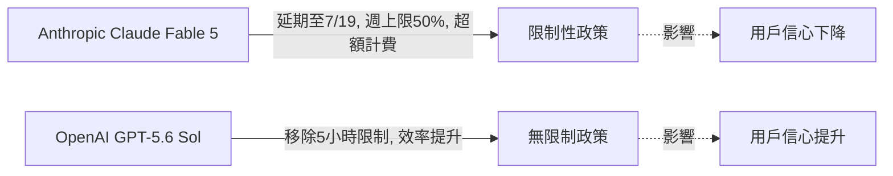
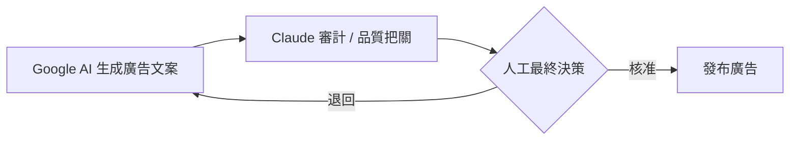

# AI Daily Digest — 2026-07-13

<!-- pipeline-generated:begin -->

## 🔥 今日 TOP 3
### 1. Claude延期 vs OpenAI解限之爭
Anthropic 將 Claude Fable 5 付費方案延期至 7/19，維持週用量上限與超額計費；同期 OpenAI 為 GPT-5.6 Sol 移除 5 小時限制並提升效率。

Simon Willison 指出，Anthropic 因算力限制反覆延期，正讓用戶轉向政策透明的 OpenAI；在模型能力趨同下，長期供應承諾已成為留住開發者的關鍵差異。

重度依賴 Claude Code 的團隊應留意 7/19 後是否有永久政策，並評估備援至其他 provider 的必要性，降低供應不確定性風險。

📖 [閱讀完整 insight](../10-insights/2026-07-12/inbox_5f26809e.md) · 🔗 [原文連結](https://simonwillison.net/2026/Jul/12/bump/#atom-everything)
### 2. Claude Code啟動耗33k tokens
第三方在 Anthropic API 前插入日誌層，完整記錄請求與 usage blocks，發現 Claude Code 執行程式碼前已耗約 33,000 tokens 初始化，OpenCode 僅需 7,000，相差 4.7 倍。

差距源自 cache strategy 與 harness token 使用設計效率不佳；對高頻呼叫、成本敏感的團隊而言，長期累積會被顯著放大，直接影響工具選型的總體成本。

建議實測自身 session 的 initialization overhead，與 OpenCode 等替代方案同條件比較，作為預算規劃與 harness 選型依據。

📖 [閱讀完整 insight](../10-insights/2026-07-12/inbox_f62892c1.md) · 🔗 [原文連結](https://systima.ai/blog/claude-code-vs-opencode-token-overhead)
### 3. Google Ads開放AI文案+Claude審核
Google 自 2026/7/1 起更新 Ads 條款，明確合法化 AI 生成廣告文案；作者提出工作流：Google AI 生成 → Claude 審計 → 人工核准。

此舉解除過去暗地使用 AI 的合規風險，但也把品質控管責任轉移給團隊；三層把關能兼顧成本效率、法規合規與品牌完整性，避免自動化失控。

行銷團隊可套用『生成→AI審計→人工核准』流程作為明天就能落地的治理範本，並持續追蹤 Google 後續揭露規範。

📖 [閱讀完整 insight](../10-insights/2026-07-12/inbox_62c8763b.md) · 🔗 [原文連結](https://medium.com/@marketing.pixeldotmedia/ai-is-now-writing-your-google-ads-heres-how-to-audit-it-with-claude-9db25d0b7b45?source=rss------claude-5)

## 📈 本週 GitHub 飆升 Top 10

_GitHub 本週新增 star 最多的專案_

### 1. [Zackriya-Solutions/meetily](https://github.com/Zackriya-Solutions/meetily)
⭐ +7,440 this week · 🧬 Rust

這是一套用 Rust 打造的會議記錄工具，靠 Parakeet／Whisper 做即時語音轉文字、辨識不同講者，再用本機執行的 Ollama 產生會議摘要，整個流程完全在本機端跑，不用把錄音上傳雲端。本週爆紅可能是因為它踩中「隱私優先」與「免付費雲端 API」這兩個近期很多人在意的痛點，加上支援 macOS 與 Windows 自架部署，門檻不高。適合注重資料隱私、常開會又不想付費用雲端會議記錄服務的團隊或個人使用。
### 2. [asgeirtj/system_prompts_leaks](https://github.com/asgeirtj/system_prompts_leaks)
⭐ +7,155 this week · 🧬 JavaScript

這個專案整理並公開了 Anthropic、OpenAI、Google、xAI 等家的模型（以及 Cursor、Copilot、Perplexity 等產品）被萃取出來的系統提示詞，屬於持續更新的資料彙整庫。這類內容一直對想了解各家 AI 產品「幕後設定」的開發者很有吸引力，本週熱度高看起來與提示詞工程（prompt engineering）社群的高討論度有關。適合想研究主流 AI 助理行為設計、或是自己在寫系統提示詞時找靈感的工程師與研究者參考。
### 3. [iOfficeAI/OfficeCLI](https://github.com/iOfficeAI/OfficeCLI)
⭐ +6,978 this week · 🧬 C#

OfficeCLI 提供一個命令列介面，讓 AI agent 可以直接讀取、編輯、自動化 Word、Excel、PowerPoint 檔案，而且不需要安裝完整的 Office 軟體，是單一執行檔、免費開源的方案。隨著愈來愈多人在用 AI agent 處理日常辦公文件自動化，這種專為 agent 設計、輕量又不依賴 Office 授權的工具，可能正好補上了現有生態的空缺。適合想串接 AI agent 做文件自動生成、報表處理、簡報產製等辦公流程的開發者或企業使用。
### 4. [diegosouzapw/OmniRoute](https://github.com/diegosouzapw/OmniRoute)
⭐ +4,506 this week · 🧬 TypeScript

OmniRoute 是一個 AI API 閘道，用單一端點就能接上 231 個以上的模型供應商（其中 50 多個免費），讓 Claude Code、Codex、Cursor、Cline、Copilot 這些工具能透過它取用免費或付費的 Claude／GPT／Gemini 等模型，並內建壓縮技術與智慧容錯切換來省 token。本週爆紅可能反映了開發者對「多供應商彈性切換、控制 AI 使用成本」需求的高度關注，尤其是在各家模型 API 費用與速率限制常變動的情況下。適合同時串接多個編碼助理工具、想省 token 成本或做多模型備援的開發者。
### 5. [stablyai/orca](https://github.com/stablyai/orca)
⭐ +4,481 this week · 🧬 TypeScript

Orca 定位為管理一整批平行運作的 AI coding agent 的開發環境，可以用自己既有的訂閱來跑各種不同的編碼代理工具，並支援桌面與行動裝置操作。隨著多 agent 並行開發、agent orchestration 逐漸成為熱門工作模式，這類統一管理介面的需求可能正在上升。適合同時操作多個 coding agent、需要跨裝置監控與調度任務進度的開發者或團隊。
### 6. [bradautomates/claude-video](https://github.com/bradautomates/claude-video)
⭐ +4,353 this week · 🧬 Python

這個專案讓 Claude 具備「看影片」的能力：透過 /watch 指令自動下載影片、擷取畫面幀、做語音轉文字，再把這些內容整理交給 Claude 分析。本週受到關注，看起來是切中了大家想讓 AI 助理理解多媒體內容（而不只是文字）的需求，屬於把既有工具串接起來、擴充 Claude 輸入模態的實用整合方案。適合需要用 Claude 分析教學影片、會議錄影或社群影片內容的開發者與內容工作者。
### 7. [usestrix/strix](https://github.com/usestrix/strix)
⭐ +4,143 this week · 🧬 Python

Strix 是一套開源的 AI 滲透測試工具，用來自動找出應用程式的安全漏洞並協助修復。隨著 AI agent 被拿來做資安檢測、DevSecOps 自動化的討論愈來愈多，這類把 AI 能力用在滲透測試流程上的開源工具，可能因此吸引了資安圈與開發者的關注。適合資安工程師、想在 CI 流程中加入自動化漏洞掃描的團隊使用。
### 8. [JuliusBrussee/caveman](https://github.com/JuliusBrussee/caveman)
⭐ +3,992 this week · 🧬 JavaScript

Caveman 是一個 Claude Code 的 skill，透過讓對話用類似「穴居人講話」的精簡方式進行，聲稱可以省下大量 token 用量。本週爆紅很可能是因為它直接回應了大家對 Claude Code token 成本、上下文用量的敏感度，加上命名和概念本身有話題性、容易在社群傳播。適合大量使用 Claude Code、想壓低 token 花費或延長對話上下文可用長度的開發者。
### 9. [ogulcancelik/herdr](https://github.com/ogulcancelik/herdr)
⭐ +3,928 this week · 🧬 Rust

herdr 是一個常駐在終端機裡的 agent 多工器，用來同時管理、切換多個正在運作的 AI coding agent。這類工具的需求可能是隨著開發者同時開多個 agent 處理不同任務、需要一個統一終端介面來監控與調度而出現的。適合習慣在終端機工作、同時操作多個 coding agent 的工程師使用。
### 10. [ruvnet/RuView](https://github.com/ruvnet/RuView)
⭐ +3,763 this week · 🧬 Rust

RuView 利用一般家用 WiFi 訊號的變化，做到即時的空間感知、生命徵象監測與人員存在偵測，完全不需要攝影機或影像畫面。這種「用既有 WiFi 做感測」的做法沒有隱私疑慮（不拍畫面）又不用額外硬體，可能是它吸引關注的主因，加上近期對非侵入式居家照護、感測技術的討論度提升。適合對智慧居家安防、長者照護監測、或非影像式室內感測應用有興趣的開發者與研究者。

## 📖 好文章 / 影片精選

_過去 30 天經 traffic 沉澱的高品質內容，按興趣領域分類。每篇只在 column 出現一次。_
### 🛠 工具版本追蹤 / Release
- **repowise** · **[v0.31.0](../10-insights/2026-07-12/inbox_3fdc834b.md)**
  Repowise v0.31.0 發佈，核心新功能為測試覆蓋率驅動的智能信號（per-test 環境、coverage-backed missing-test signal）與 `repowise impacted-tests` 命令、從 agent 會話文字紀錄挖掘持久決策並在 SessionStart/編輯時注入相關度排序的決策、以及錨定在實際程式碼體的
  _+ 1 個近期版本（v0.30.0，僅顯示最新）_
- **claude-code** · **[v2.1.206](../10-insights/2026-07-10/inbox_ee0952e0.md)**
  Claude Code v2.1.206 發布了 43 項改進，核心包括背景 agent 自動升級（新版本發布後立即在背景更新，避免 stale session 延遲）、MCP 伺服器 per-server request_timeout_ms 修復（長執行任務不再因 60s 預設逾時而失敗）、CLAUDE_CODE_EXTRA_BODY 環變數傳播修復（背
### 📚 AI 知識管理
- **medium-towards-data-science** · **[RAG Was Always a Temporary Workaround. What is Next?](../10-insights/2026-07-10/inbox_207ed63c.md)**
  本文提出一個重要的基礎設施方向論斷：向量資料庫（vector database）只是 RAG 的臨時過渡方案。作者認為向量檢索本質上無法滿足長期的 AI 應用需求，而只是一個過渡橋接。下一波 AI 基礎設施革命應轉向「持久神經狀態」（persistent neural state）的存儲和處理。同時，系統必須遵守嚴格的延遲預算（strict latency 
- **medium-tag-llm** · **[Why Embedding Based Semantic Search Is Not Enough for Production RAG](../10-insights/2026-07-11/inbox_b3c04173.md)**
  本文針對生產環境 RAG 系統的檢索策略進行實踐分析。作者從親身經驗出發，指出許多開發者初期傾向於將語義搜索（embedding-based search）視為檢索問題的完整解決方案，即單純地對文件進行分塊與嵌入後就直接使用。然而生產環境中，純 embedding 方法存在明顯局限，無法勝任複雜場景。文章隱示需要採用超越語義搜索的混合檢索策略。這對構建穩健 
### 🏢 企業導入 AI / 團隊實踐
- **simon-willison** · **[Quoting Andrew Singleton](../10-insights/2026-06-12/inbox_afb05a2b.md)**
  Andrew Singleton 在《AI 經濟入門》中用尖銳的諷刺比喻批評 AI 投資虛報問題：一位女性在火葬場獲得 200 億美元投資（換取 5% 股份），隨後將 100 億美元焚燒，再花 100 億購買丙烷燃燒這些錢，使投資者能誇稱「本季度 AI 投資獲得 100 億美元收入且擁有 5% 的 1,000 億美元企業」。這則故事映射了當前 AI 領域的財
- **infoq-main** · **[Slack Eliminates SSH in EMR Pipelines, Migrates 700+ Jobs to Rest-Based Architecture](../10-insights/2026-06-12/inbox_67d3e00b.md)**
  Slack 完成資料平台現代化，將 EMR pipelines 中的 700+ Airflow operators 從 SSH 執行遷移至基於 REST 的 Quarry 新架構。本次遷移消除了直接的 SSH 存取，同時改善安全性、可靠性和可觀測性，並實現了伺服器端 job 生命週期管理。Slack 的這次大規模遷移展示了如何系統性地現代化資料基礎設施。
- **infoq-main** · **[Angular&#39;s Official Agent Skills Helps AI Coding Tools Write Modern Angular](../10-insights/2026-06-12/inbox_6dae80b1.md)**
  Google Angular 團隊釋出 angular/skills 儲存庫，包含專為 AI coding agents 最佳化的 Agent Skills。該 skills 增強了 AI 工具編寫現代 Angular 程式碼的能力，涵蓋程式碼生成和應用程式腳手架。儲存庫作為 Angular 最佳實踐快照，幫助 AI agents 瞭解最新慣例，進而改進程式
- **infoq-main** · **[Podcast: Craig McLuckie on Culture as a Team&#39;s Operating System in the AI Era](../10-insights/2026-06-12/inbox_f74e8a7e.md)**
  InfoQ 播客邀請 Kubernetes 共同創作者、Stacklok CEO Craig McLuckie 討論 AI 時代的團隊文化。核心論點包括：AI 編碼工具對開源社區和工程團隊的衝擊、組織文化的刻意設計、以及 AI 時代工程師職業路徑的演變。McLuckie 強調了文化在應對 AI 工具普及挑戰中的「操作系統」角色，並探討開源社區如何管理和評估 
- **medium-towards-data-science** · **[I Thought Data Engineering Was Just Writing Scripts. I Was Wrong.](../10-insights/2026-06-12/inbox_1b667dee.md)**
  文章分享作者在將 ETL 管道推向生產環境時遭遇的三個關鍵障礙與深層經驗教訓。作者強調生產就緒（production-ready）遠超出單純腳本編寫的技術範疇，涉及可靠性設計、實時監控、故障恢復與冪等性等系統工程考量。通過具體失敗案例揭示了數據工程與企業軟體工程之間的實踐落差，提醒工程師應主動關注非功能性需求（可靠性、可觀測性、可維護性）。此篇章強調從「能跑
### 🎓 AI 使用技巧 / 心法
- **medium-towards-data-science** · **[Long Context Isn’t Free — I Built a Safe Prompt-Pruning Layer That Makes LLM Systems Work](../10-insights/2026-07-11/inbox_3bf9a9af.md)**
  作者提出確定性 prompt pruning 層，解決長上下文 LLM 系統的成本與品質權衡。核心洞察：LLM 失敗非因遺忘而因記憶過多，冗餘 token 累積驅動成本增加、延遲提升、輸出品質隱性劣化。方案透過確定性演算法減少 token 使用而保持依賴完整，已通過真實基準測試和生產驗證。這揭示了長上下文成本非零且具隱藏品質成本的框架性認知。
- **medium-tag-llm** · **[Why Your AI Agent Keeps Failing (and the Fix Has Nothing to Do With the Model)](../10-insights/2026-07-11/inbox_cea38279.md)**
  文章指出AI agent失敗的根本原因並非基礎LLM能力不足，而在於agent loop（決策迴圈）的設計缺陷。作者提供實踐指南，強調修復loop架構、優化工具呼叫流程、改進狀態管理和錯誤恢復機制遠比升級基礎模型更有效。這是一個重要的視角轉變，許多team盲目地假設「更大/更強的LLM會解決所有問題」，但實際瓶頸常在於迴圈邏輯。文章論點涵蓋loop設計的可靠
- **medium-tag-claude** · **[AI Engineer Series: 10 Production-Grade Prompts That Turn Claude Into a Staff Engineer](../10-insights/2026-07-12/inbox_1215cfe1.md)**
  Paul Cardell 在本系列文章中提供 10 個專業級 prompt 範例，旨在讓 Claude 發揮類似 Staff Engineer 的工程能力。核心觀點直指 prompt engineering 的根本誤區：不應該用簡短的 Slack 訊息對待 AI 助手，而應給予清晰、詳細、工程級別的指令——就像對待真正的資深工程師一樣。這反映出一個關鍵原則：
- **medium-tag-llm** · **[Stop Treating Open Source Models as a Downgrade: How Model Routing Actually Works](../10-insights/2026-07-12/inbox_02ea1dab.md)**
  Medium 文章「Stop Treating Open Source Models as a Downgrade: How Model Routing Actually Works」由 Mohammad Liyaghi 撰寫，挑戰對開源模型的貶低看法。文章強調過去 18 個月內開源與專有模型的能力差距已大幅縮小，動態 model routing 策略已成熟
- **medium-tag-claude** · **[AI Is Now Writing Your Google Ads. Here’s How to Audit It with Claude](../10-insights/2026-07-12/inbox_62c8763b.md)**
  自 2026 年 7 月 1 日起，Google 正式更新 Ads Terms of Service，明確規定並合法化 AI 在 Google Ads 中的應用，終結了此前「暗箱操作」的灰色地帶。作者 Pixel Dot Media 提出實踐工具鏈：Google AI 生成廣告文案 → Claude 進行審計和質控 → 人工決策批准，形成三層把關流程。這套方
### 💳 支付 / Fintech
- **medium-tag-claude** · **[How Claude Calls Me on WhatsApp to Manage My Company](../10-insights/2026-07-10/inbox_a4fedd0a.md)**
  Ilian 於 Medium 撰文分享真實案例：使用 Claude 通過 WhatsApp 整合方式自動化管理 SaaS 公司 Kadrella 的日常營運。Kadrella 專門管理私人家教業務，涉及課程排表、學生與教師管理、支付處理等複雜流程。作者通過將 Claude 嵌入 WhatsApp，實現了對這些業務流程的自動化和智能決策。WhatsApp 作為
### ⛓️ 區塊鏈 / Web3
- **substack-maxcryptospace** · **[7 月直播 AMA:下半年前瞻+我的 AI 工作流](../10-insights/2026-07-12/inbox_96f39bf9.md)**
  Max Crypto Space 將於 2026 年 7 月舉辦直播 AMA 活動。此次活動涵蓋下半年市場前景展望、AI 工具工作流評測、產業戰略與侷局分析，以及資源配置整合方向等多個主題。AMA 形式的實時互動聚焦於 AI 工具在當下市場環境中的實踐應用與未來趨勢判斷。參與聽眾主要為 AI 工具使用者與產業從業者。此為 AI 從業者深入了解下半年發展方向的
- **substack-web3matters** · **[第 190 期](../10-insights/2026-07-13/inbox_83c9a9fd.md)**
  該內容為 Web3/加密貨幣相關新聞，不屬於 AI 產業新知範圍，無法處理。
### 🛤️ AI Flow 導入心得 / 技術分享
- **infoq-main** · **[How Datadog Used Claude and Cursor for Test-Driven Production Migration](../10-insights/2026-07-10/inbox_4267b4fc.md)**
  Datadog 工程師 Arnold Wakim 在最近的文章中分享了使用 Claude 和 Cursor 進行測試驅動生產系統遷移的實戰經驗。該專案針對公司存儲後端面臨的硬限制進行了全面優化和重構。通過引入 AI 輔助開發，團隊成功突破了性能瓶頸，實現了顯著的性能改善。文章詳細記錄了哪些開發策略有效、哪些失敗，以及從中萃取的工程教訓。對於考慮在生產環境引入

## 💡 今日 Takeaway

_讀完今日所有內容後，可帶走的知識點_
### 1. AI Agent不能當專案DRI
AI agent 不應被指定為專案的 Directly Responsible Individual，因為究責機制必須落在能承擔後果的人身上，機器無法被追究責任。此原則源自 Apple/GitLab 的管理制度與 IBM 1979 年的經典警語，在導入 agentic AI 治理架構時應內建為預設規則：每個 agent 驅動的專案都要有明確的人類 owner。

_類型：framework_

**參考來源**：
- [Directly Responsible Individuals (DRI)](../10-insights/2026-07-12/inbox_1606e4b3.md) · [原文](https://simonwillison.net/2026/Jul/12/directly-responsible-individuals/#atom-everything)
### 2. 多模型辯論比單一自信答案更可靠
單一模型容易產生幻覺與過度自信，讓多個模型互相辯論、暴露分歧點，比追求『快速自信答案』更能反映真實不確定性。這個模式特別適合醫療、法律、金融等高風險決策場景，可作為需要高可靠度的 AI 產品設計準則。

_類型：pattern_

**參考來源**：
- [Debate TelloDB Review: A More Honest Way to Use Multiple AI Models?](../10-insights/2026-07-12/inbox_d35ed261.md) · [原文](https://medium.com/@mazharm0786/debate-tellodb-review-a-more-honest-way-to-use-multiple-ai-models-a75ec0d77438?source=rss------claude-5)
### 3. 模型選擇應是動態路由決策
隨著開源與專有模型能力差距快速縮小，『固定用最大模型』的假設已過時；應把模型選擇視為可依成本與效能動態優化的路由決策，並定期重新評估，而非一次決定就不再檢視。

_類型：pattern_

**參考來源**：
- [Stop Treating Open Source Models as a Downgrade: How Model Routing Actually Works](../10-insights/2026-07-12/inbox_02ea1dab.md) · [原文](https://medium.com/@el_mohamad/stop-treating-open-source-models-as-a-downgrade-how-model-routing-actually-works-3891150cbc97?source=rss------large_language_models-5)
### 4. 給AI工程級指令，而非簡訊式提問
把 Claude 當作資深工程師對待、給予清晰詳盡的工程級指令，而非用簡短的 Slack 訊息式提問，能顯著提升輸出品質。核心原則是『輸入品質決定輸出品質』，可套用在任何需要高品質產出的 AI 協作場景。

_類型：technique_

**參考來源**：
- [AI Engineer Series: 10 Production-Grade Prompts That Turn Claude Into a Staff Engineer](../10-insights/2026-07-12/inbox_1215cfe1.md) · [原文](https://medium.com/@paulcardell/ai-engineer-series-10-production-grade-prompts-that-turn-claude-into-a-staff-engineer-380c45fab327?source=rss------claude-5)
### 5. 200 OK不代表資料完整無誤
特定時序下的 race condition 可能讓大型 HTTP response 被無聲截斷，卻仍回報 200 OK 成功狀態。設計高吞吐系統時應加入內容長度或 checksum 驗證等機制，不能只依賴 HTTP status code 判斷傳輸完整性。

_類型：data-point_

**參考來源**：
- [Cloudflare Identifies Race Condition in hyper’s HTTP/1 Implementation](../10-insights/2026-07-12/inbox_d4f72895.md) · [原文](https://www.infoq.com/news/2026/07/cloudflare-hyper-bug-fix/?utm_campaign=infoq_content&utm_source=infoq&utm_medium=feed&utm_term=global)

<!-- pipeline-generated:end -->

<!-- user-notes -->
<!-- Write your own notes below; pipeline never touches this section. -->