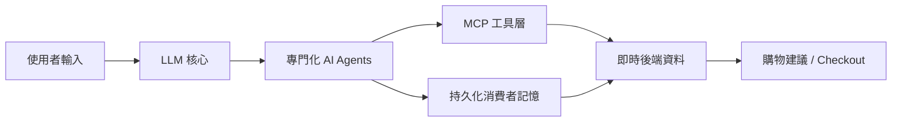

# AI Daily Digest — 2026-07-14

<!-- pipeline-generated:begin -->

## 🔥 今日 TOP 3
### 1. DoorDash AI 購物助手轉換率+24%
DoorDash 公開其「Ask DoorDash」購物助手架構，結合 LLM、專門化 AI agents、MCP 工具層，以及含持久化消費者記憶並串接即時後端資料的智能層。

實測顯示 checkout 轉換率提升 24%、購物籃平均金額增加 17%，證明多層次系統優於單一 LLM 的商業級落地效果，對消費電商應用具直接參考價值，尤其是記憶驅動的意圖理解能力最為關鍵。

下一步值得觀察持久化記憶如何與即時後端資料協同運作以提升準確度；讀者可用此架構評估自家產品是否該從單一聊天機器人升級為 agent + MCP + memory 的複合系統。

📖 [閱讀完整 insight](../10-insights/2026-07-13/inbox_b7a8dbac.md) · 🔗 [原文連結](https://www.infoq.com/news/2026/07/doordash-ai-ask-assistant/?utm_campaign=infoq_content&utm_source=infoq&utm_medium=feed&utm_term=global)
### 2. Grok CLI 外洩用戶整個主目錄
Grok CLI 被揭露存在重大安全漏洞，會將使用者整個主目錄不當上傳至 Google Cloud Storage，事件經 Twitter/X 披露並由 XCancel 存檔。

外洩內容包含密鑰、環境變數、設定檔與個人文件等高度敏感資料，影響所有曾使用該工具的使用者；此事件凸顯 CLI 工具在檔案存取權限與資料上傳邏輯上普遍缺乏安全審查的系統性風險，用戶隱私暴露程度遠超一般漏洞事件。

讀者若曾安裝或執行過 Grok CLI，應立即檢查主目錄是否含有洩露痕跡、輪換所有可能暴露的密鑰與 token，並在安裝任何具檔案系統存取權的 CLI 工具前，養成檢視其網路請求與上傳行為的習慣。

📖 [閱讀完整 insight](../10-insights/2026-07-13/inbox_423717fb.md) · 🔗 [原文連結](https://twitter.com/a_green_being/status/2076598897779020159)
### 3. 直覺編碼在最後 20% 大量翻車
一篇基於 70 次端到端代理運行、跨 6 個生產專案的實證研究指出，依賴 AI 直覺而缺乏明確規格的「vibe coding」能快速完成前 80% 功能，但邊界情況與異常處理會讓後段失敗率急遽攀升，甚至趨近 100%。

這對大量仰賴 Claude Code、Cursor 等工具進行「氛圍式」開發的個人與團隊意義重大——問題根源不是模型能力不足，而是規格缺失導致邊界不清；忽視這道門檻容易讓專案在收尾階段大量返工。

文章提出的「直覺原型 → 規格明確化 → 逐步實現 → 邊界測試」流程可直接套用：明天開始新專案時，前 80% 可放心用直覺推進，但進入收尾階段前務必先補齊規格與邊界測試清單再繼續。

📖 [閱讀完整 insight](../10-insights/2026-07-13/inbox_2c779bd6.md) · 🔗 [原文連結](https://medium.com/@kojott/vibe-coding-gets-you-to-80-then-it-falls-apart-da0e0751f15d?source=rss------claude-5)

## 📖 好文章 / 影片精選

_過去 30 天經 traffic 沉澱的高品質內容，按興趣領域分類。每篇只在 column 出現一次。_
### 🛠 工具版本追蹤 / Release
- **claude-code** · **[v2.1.208](../10-insights/2026-07-14/inbox_5d52eace.md)**
  Claude Code v2.1.208發布，包含多項新功能和修復。新增screen reader模式支援無障礙使用（--ax-screen-reader或CLAUDE_AX_SCREEN_READER=1）、vim insert mode快捷鍵映射、CLAUDE_CODE_PROCESS_WRAPPER企業安全防護。工具池緩存優化實現7倍加速（高工具數場景
- **ruflo** · **[v3.26.1 — Windows statusline hotfix](../10-insights/2026-07-13/inbox_cc7bef6a.md)**
  Ruflo v3.26.1 緊急修復 Windows 用戶的 statusline 顯示問題——狀態列只顯示 2 行且 intelligence percentage 卡在 0%。根本原因：代碼重複加上 `2>/dev/null` 重定向，但 Node execSync 本身已透過 stdio: ['pipe','pipe','pipe'] 自動捕獲 std
  _+ 1 個近期版本（v3.26.0，僅顯示最新）_
- **claude-mem** · **[v13.11.0](../10-insights/2026-07-13/inbox_d75ce0a0.md)**
  Claude Memory (claude-mem) v13.11.0 退役獨立的 cloud-sync.mjs daemon，改採 worker 內建同步機制——每次本地寫入觸發背景 flusher（1.5 秒防抖合併連續寫入），分頁刷新至 cmem.ai（200 行/2MB 單頁、30 秒逾時、指數退避重試）。新增 GET /api/sync/statu
### 📚 AI 知識管理
- **medium-tag-llm** · **[From Retrieval to Reliability: Building Trust in Enterprise RAG Systems](../10-insights/2026-07-10/inbox_05e1d133.md)**
  Medium 文章，作者 Chitra Sharma，標題為「從檢索到可靠性：構建企業 RAG 系統的信任」。預覽提及「構建可信 AI 不止需要強大的語言模型，更需要可靠的檢索、嚴謹的評估與透明度」。完整內容未提供，無法得知企業 RAG 系統的具體信任構建方法、評估指標或可靠性驗證策略。
- **medium-towards-data-science** · **[RAG vs Fine-Tuning Explained: What They Actually Do and When to Use Each](../10-insights/2026-07-12/inbox_e332bf3a.md)**
  Towards Data Science 發表文章比較 RAG（檢索增強生成）與 Fine-Tuning 兩種 LLM 強化技術。文章主張這不是「哪個更好」的競爭問題，而是針對不同問題場景的兩種不同解決方案。但原文摘錄不完整，無法提取具體對比論據和決策框架細節。
- **medium-tag-llm** · **[Cross Encoder as a judge](../10-insights/2026-07-12/inbox_ba4836dd.md)**
  Medium 文章「Cross Encoder as a Judge」討論在 RAG 系統中如何使用 Cross Encoder 作為相關性判斷工具。作者 Chetan Chhabra 複顧 Cross Encoder 的基礎概念，並對比余弦相似度與 Cross Encoder 在檢索評估中的差異。但摘錄在論述中被截斷，無法看到完整的論證邏輯、性能對比或實施
- **medium-towards-data-science** · **[Agentic RAG: Let the Agent Search](../10-insights/2026-07-13/inbox_9e25983f.md)**
  文章介紹基於 OpenAI Agents SDK 的最小實現，將 RAG（檢索增強生成）重新設計為「搜尋-閱讀-決策」的循環模式。通過讓 agent 主動搜尋而非被動檢索，改變了傳統 RAG 的靜態流程。具體的實現細節與性能對比未在摘要中展開。
### 🏢 企業導入 AI / 團隊實踐
- **medium-towards-data-science** · **[The Three Dimensions of Custom Agentic Alignment: Purpose, Principles and Practices](../10-insights/2026-07-13/inbox_8fc78360.md)**
  文章提出企業級 agentic AI 對齐的三維框架：Purpose（企業意圖）、Principles（行為規範）、Practices（實施機制）。該框架旨在確保自主 agent 在多場景下的一致性行為，而非單一決策或單一應用。通過三維互鎖，實現從企業戰略到具體 agent 執行的對齐。具體案例與實施指南未在摘要中展開。
### 🎓 AI 使用技巧 / 心法
- **medium-towards-data-science** · **[Context Rot: Why Claude Code Sessions Decay, and How to Govern Them](../10-insights/2026-07-13/inbox_dec8ac24.md)**
  文章指出 Claude Code 長會話中存在「context rot」現象——內容衰變遠早於 token 上限觸發。作者強調這是被忽視的實務問題，並提出會話治理方法。通過主動治理而非被動等待，可以防止長會話品質無聲衰退。具體的衰變機制與治理策略細節未在摘要中展開。
### 💳 支付 / Fintech
- **substack-darren-techtalk** · **[AI 讓產品變快了,但沒有讓商業變簡單:支付產品經理重新理解 AI Native 的 7 個觀點](../10-insights/2026-07-14/inbox_5c46e307.md)**
  支付產品經理分享 2026 上半年集成 AI 到支付產品全鏈路（開發、市場進入、運營）的實踐經驗。核心洞察是：AI 能讓產品變快，但無法直接簡化商業邏輯複雜度。真正的瓶頸不在技術執行力，而在於場景識別、決策判斷與生態信任三個維度。標題承諾『7 個觀點重新理解 AI Native』，反映 AI 賦能商業遠複雜於純技術速度。（原文摘要編碼部分損壞，核心論述基於語
### 🔐 AI 安全 / 濫用
- **hackernews** · **[GhostLock, a stack-UAF that has existed in all Linux distributions for 15 years](../10-insights/2026-07-08/inbox_bf8328b4.md)**
  GhostLock 是一個 Use-After-Free（UAF）棧記憶體漏洞，已存在於所有主流 Linux 發行版超過 15 年。該漏洞允許攻擊者訪問已釋放的記憶體區域，可能導致信息洩露或代碼執行。該研究由 Nebulon Security 完成，納入其 ionstack 安全分析項目。這一發現揭示了在廣泛部署的 Linux 系統中，現有安全審計和防護機制
### 🛤️ AI Flow 導入心得 / 技術分享
- **infoq-main** · **[How DoorDash Built an AI Shopping Assistant That Doesn’t Rely on the LLM Alone](../10-insights/2026-07-13/inbox_b7a8dbac.md)**
  DoorDash 揭露其 Ask DoorDash AI 購物助手的架構設計，結合 LLM、專門化 AI agents、MCP 工具層和智能層（含持久化消費者記憶與即時後端資料），驗證了多層次系統優於單一 LLM 的模式。實際部署結果顯示 checkout 轉換率提升 24%、購物籃平均金額增加 17%，並通過記憶驅動的會話改善意圖準確度。此案例展示了如何透
- **medium-tag-claude** · **[Vibe Coding Gets You to 80%. Then It Falls Apart.](../10-insights/2026-07-13/inbox_2c779bd6.md)**
  基於 70 次端到端代理運行、跨 6 個生產專案的實證數據，作者揭示了「半直覺編碼」（vibe coding）的效能天花板：這種依賴 AI 直覺而缺乏明確規格的方式能快速完成前 80% 的功能。但剩餘 20% 的邊界情況、異常處理和細節實現會導致失敗率急劇上升，甚至接近 100%。根本問題不在 AI 能力，而在規格缺失造成邊界不清。從直覺過渡到可靠需要明確的
- **medium-tag-claude** · **[I Let v0 Design My App and Claude Code Build It. Here’s the Division of Labor That Actually Works](../10-insights/2026-07-13/inbox_eefb0cd7.md)**
  在開發視頻訪談應用時，作者嘗試了 Vercel v0 設計工具與 Claude Code 的協作模式。v0 在設計錄製屏幕 UI 時達到了最大上下文限制，揭示了一個重要的分工邊界：v0 擅長快速生成 UI 設計和組件原型，但上下文容量的物理限制制約了其在大型或複雜設計中的應用。Claude Code 在接手後，能夠處理業務邏輯、狀態管理和多組件間的集成，而不
- **substack-lennys-newsletter** · **[This solo builder runs 24/7 local AI on his own hardware | Alex Finn](../10-insights/2026-07-13/inbox_41cffbbd.md)**
  獨立開發者 Alex Finn 透過 5 台本地電腦組成的 AI 系統實現 24/7 自動化運行，利用 Claude Code 的 build-and-review 迴圈在睡眠期間自動交付功能。該方案提供無限制的本地計算能力，相比 $20/月訂閱提供更高價值。案例展示本地 AI 基礎設施支持高度自動化工作流的可行性，打破了純雲端或訂閱模式的依賴。

## 💡 今日 Takeaway

_讀完今日所有內容後，可帶走的知識點_
### 1. 直覺編碼在 80% 進度後失敗率骤升
根據 70 次代理運行、跨 6 個生產專案的實證分析，缺乏明確規格的直覺編碼能快速完成前 80% 功能，但邊界情況與異常處理會讓後 20% 的失敗率急遽攀升。可行做法是採用「直覺原型 → 規格明確化 → 逐步實現 → 邊界測試」四步流程，把直覺速度與規格可靠性結合起來。

_類型：pattern_

**參考來源**：
- [Vibe Coding Gets You to 80%. Then It Falls Apart.](../10-insights/2026-07-13/inbox_2c779bd6.md) · [原文](https://medium.com/@kojott/vibe-coding-gets-you-to-80-then-it-falls-apart-da0e0751f15d?source=rss------claude-5)
### 2. 軟體工程的難點是規格定義，不是邏輯實作
寫出迴圈或函式邏輯往往只需幾分鐘，真正耗時的是把模糊需求轉化成機器可依循、可驗證的具體規格。這個原則適用於任何開發情境：與其急著寫程式，不如先把「什麼叫做好」定義清楚，再進入實作。

_類型：pattern_

**參考來源**：
- [The Loop Was Never the Hard Part](../10-insights/2026-07-13/inbox_20fc442d.md) · [原文](https://medium.com/@elliotJL/the-loop-was-never-the-hard-part-5bdd4352acab?source=rss------claude-5)
### 3. 長會話品質衰退早於 token 上限觸發
Claude Code 等長會話工具的內容品質會在達到 token 上限前就悄悄衰退，這種「context rot」若不主動治理容易被忽略。實務上應建立檢查點或會話分段機制，定期驗證早期上下文是否仍被正確理解，而非被動等到輸出明顯失準才處理。

_類型：pattern_

**參考來源**：
- [Context Rot: Why Claude Code Sessions Decay, and How to Govern Them](../10-insights/2026-07-13/inbox_dec8ac24.md) · [原文](https://towardsdatascience.com/governed-context-managing-context-rot-in-claude-code/)
### 4. Windows CLI 別假設 POSIX 路徑存在
在 Windows cmd.exe 上寫死 /dev/null 之類的 POSIX 路徑會讓子行程呼叫無聲失敗並回退到預設值，因為該路徑根本不存在。若執行函式（如 Node execSync）已內建 stdio 管道捕獲輸出，就不需額外手動重定向；這個坑在任何要支援跨平台 CLI 的專案都可能踩到。

_類型：technique_

**參考來源**：
- [v3.26.1 — Windows statusline hotfix](../10-insights/2026-07-13/inbox_cc7bef6a.md) · [原文](https://github.com/ruvnet/ruflo/releases/tag/v3.26.1)
### 5. 統計方法不變，但應用脈絡決定一切
學術建模解釋人們為何參與（why），業界建模預測誰會參與（who），兩者底層統計方法幾乎相同，但假設、資料特性與部署目標的差異會導致實踐方式截然不同。將學術方法搬進業界時，真正的挑戰在於脈絡轉化的工程細節，而非統計方法本身的創新。

_類型：pattern_

**參考來源**：
- [Building Models in Two Worlds: From Latent Constructs to Behavioral Signals](../10-insights/2026-07-13/inbox_20ecbf0e.md) · [原文](https://towardsdatascience.com/building-models-in-two-worlds-from-latent-constructs-to-behavioral-signals/)

<!-- pipeline-generated:end -->

<!-- user-notes -->
<!-- Write your own notes below; pipeline never touches this section. -->