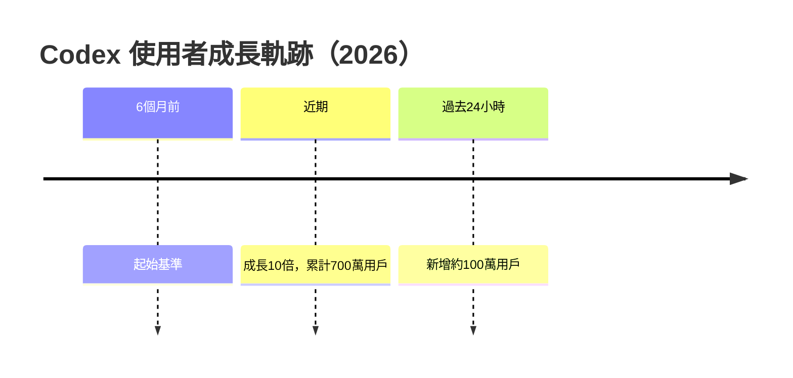

# AI Daily Digest — 2026-07-15

<!-- pipeline-generated:begin -->

## 🔥 今日 TOP 3
### 1. Codex 用戶暴增：6個月成長10倍
Latent Space 報導，OpenAI Codex 過去六個月使用量成長超過 10 倍，用戶數達 700 萬，光是過去 24 小時就新增約 100 萬用戶，顯示成長速度持續加速。



這波爆發凸顯 AI coding agent 市場競爭白熱化，文章並暗示對比之下 Claude Code 近期報告相對沉寂，顯示開發者工具的市場份額可能正快速位移。

明天可留意 Claude Code 是否推出對應功能更新以拉回關注度，並觀察兩大陣營未來幾週的發版頻率與功能路線圖差異，作為團隊工具選型的參考依據。

📖 [閱讀完整 insight](../10-insights/2026-07-14/inbox_e77524e1.md) · 🔗 [原文連結](https://www.latent.space/p/ainews-codex-usage-up-10x-in-6-months)
### 2. AI工程新階段：圍繞Agent設計系統
Latent Space 在 AI Engineering World's Fair 2026 觀察到，業界正從「用 agents 構建系統」轉向「圍繞 agents 設計系統」，agent 不再是嵌入式工具，而成為系統拓撲、通訊模式與狀態管理的核心設計原語。

```mermaid
graph LR
    subgraph 舊範式：用Agent構建
    A[應用系統] --> B[呼叫Agent工具]
    end
    subgraph 新範式：圍繞Agent設計
    C[Agent核心原語] --> D[系統拓撲]
    C --> E[通訊模式]
    C --> F[狀態管理]
    end
```

這代表 agentic 系統方法論已從探索階段邁入成熟的架構設計階段，對正規劃下一代 AI 產品的團隊而言，意味著系統設計思維必須升級，不能再把 agent 當成插入既有架構的黑盒工具。

下一步可檢視現有系統是否仍以「呼叫 agent」的舊思維設計，並參考 Google Genkit 新發布的 Agents API（detached turns、human-in-the-loop）作為以 agent 為中心的實作範例。

📖 [閱讀完整 insight](../10-insights/2026-07-14/inbox_06c3a0d1.md) · 🔗 [原文連結](https://www.latent.space/p/aiewf26trends)
### 3. Context Store：AI協作代碼演進安全網
論文指出 AI 能加速完成開發前 80% 工作，卻可能隱匿架構複雜性後患；作者提出 Context Store 模式，將規格、SDD、TDD 與自動化健身函數統一為 repo 內知識庫，作為 AI agent 與人類 reviewer 共同理解系統的基礎。

這個框架把開發心態從「AI 吞吐量優先」轉向「系統架構理解優先」，正面回應業界對 AI 生成代碼快速演進卻失控的普遍焦慮，特別適合長期維護、多人協作的專案。

團隊導入 AI coding agent 前，可先評估是否已建立類似的規格與健身函數知識庫，作為 agent 產出代碼的驗證錨點，而非事後才補文檔。

📖 [閱讀完整 insight](../10-insights/2026-07-14/inbox_4157e9d5.md) · 🔗 [原文連結](https://www.infoq.com/articles/ai-speed-context-store-architecture/?utm_campaign=infoq_content&utm_source=infoq&utm_medium=feed&utm_term=global)

## 📖 好文章 / 影片精選

_過去 30 天經 traffic 沉澱的高品質內容，按興趣領域分類。每篇只在 column 出現一次。_
### 🛠 工具版本追蹤 / Release
- **claude-code** · **[v2.1.210](../10-insights/2026-07-14/inbox_ef1a85c1.md)**
  Claude Code v2.1.210 版本發布，聚焦於隔離性、安全性和穩定性修復。最關鍵的修復是 worktree subagents 隔離漏洞—此前 subagents 能對主倉庫運行 git-mutating 命令，現已限制在各自的 worktree 內。第二個重要安全修復是 ultracode keyword opt-in 在非人工輸入（webho
  _+ 1 個近期版本（v2.1.209，僅顯示最新）_
- **ruflo** · **[v3.30.2 — doctor memory functional checks (#2677 checks 1-3)](../10-insights/2026-07-14/inbox_28502648.md)**
  Ruflo v3.30.2 發佈（修復版本），核心改進是升級 `ruflo doctor --component memory` 的檢查機制。之前版本僅執行表面檢查（existsSync + statSync），無法偵測真實問題——甚至在 DB 99.97% 空白或 SQLite 損壞時仍報告 PASS（@stuinfla 的 81 家店報告）。新版本新增三
  _+ 5 個近期版本（v3.30.1 → v3.27.0，僅顯示最新）_
### 📚 AI 知識管理
- **medium-tag-claude** · **[I Built an AI Second Brain That Actually Remembers Everything](../10-insights/2026-07-14/inbox_24e701d8.md)**
  本文介紹一個具備持久記憶（persistent memory）的 AI「第二大腦」系統。傳統 AI 對話每次都從零開始，無法跨對話保留上下文和知識。持久記憶模式打破此限制，讓 AI 保留使用者的歷史互動、偏好和專案知識，降低每次對話的重複成本。作者認為這是 2026 年最大的生產力突破，推動 AI 從臨時工具演進為可信賴的長期知識夥伴。
### 🏢 企業導入 AI / 團隊實踐
- **openai-blog** · **[How to manage AI investments in the agentic era](../10-insights/2026-07-14/inbox_846e2c24.md)**
  OpenAI 發布企業 AI 投資管理指南，針對 agentic era 時代提出策略框架。核心建議是衡量「每美元的有用工作」（useful work per dollar）作為 KPI 而非單純 token 消耗，並通過提高效率和擴大高價值工作流來優化 AI 支出。該指南幫助企業在 agent 技術普及時代做出更聰明的投資決策。
### 🎓 AI 使用技巧 / 心法
- **medium-tag-llm** · **[Prompt Caching Is a Layout Discipline, Not a Feature Flag](../10-insights/2026-07-14/inbox_941985e6.md)**
  本文重新界定了 prompt caching 的本質——它不只是一個功能開關（feature flag），而是一種涉及 prompt 結構設計的系統性紀律。文章強調通過合理的 prompt 組織方式，開發者可以同時降低 LLM 成本和推理延遲。然而作者警示，不當的 caching 策略（如在錯誤的位置應用緩存）可能反而增加成本。這啟示 prompt cach
- **medium-tag-claude** · **[Claude Loops 2: Context Is the Hidden Loop](../10-insights/2026-07-14/inbox_39916390.md)**
  本文探討 Claude 長時間會話中性能衰退的根本原因，核心論點為「context 是隱藏的 loop」。隨著對話長度增加，Claude Code sessions 的品質逐漸下降，成為長會話 agent 系統的核心瓶頸。文章提出四層管理策略應對此問題：memory 管理、context compacting、清除冗餘段落、以及透過 subagents 分流
- **medium-tag-claude** · **[How to Connect Claude to My Database (2026 Guide)](../10-insights/2026-07-14/inbox_bc47e918.md)**
  本文為 2026 年實務指南，說明如何讓 Claude 直接連接到數據庫而避免重複手動貼上 CSV 的低效做法。文章核心建議是透過某種集成方式（推測為 API 或 MCP 機制）提供即時數據存取，讓 Claude 能直接查詢活數據。這種做法大幅提升涉及數據檢索、報表生成、分析密集型工作流的效率。對於需要 Claude 頻繁與數據互動的用戶有實務指導意義。
- **infoq-main** · **[Article: Comprehension at AI Speed: Building a Context Store for Evolutionary Architecture](../10-insights/2026-07-14/inbox_4157e9d5.md)**
  論文指出 AI 加速開發前80%但隱匿架構複雜性後患。提出 Context Store 模式——統一規格錨定、SDD、TDD 與自動化健身函數的知識倉庫——作為 AI 代理與人類 reviewer 安全協作進化程式碼的基礎。該架構以「系統理解」取代「吞吐量優先」，解決 AI 開發的根本風險：過快演進而失控。Stella Berhe、Stephan Bragn
- **medium-tag-llm** · **[Google Just Proved Reasoning Models Know Things Instant Models Can’t Reach — And That’s a Problem](../10-insights/2026-07-11/inbox_916287a9.md)**
  Google發表研究論文，科學驗證了推理模型（reasoning models）掌握快速推理模型（instant models）無法達到的知識和能力。該研究定量揭示了「思考型」模型與快速廉價模型間的知識差異本質，這對模型選型和應用架構設計有重要指導。論文發現推理過程本身賦予模型存取更深層知識的能力，這並非單純的縮放效應。該發現提示開發者在追求低成本快速回應的
### 🛤️ AI Flow 導入心得 / 技術分享
- **medium-tag-llm** · **[I Cut My AI Bill 90% With One LangGraph Dict Field](../10-insights/2026-07-14/inbox_aea73e9c.md)**
  分享通過 LangGraph 字典字段優化 API 成本的真實案例。該開發者的月度 API 帳單從 $2,800 大幅降至 $178，節省幅度達 90%。他發現六個月來一直錯誤地向 DeepSeek 發送冗長 context。通過改變數據結構、採用 LangGraph 字典字段代替長 context 傳遞，實現了成本的劇烈改善。該案例深刻展示了 contex

## 💡 今日 Takeaway

_讀完今日所有內容後，可帶走的知識點_
### 1. 預見未來≠實現未來：執行力才是關鍵
技術遠見與商業化能力是完全不同的能力組合——General Magic 早在 1990 年代就設計出智慧型手機雛形卻仍失敗，證明看到趨勢不等於能執行。評估任何「領先市場」的技術判斷時，應同時檢視團隊的執行力、成本控制與市場時機掌握，而非只看技術前瞻性。

_類型：pattern_

**參考來源**：
- [The Prophets Who Shipped Too Soon](../10-insights/2026-07-14/inbox_6a096961.md) · [原文](https://thecuriosity.substack.com/p/the-prophets-who-shipped-too-soon)
### 2. Context 管理方式直接決定 LLM API 成本
一名開發者因六個月來向 DeepSeek 傳送冗長 context，改用 LangGraph 字典字段取代長文本傳遞後，月費從 $2,800 降至 $178（降幅 90%）。整合 LLM 的系統在優化前，應先檢查 context 傳遞的資料結構是否精簡，而非只調整 prompt 內容本身。

_類型：technique_

**參考來源**：
- [I Cut My AI Bill 90% With One LangGraph Dict Field](../10-insights/2026-07-14/inbox_aea73e9c.md) · [原文](https://medium.com/@javiercollipalsaavedra/i-cut-my-ai-bill-90-with-one-langgraph-dict-field-f9a4ad6643db?source=rss------large_language_models-5)
### 3. 長 context 是隱藏的效能負債，需主動管理
隨對話長度增加，agent 系統品質會逐漸衰退，這種衰退不會立即顯現卻持續累積成本。可透過 memory 管理、context compacting、清除冗餘段落、subagents 分流四層策略分散壓力，設計長會話系統時應預先規劃這條衰減曲線。

_類型：framework_

**參考來源**：
- [Claude Loops 2: Context Is the Hidden Loop](../10-insights/2026-07-14/inbox_39916390.md) · [原文](https://pub.towardsai.net/claude-loops-2-context-is-the-hidden-loop-417c6d646807?source=rss------claude-5)
### 4. 用『每美元有用工作』取代 token 消耗當 KPI
衡量 AI 投資成效時，單純看 token 用量會誤導決策；應改用「每美元產出的有用工作量」作為核心指標，聚焦效率提升與高價值工作流擴展。這個框架適用於任何評估 agentic AI 系統 ROI 的場景，不限於特定廠商工具。

_類型：framework_

**參考來源**：
- [How to manage AI investments in the agentic era](../10-insights/2026-07-14/inbox_846e2c24.md) · [原文](https://openai.com/index/managing-ai-investments-in-agentic-era)
### 5. Prompt caching 是架構紀律，不是功能開關
Prompt caching 的效益取決於 prompt 結構設計是否合理，而非單純開啟某個設定；錯誤的快取位置反而會提高成本。導入前應先理解底層成本模型，透過刻意的 prompt 組織方式同時降低 token 成本與推理延遲。

_類型：framework_

**參考來源**：
- [Prompt Caching Is a Layout Discipline, Not a Feature Flag](../10-insights/2026-07-14/inbox_941985e6.md) · [原文](https://medium.com/@srivatsa4123/prompt-caching-is-a-layout-discipline-not-a-feature-flag-0684c48feed1?source=rss------large_language_models-5)

<!-- pipeline-generated:end -->

<!-- user-notes -->
<!-- Write your own notes below; pipeline never touches this section. -->