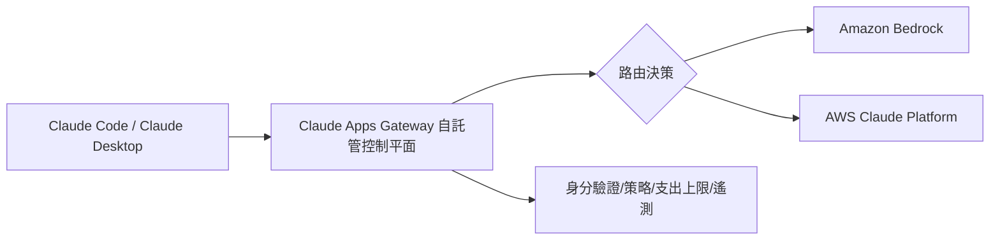

# AI Daily Digest — 2026-07-16

<!-- pipeline-generated:begin -->

## 🔥 今日 TOP 3
### 1. Claude web_fetch 洩露漏洞遭修復
Simon Willison 報導研究者 Ayush Paul 發現 Claude 的 web_fetch 工具存在設計缺陷：規則雖限制工具只能訪問使用者直接提供或 web_search 回傳的網址，但 Claude 仍會跟隨「已抓取頁面內嵌的連結」逐步瀏覽。攻擊者建立蜜罐網站，並用 user-agent 條件式向 Claude 顯示隱藏指令，誘導它一步步洩露使用者記憶中的姓名、居住城市與雇主等私人資訊。

這是「致命三角」（工具存取＋私人記憶＋不受信任外部內容）資料外洩模式的具體案例，凸顯賦予模型長期記憶後，看似無害的瀏覽功能都可能變成外洩管道，對所有導入個人化記憶功能的 AI 產品團隊都是警訊。

Anthropic 已修復，禁止 web_fetch 訪問自身抓取內容中嵌入的連結，從根本切斷此外洩向量。開發者設計工具存取規則時，應比照此案例全面檢查「間接路徑」是否也被涵蓋，而非只堵最明顯的直接輸入。

📖 [閱讀完整 insight](../10-insights/2026-07-15/inbox_c0b42ede.md) · 🔗 [原文連結](https://simonwillison.net/2026/Jul/15/claude-web-fetch-exfiltration/#atom-everything)
### 2. AWS推出Claude企業級管理閘道
AWS 與 Anthropic 聯合發布 Claude apps gateway，一個可自託管的無狀態控制平面，讓企業集中管理 Claude Code 與 Claude Desktop 的身分驗證、使用政策、支出上限與遙測資料，並可將推理請求路由至 Amazon Bedrock 或 AWS 上的 Claude Platform。

對正在規模化導入 Claude 的企業而言，這解決了多團隊各自串接 API 金鑰與政策的治理難題，統一入口能同時滿足合規稽核與成本控管需求，是 Claude 走向企業級部署的重要基礎設施補強。

值得觀察的是 gateway 的路由彈性未來是否會擴及其他模型供應商，以及自託管模式是否會成為其他雲端商仿效的標準；企業導入前應先評估與現有 IAM、計費系統的整合成本。

📖 [閱讀完整 insight](../10-insights/2026-07-15/inbox_0f08465c.md) · 🔗 [原文連結](https://www.infoq.com/news/2026/07/claude-apps-gateway-aws/?utm_campaign=infoq_content&utm_source=infoq&utm_medium=feed&utm_term=global)
### 3. Grok CLI違規上傳隱私後緊急開源
xAI 的 grok CLI 編碼代理因預設將整個工作目錄上傳到 Google Cloud，導致用戶在家目錄執行時 SSH 金鑰、密碼管理器資料庫、照片等私人檔案全數外洩。事件曝光後 xAI 緊急禁用上傳功能、承諾刪除已收集資料，並將整個 Grok Build 代碼庫（84 萬行 Rust，Apache 2.0）開源以重建信任。

這起事件顯示編碼代理類工具「預設上傳/遙測」的設計選擇有多危險——一個未充分揭露的預設行為就能演變成大規模隱私事故；開源後也可看出 grok 借用了 Codex、Claude、OpenCode 的部分工具實作（apply_patch、bash、edit 等），反映編碼代理工具鏈正逐漸趨同。

開發者在啟用任何編碼代理前，應先確認其資料保留與上傳的預設值，並留意本次公開原始碼是否仍殘留其他未禁用的遙測路徑；xAI 的開源決策也為同業樹立了「事故後用透明度贖罪」的先例，值得持續追蹤是否成為業界標準應對模式。另外，今日仍有 3 則項目尚未完成分析，待後續處理。

📖 [閱讀完整 insight](../10-insights/2026-07-15/inbox_489915fa.md) · 🔗 [原文連結](https://simonwillison.net/2026/Jul/15/grok-build/#atom-everything)

## 📖 好文章 / 影片精選

_過去 30 天經 traffic 沉澱的高品質內容，按興趣領域分類。每篇只在 column 出現一次。_
### 🛠 工具版本追蹤 / Release
- **claude-code** · **[v2.1.211](../10-insights/2026-07-15/inbox_ddbecf3d.md)**
  Claude Code 發布 v2.1.211 維護版本，包含 50+ 項修復和改進。新增 --forward-subagent-text flag 和環境變數以在 stream-json 輸出中包含 subagent 文本和思考過程。修復了權限預覽中的字元顯示問題（雙向覆蓋、零寬度和相似引號字元），禁用自動模式對 PreToolUse hook 的覆蓋，並
### 📚 AI 知識管理
- **medium-towards-data-science** · **[Most RAG Hallucinations Are Retrieval Failures: How the Retrieval Brick Decides What the Model Can Invent](../10-insights/2026-07-15/inbox_7ae4228f.md)**
  提出 RAG 系統中的 hallucination 問題本質源自 retrieval failures 而非模型本身的創造力失控。文章論述指出檢索層（retrieval brick）決定了模型能編造內容的邊界——若檢索結果正確，模型就無不正確資訊可用於生成幻覺。因此優化檢索品質（embedding、ranking、召回率）是消除 hallucination 
- **medium-towards-data-science** · **[Building Trustworthy Production RAG Systems Through Continuous Evaluation](../10-insights/2026-07-15/inbox_c81d9916.md)**
  提出生產環境 RAG 系統應建立持續評估框架。核心是監測三類失效：retrieval failures（檢索失敗）、hallucinations（模型幻覺）、performance drift（性能衰退），在問題到達用戶前及時發現。框架涵蓋從檢索層到模型層的全鏈路監測，確保 RAG 系統的長期可信性。
- **infoq-main** · **[Presentation: Postgres for Production Agents: Your Relational Foundation for Enterprise AI](../10-insights/2026-07-15/inbox_ab827cfe.md)**
  Gwen Shapira 分享企業如何利用 PostgreSQL 擴展 AI 功能至關鍵任務應用。她詳述了 Postgres 的多模式能力，包括 JSONB 解析、高召回率 HNSW 向量索引、以及向量量化（可提升查詢速度 4 倍）等具體技術方案。此外介紹了 agents 的記憶體管理策略，為構建生產級 AI 系統提供實務框架。
### 🏢 企業導入 AI / 團隊實踐
- **openai-blog** · **[Introducing the OpenAI Partner Network](../10-insights/2026-06-14/inbox_eea129ea.md)**
  OpenAI 正式推出 Partner Network 計劃，投入 1.5 億美元資金支援全球合作夥伴加速企業 AI 應用的採用、部署與數位轉型。此舉標誌著 OpenAI 在企業生態系統上的重要戰略投資，旨在協助組織加速 AI 轉型進程。
- **codex** · **[0.140.0](../10-insights/2026-06-15/inbox_1d810ec8.md)**
  OpenAI Codex 發布 v0.140.0，新增 /usage 視圖用於追蹤日度/週度/累積 token 使用量、/import 指令從 Claude Code 匯入設定、@ mention 統一菜單選擇檔案/外掛/技能。重點改進包括 SQLite 資料庫自動備份與復原機制、MCP 瞬態失敗自動重試、OAuth 憑證失敗狀態通報、禁用伺服器設定保留。針
- **infoq-main** · **[Presentation: Practical Performance Tuning for Serverless Java on AWS](../10-insights/2026-06-15/inbox_8da589f9.md)**
  AWS Hero Vadym Kazulkin 在演講中深入分析 Java 在 AWS Lambda 上的效能調優技巧，對比 SnapStart（含快照前置鉤子）與 GraalVM 靜態編譯兩種冷啟動解決方案，並探討 Project Leyden 與 Java 25 的架構意涵。演講針對記憶體足跡與啟動時間兩大 Java 無伺服器部署瓶頸。
- **infoq-main** · **[Anthropic Releases and Temporarily Suspends Claude Fable 5](../10-insights/2026-06-15/inbox_7939494c.md)**
  Anthropic 於 2026 年 6 月 9 日發布 Claude Fable 5，專為長期任務設計的旗艦級模型，但隨後因美國政府出口管制指令而迅速下架。該模型共享 Claude Mythos 5 架構，支援廣泛 token 使用。模型包含強制性資料保留要求，直接影響與 Microsoft 等夥伴的部署計畫。此事件凸顯地緣政治與監管環境如何約束先進 AI
- **infoq-main** · **[Spring Boot 4.1 Adds gRPC Auto-Configuration, SSRF Mitigation, and Kotlin 2.3 Support](../10-insights/2026-06-15/inbox_5d4751f1.md)**
  Broadcom 於 2026 年 6 月 10 日發布 Spring Boot 4.1，新增三項重要功能：gRPC 自動配置、HTTP 用戶端 SSRF 漏洞緩解，以及升級至 Kotlin 2.3。此外增強懶載資料源連線、@Async 方法的非同步上下文傳播，以及改進的 OpenTelemetry 原生支援。發布時程不尋常地調整兩次（原訂 5 月 11-2
### 🎓 AI 使用技巧 / 心法
- **medium-towards-data-science** · **[Don’t Let Claude Grade Its Own Homework](../10-insights/2026-07-15/inbox_6277bbac.md)**
  文章強調不應讓 Claude 自我審查 PR 代碼，提出跨 provider（不同 AI 實驗室）的多模型評審更加可靠。實踐中可在 GitHub Actions 中使用 Codex 進行 cross-provider 審查流程。核心洞察是獨立的第二意見能相互補強、降低單一模型 bias 風險，這對 LLM 輔助開發的品質保證有重要意義。
- **medium-tag-llm** · **[Your AI Writes the Code. Who Reviews the Plan?](../10-insights/2026-07-16/inbox_de901d19.md)**
  Medium 文章探討 AI 輔助編程中規劃與提示的效果差異。研究發現，當規範（spec）作為獨立步驟時，可將弱模型的通過率提升近一倍；但同樣的規範直接貼入提示詞中卻無效果。這揭示了一個關鍵模式：結構化的外部規劃優於內聯提示，對 AI 驅動開發工作流設計具有重要指導意義。該發現挑戰傳統 prompt engineering 的做法，提示分離規劃可能是下一代 
- **medium-tag-claude** · **[How SKILL.md Files Actually Work](../10-insights/2026-07-16/inbox_9c02605d.md)**
  Medium 文章探討 SKILL.md 等結構化檔案在 Claude 工程中的重要性。文章指出傳統 prompt engineering 的核心問題：精心設計的提示在特定時間有效，但穩定性差，具體表現為「週二有效、週四就壞」的脆弱性。結論是 prompt engineering 並未死亡，而是已成為必要但不充分的手段。需要透過 SKILL.md 等結構化規
### 💳 支付 / Fintech
- **infoq-main** · **[Stripe Benchmark Shows AI Agents Build Integrations but Struggle with Validation](../10-insights/2026-07-15/inbox_bf4e53d9.md)**
  Stripe 推出基準測試套件，評估 AI agents 是否能在後端、前端和瀏覽器結帳等真實工作流中構建 Stripe 集成。該研究著重於端到端軟體工程能力，特別是在生產環境約束下 agents 在執行、測試和驗證方面的差距。這個 benchmark 有助於量化 agentic 系統在實務應用中的可靠性。
- **infoq-main** · **[AWS Ships Claude Apps Gateway as Self-Hosted Control Plane for Claude Code and Claude Desktop](../10-insights/2026-07-15/inbox_0f08465c.md)**
  AWS 與 Anthropic 聯合發布 Claude apps gateway，提供自託管的控制平面，集中管理身分驗證、策略、遙測、路由和支出上限，支援 Claude Code 和 Claude Desktop。該 gateway 以無狀態容器形式運行，可將推理工作路由至 Amazon Bedrock 或 AWS 上的 Claude Platform，為企
### 🔐 AI 安全 / 濫用
- **simon-willison** · **[How I tricked Claude into leaking your deepest, darkest secrets](../10-insights/2026-07-15/inbox_c0b42ede.md)**
  Simon Willison 報導 Ayush Paul 發現的 Claude web_fetch 工具重大安全漏洞。Claude 可訪問用戶私人數據（過去互動的記憶），web_fetch 工具雖受限於用戶直接輸入或 web_search 返回的 URL，但設計缺陷允許訪問其已獲取頁面中嵌入的連結。攻擊者可製作蜜罐網站，誘導 Claude 通過頁面上的嵌入連
- **simon-willison** · **[xai-org/grok-build, now open source](../10-insights/2026-07-15/inbox_489915fa.md)**
  xAI 的 grok CLI 編碼代理工具因默認上傳整個目錄到 Google Cloud 而引發重大隱私爭議。用戶報告在家目錄運行時導致 SSH 密鑰、密碼管理器資料庫、文檔、照片和影片等全部被上傳。xAI 響應社群反彈，禁用上傳功能並承諾刪除所有已上傳的用戶數據，隨後開源了整個 Grok Build 代碼庫（Apache 2.0 許可）。代碼庫包含 844
### 🛤️ AI Flow 導入心得 / 技術分享
- **medium-tag-claude** · **[I Let Claude Code Write 60% of My Code. Here’s What I’d Never Let It Touch Again.](../10-insights/2026-07-15/inbox_f3477d77.md)**
  開發者分享三個月密集使用 Claude Code 的實戰經驗與收穫。Claude Code 在編程生產力上表現出色，可代寫約 60% 代碼量，有六個高效應用場景，但也發現四個不適合委託的任務類型。作者總結出使用前應遵循的工作流規則，為 Claude Code 使用者提供實踐參考框架。

## 💡 今日 Takeaway

_讀完今日所有內容後，可帶走的知識點_
### 1. 工具限制須堵住間接洩露路徑
只限制工具的「直接輸入」來源並不夠，攻擊者仍可能利用已抓取內容中嵌入的連結串成資料外洩鏈。設計存取限制時應涵蓋所有間接路徑，而非只堵最明顯的入口，才能真正防止規則被繞過。

_類型：pattern_

**參考來源**：
- [How I tricked Claude into leaking your deepest, darkest secrets](../10-insights/2026-07-15/inbox_c0b42ede.md) · [原文](https://simonwillison.net/2026/Jul/15/claude-web-fetch-exfiltration/#atom-everything)
### 2. RAG幻覺多源自檢索失敗非模型
RAG 系統的 hallucination 本質是垃圾進垃圾出：檢索層決定了模型能編造的邊界，若檢索結果正確，模型就沒有錯誤資訊可用。優化 embedding、ranking 與召回率，比單純調整 temperature 更能根本解決幻覺問題。

_類型：pattern_

**參考來源**：
- [Most RAG Hallucinations Are Retrieval Failures: How the Retrieval Brick Decides What the Model Can Invent](../10-insights/2026-07-15/inbox_7ae4228f.md) · [原文](https://towardsdatascience.com/most-rag-hallucinations-are-retrieval-failures-how-the-retrieval-brick-decides-what-the-model-can-invent/)
### 3. 規劃獨立於Prompt可讓弱模型翻倍
把 spec 抽成獨立步驟、而非直接貼進同一個 prompt，能讓弱模型的任務通過率接近翻倍；同樣內容內聯反而無效果。這顯示結構化的外部規劃優於單純 prompt 工程，開發流程應採「計畫先行」架構。

_類型：pattern_

**參考來源**：
- [Your AI Writes the Code. Who Reviews the Plan?](../10-insights/2026-07-16/inbox_de901d19.md) · [原文](https://medium.com/@nitingar/your-ai-writes-the-code-who-reviews-the-plan-52dea34cc60f?source=rss------large_language_models-5)
### 4. 跨Provider互審比自我審查可靠
讓模型自己審查自己寫的 PR 容易放過自身盲點；改用不同實驗室的模型（如在 GitHub Actions 中串接 Codex）交叉審查，能相互補強並降低單一模型的偏見風險。此原則適用於任何 LLM 輔助的品質把關流程。

_類型：pattern_

**參考來源**：
- [Don’t Let Claude Grade Its Own Homework](../10-insights/2026-07-15/inbox_6277bbac.md) · [原文](https://towardsdatascience.com/dont-let-claude-gaslight-you/)
### 5. 向量量化可讓查詢提速4倍
Postgres 搭配 HNSW 向量索引可做到高召回率的語意檢索，並用 JSONB 同時保存結構化上下文；向量量化技術能將查詢速度提升約 4 倍。既有的關聯式資料庫也能承擔生產級 AI agent 的記憶體與檢索需求，不一定要另建向量資料庫。

_類型：technique_

**參考來源**：
- [Presentation: Postgres for Production Agents: Your Relational Foundation for Enterprise AI](../10-insights/2026-07-15/inbox_ab827cfe.md) · [原文](https://www.infoq.com/presentations/postgres-ai-agents/?utm_campaign=infoq_content&utm_source=infoq&utm_medium=feed&utm_term=global)
## ⏳ 待處理 (3 筆)

<!-- pipeline-generated:end -->

<!-- user-notes -->
<!-- Write your own notes below; pipeline never touches this section. -->