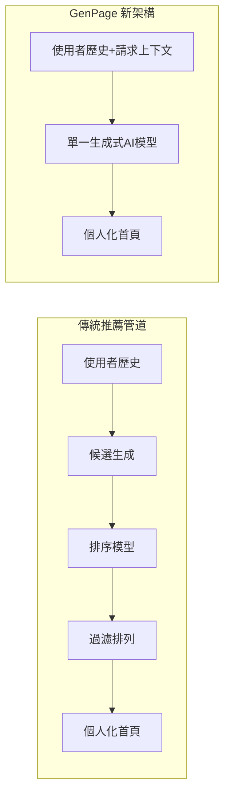

# AI Daily Digest — 2026-07-20

<!-- pipeline-generated:begin -->

## 🔥 今日 TOP 3
### 1. Google AlphaEvolve 商業化上線
Google 將 DeepMind 的 AlphaEvolve 進化式代碼優化研究正式產品化，在 Gemini Enterprise Agent Platform 推出 GA 版本，評估器於客戶端執行、代碼不離開客戶基礎設施，Klarna 等早期用戶已回報 ML 訓練吞吐量翻倍成果。

這代表 Google 把過去僅限研究論文的進化演算法搜尋能力，轉為企業可直接調用的商業服務，並以「評估器在客戶端執行」設計解決企業對代碼外洩的疑慮，是 code-optimization-as-a-service 的重要里程碑，也讓 Google 在企業 AI agent 平台上與 Anthropic、OpenAI 的差異化更明顯。

實踐者已指出限制：只有存在明確可測量評估函數（如訓練吞吐量、延遲）的場景才有效，缺乏客觀指標的任務（產品設計、內容生成）仍不適用。企業評估導入前，應先盤點自身業務是否具備可量化的評估函數。

📖 [閱讀完整 insight](../10-insights/2026-07-19/inbox_01bfda90.md) · 🔗 [原文連結](https://www.infoq.com/news/2026/07/alphaevolve-generally-available/?utm_campaign=infoq_content&utm_source=infoq&utm_medium=feed&utm_term=global)
### 2. Netflix GenPage 取代推薦管道
Netflix 開發 GenPage 系統，用單一生成式 AI 模型取代傳統多階段推薦管道（候選生成、排序、過濾、排列），輸入使用者歷史與請求上下文，一次性直接生成完整個人化首頁版面與內容。

相較過去需串接多個獨立模型的推薦系統，GenPage 同時提升使用者參與度並降低服務延遲，代表生成式 AI 應用正從「輔助決策」演進為「端到端流程替代」，在生產規模產品中直接取代複雜的傳統 ML pipeline 工程。

值得觀察的是「單一生成模型吃掉整條 pipeline」的模式能否複製到電商排序、廣告投放等其他消費互聯網場景，以及背後推論成本與延遲如何隨規模擴大而變化。

📖 [閱讀完整 insight](../10-insights/2026-07-19/inbox_2dfd5b71.md) · 🔗 [原文連結](https://www.infoq.com/news/2026/07/netflix-llm-homepage-generation/?utm_campaign=infoq_content&utm_source=infoq&utm_medium=feed&utm_term=global)
### 3. Claude M365 連接器開放寫入
Anthropic 於 2026 年 7 月 7 日將 Claude 的 Microsoft 365 連接器從唯讀模式升級為寫入模式，新增電子郵件發送與檔案編輯能力，並依「影響半徑（blast radius）」與風險程度排列出五項新能力供組織評估。

這使 Claude 從單純「讀取企業資料回答問題」躍升為可直接操作使用者信箱與文件系統的行動代理，大幅擴展其在企業工作流中的實用性，但也把 Claude 出錯或被誤導的潛在傷害半徑，從「讀錯資料」提升到「寄錯信、改錯檔」等級，對組織治理是全新考驗。

企業導入前應優先依風險排序逐項開啟權限，並建立審核與復原機制（如寄件前確認、檔案版本控管），而非一次性全開所有寫入能力；IT／安全團隊需重新評估 access control 與 audit log 覆蓋範圍。

📖 [閱讀完整 insight](../10-insights/2026-07-19/inbox_29fe9cb3.md) · 🔗 [原文連結](https://medium.com/@automation.labs/claude-can-now-send-email-in-microsoft-365-rank-these-5-powers-by-risk-9b9f13fd4d67?source=rss------claude-5)

## 📈 本週 GitHub 飆升 Top 10

_GitHub 本週新增 star 最多的專案_

### 1. [OpenCut-app/OpenCut](https://github.com/OpenCut-app/OpenCut)
⭐ +12,743 this week · 🧬 TypeScript

這是一套開源的影片剪輯工具，定位是 CapCut 的替代方案，讓使用者不用依賴特定商業剪輯 App 也能做短影音剪輯與後製。本週爆紅看來是切中了創作者對「開源、可自架、資料自主」剪輯工具的需求，畢竟短影音創作社群本身規模就很大。適合內容創作者、或想自己架設剪輯服務、對第三方 App 資料處理有疑慮的開發者。
### 2. [mattpocock/skills](https://github.com/mattpocock/skills)
⭐ +10,983 this week · 🧬 Shell

作者把自己實際在用的 AI coding agent「skills」（放在 `.agents` 目錄下的技能定義）整理成公開倉庫，讓其他工程師可以直接拿來套用到 Claude Code 之類的 agent 工作流程。本週爆紅可能是因為「skill」這種可重複使用、可分享的 agent 能力包裝方式正是近期 agentic coding 圈的熱門話題，直接拿現成範本比自己從零摸索省事很多。適合已經在用 AI coding agent、想快速補齊常用技能組合的工程師。
### 3. [Nutlope/hallmark](https://github.com/Nutlope/hallmark)
⭐ +9,193 this week · 🧬 CSS

這是一個給 Claude Code、Cursor、Codex 等 AI coding agent 使用的「設計技能」，目的是避免 AI 生成的介面出現一眼就能看穿的陳腔濫調風格（例如過度使用的漸層、圓角卡片排版）。本週爆紅可能是戳中了很多人用 AI 生成前端畫面時「長得都很像、缺乏質感」的痛點，把設計品味規則化成 agent 可以直接遵循的技能。適合用 AI agent 產出前端介面、又希望成品不要一眼被認出是 AI 做的設計師與工程師。
### 4. [Shubhamsaboo/awesome-llm-apps](https://github.com/Shubhamsaboo/awesome-llm-apps)
⭐ +6,211 this week · 🧬 Python

這個倉庫收錄了上百個可直接執行的 AI Agent 與 RAG 應用範例，強調「clone 下來就能跑、可客製化、可上線」，而不只是概念性 demo。這類即拿即用的範例集一直是開發者學習與組裝 agent 系統時的熱門起點，隨著 agent 相關工具鏈越來越成熟，這類參考價值也跟著提升。適合想快速學習或拼裝 LLM agent／RAG 應用、需要現成範例當起點的開發者。
### 5. [HKUDS/Vibe-Trading](https://github.com/HKUDS/Vibe-Trading)
⭐ +5,228 this week · 🧬 Python

這是一個把「vibe trading」概念包裝成個人交易代理人的專案，讓使用者透過 AI agent 協助進行市場分析與交易決策輔助。本週爆紅可能與 AI agent 跨入金融交易這個話題性本身就高有關，加上 HKUDS 團隊先前有多個受關注的開源專案，容易帶動流量；不過交易類工具實際成效如何我沒有把握，熱度也可能來自好奇與討論而非實際採用。適合對 AI 輔助交易策略感興趣的開發者或量化愛好者，實盤使用前建議先評估風險。
### 6. [iOfficeAI/OfficeCLI](https://github.com/iOfficeAI/OfficeCLI)
⭐ +4,269 this week · 🧬 C#

這是專為 AI agent 設計的 Office 文件操作工具，讓 agent 能直接讀寫與自動化處理 Word、Excel、PowerPoint 檔案，特色是免安裝 Office、單一執行檔、完全開源免費。本週爆紅看來是解決了 agent 在伺服器或無 GUI 環境下無法操作 Office 文件的實際痛點，這類需求隨著 AI 處理日常辦公任務越來越普遍而增加。適合想串接 AI agent 自動產製報表、簡報或文件、又沒有 Office 授權的開發團隊。
### 7. [earendil-works/pi](https://github.com/earendil-works/pi)
⭐ +2,854 this week · 🧬 TypeScript

這是一套 AI agent 工具箱，把統一的 LLM API 介面、agent 執行迴圈、終端機互動介面（TUI），以及可直接使用的 coding agent CLI 整合在一起。本週爆紅可能是因為市面上 agent 框架選擇越來越多，這種把底層元件都打包好、又保留客製彈性的輕量工具箱，對想自建 agent 而非直接用現成產品的開發者很有吸引力。適合想打造自己的 coding agent 或 agent 應用、但不想從零寫模型呼叫與迴圈邏輯的工程師。
### 8. [openinterpreter/openinterpreter](https://github.com/openinterpreter/openinterpreter)
⭐ +2,498 this week · 🧬 Rust

這是一個讓開放權重模型（例如描述中提到的 Kimi K3）也能當作 coding agent 使用的工具，用 Rust 重寫以強調執行效能與終端機操作體驗。根據近期觀察，Kimi K3 這類開放模型才剛釋出、本身話題度就不低，能讓開放模型具備 coding agent 能力，正好接上不想完全依賴封閉商用模型的開發者需求。適合重視資料自主或成本控制、想用開放模型做程式碼協作的團隊。
### 9. [HKUDS/DeepTutor](https://github.com/HKUDS/DeepTutor)
⭐ +2,375 this week · 🧬 Python

這個專案主打「終身個人化家教」，目標是打造能長期記住學習者程度與進度、持續調整教學內容的 AI 學習夥伴，並附有對應的網站服務可以體驗。本週爆紅可能一部分來自教育類 AI agent 本身就是熱門應用方向，加上同團隊 HKUDS 過去專案累積的關注度，容易在本週榜單上跟著被推高。適合想找 AI 家教做長期學習輔導的個人使用者，或對個人化教學系統設計有興趣的開發者。
### 10. [openai/codex](https://github.com/openai/codex)
⭐ +2,361 this week · 🧬 Rust

這是 OpenAI 官方推出、可在終端機裡直接使用的輕量 coding agent，讓開發者不用離開命令列就能請 AI 協助寫程式與除錯。本週爆紅可能是因為出自 OpenAI 本家，加上近期各家 agentic coding CLI（例如 Claude Code）競爭態勢升溫，官方工具的任何更新都容易被大量關注與追蹤。適合習慣在終端機工作、想要官方原生支援的 coding agent，或想比較各家 CLI coding agent 的開發者。

## 📖 好文章 / 影片精選

_過去 30 天經 traffic 沉澱的高品質內容，按興趣領域分類。每篇只在 column 出現一次。_
### 🛠 工具版本追蹤 / Release
- **claude-code** · **[v2.1.215](../10-insights/2026-07-19/inbox_fab115f0.md)**
  Claude Code v2.1.215 發布改變代理自動執行行為。舊版本中 Claude 會自動執行 /verify 和 /code-review 指令，新版本改為等待使用者明確呼叫。此改變讓使用者能夠更細粒度地控制驗證和程式碼審查流程的觸發時機，避免不必要的自動工作。
  _+ 1 個近期版本（v2.1.212，僅顯示最新）_
- **repowise** · **[vscode-v0.4.0: release(vscode): v0.4.0 (#910)](../10-insights/2026-07-18/inbox_b50762c5.md)**
  Repowise 發布 VS Code 擴展 v0.4.0，整合自 v0.27.0 以來積累的 UI 變更（graph、health、docs、C4 元件）。MIN_SERVER_VERSION 保持 0.26.0，無需新伺服器契約變更。此版本在 release checklist 新增「bundled-UI freeze trap」追蹤項目，防止未來UI整
  _+ 1 個近期版本（v0.33.0，僅顯示最新）_
- **ruflo** · **[Ruflo v3.32.4 — Meta Proxy v0.4 default install](../10-insights/2026-07-17/inbox_5d5dd15b.md)**
  Ruflo v3.32.4 穩定版釋出。整合 Meta Proxy v0.4 作為預設安裝選項（透過 ruflo proxy install --yes）。修復 @claude-flow/cli 編譯成品發布流程，防止遺失端點問題。明確解析 @claude-flow/cli@^3.32.4 版本依賴。已在隔離 Windows 環境驗證簽署的 v0.4.0 二
  _+ 1 個近期版本（v3.32.2，僅顯示最新）_
### 📚 AI 知識管理
- **medium-towards-data-science** · **[One RAG Pipeline, Four Very Different PDFs: Same Four Bricks, Every Answer Typed and Cited](../10-insights/2026-07-17/inbox_9f18af7f.md)**
  企業級文件智能系統需處理多種異質 PDF 格式，包括學術論文、NIST 標準檔案、結構破損的報告等。傳統 RAG（檢索增強生成）方案往往難以統一處理如此多元的文件格式，通常需針對不同格式進行客製化工程。本文提出一個單一 RAG 架構方案，採用標準化四層模塊化元件設計（稱為「Four Bricks」）。該架構無需對不同格式重新工程化，能夠統一處理多元的 PDF
### 🏢 企業導入 AI / 團隊實踐
- **medium-tag-claude** · **[Deploying AI at a mid-size company: honest notes from the inside](../10-insights/2026-07-18/inbox_b157530b.md)**
  中型公司實戰部署 AI 的經驗總結，涵蓋組織、成本、工程、治理四個層面。重點包括：組織需調整結構適應 AI 工作流；token 配額管理從無限轉為受控；prompt 應像代碼一樣版本化、審查、測試；AI 審計成為新的治理職能。這些實踐反映企業 AI 成熟度提升過程中的必經之路。
### 🎓 AI 使用技巧 / 心法
- **medium-tag-claude** · **[How to Reduce Token Usage on Claude Code — Measured Across 28,738 Real Requests](../10-insights/2026-07-18/inbox_fd341083.md)**
  根據對 28,738 個真實請求和 573 個實際會話的實測數據，文章揭露 Claude Code 的 token 優化真相：許多網路上流傳的省 token 方法其實是民間傳說，作者用數據推翻許多著名的優化技巧。這份實測研究對於大規模使用 Claude Code 進行成本控制具有重要參考價值，可幫助開發者識別真正有效的優化策略而非盲目跟風。
- **medium-tag-claude** · **[Onboarding Agent from Scratch. Part 4: Prompts You Can Test, Not Just Tweak](../10-insights/2026-07-19/inbox_545b788b.md)**
  該文為「從零開始的 Onboarding Agent」系列第 4 部分，重點是讓 prompt 能被測試而非僅能手工調整。第 3 階段透過強制工具使用在 prompt 中建立結構化契約：保證每次都返回 {answer, source, confidence} 的結構。這個方法利用工具使用的確定性強制 agent 遵守輸出格式，使 prompt 工程從試錯轉向
- **medium-tag-claude** · **[#3 Claude Loops: Design the Tool Loop](../10-insights/2026-07-19/inbox_f0a05885.md)**
  該文為「Claude Loops」系列第 3 部分，核心主題是工具循環設計——如何向 Claude Code 公開恰當的工具同時隱藏危險工具，並透過許可權控制讓 Claude 能自主行動而不偏離目標。文章討論工具選擇的設計原則：根據業務需求與安全考量決定工具暴露範圍，避免過度授權導致無關操作，同時保留 Claude 的決策自主性。這是構建可控且高效 AI 代
- **medium-tag-claude** · **[18 Claude Skills That Turn a Product Idea Into a Launch](../10-insights/2026-07-19/inbox_ee088035.md)**
  該文介紹將 Pragmatic Institute 的 18 項產品開發框架與最佳實踐重構為 Claude skills，展示 AI 代理如何加速從想法到產品上市的全流程。作者透過 Claude skills 實現了產品發現、需求分析、設計決策、團隊協調等關鍵階段的自動化。這反映出產品開發領域正在經歷的工作方式轉型：從手工驅動的 checklist 轉向 A
### 💳 支付 / Fintech
- **medium-towards-data-science** · **[How to Improve Customer Retention in FinTech](../10-insights/2026-07-18/inbox_bcdb7775.md)**
  Towards Data Science 發表 FinTech 客戶保留實務指南，介紹結合流失前預測評分（pre-churn scoring）與提升模型（uplift modeling）的方法論。Pre-churn scoring 用於預測個別客戶的流失風險等級，而 uplift modeling 則估計特定干預措施（如優惠、客服互動）對客戶留存的實際增幅效
### ⛓️ 區塊鏈 / Web3
- **substack-maxcryptospace** · **[🔒 2026 會員 AMA:持倉大調整+AI 工作流公開](../10-insights/2026-07-19/inbox_cfe76367.md)**
  無法生成完整摘要。Substack 文章涉及 2026 年加密市場前景、持倉調整、AI 工作流程等議題，但提供之內文為 HTML 編碼摘要片段。來源為加密貨幣／金融類 Substack，主要內容非 AI 產業聚焦。
- **substack-web3matters** · **[第 191 期](../10-insights/2026-07-20/inbox_0957a4b2.md)**
  無法生成摘要。Substack 第 191 期文章主題涉及比特幣市場波動性、加密交易所及 Web3 相關議題，不屬於 AI 產業新聞範疇。
### 🔐 AI 安全 / 濫用
- **simon-willison** · **[Quoting Thibault Sottiaux](../10-insights/2026-07-16/inbox_19aff0dd.md)**
  OpenAI Codex 在 GPT-5.6 中發現檔案刪除漏洞，由 Codex 團隊 Thibault Sottiaux 揭露。觸發條件三要素組合：(1) Full access mode 啟用，(2) 無 sandbox 保護且無 auto review，(3) Model 誤試圖 override $HOME 環境變數以定義臨時目錄。結果：Model 
- **medium-tag-claude** · **[The Kids are Using AI To Scan GitHub Repos For Private Keys (Successfully), But Leaving Their...](../10-insights/2026-07-18/inbox_67ac401a.md)**
  文章揭露一個新興的網路安全威脅：駭客和初學駭客正在利用 AI 工具自動掃描 GitHub 公開倉庫、尋找洩露的私鑰和敏感認證資料，且成功率相當高。有趣的是，這些攻擊者在進行掃描時也留下了足跡和痕跡，未能做到完全隱蔽。這個發現突出了 AI 被用作攻擊工具的現實威脅，同時也指出攻擊者因操作不當留下可追蹤的證據。
### 🛤️ AI Flow 導入心得 / 技術分享
- **medium-towards-data-science** · **[Context Engineering Isn’t Enough — A Loop Engineering Experiment With No LLM Inside the Loop](../10-insights/2026-07-17/inbox_53bc4c00.md)**
  作者構建了一個關鍵實驗來隔離控制流本身的威力：用決定論的 Python 基準取代 LLM，用簡單規則模擬執行流程。跨 300 個隨機種子測試後發現，目標導向的控制器能隔離失敗、完成線性管道永遠無法到達的分支。這是第一次用實驗方法證明迴圈架構的效能與 LLM 質量無關。作者並詳細記錄了調試過程中發現的微妙 bug，強調了嚴謹驗證的重要性。核心洞察：故障隔離是控
- **medium-towards-data-science** · **[Your AI Agent Passed Every Eval. Finance Still Killed It.](../10-insights/2026-07-19/inbox_73e0316c.md)**
  作者分享深刻的生產案例：某 AI Agent 通過評估環境的所有功能指標，卻在生產環境被財務部門叫停——因為解決問題的成本高於人工操作。這暴露了評估指標與業務可行性之間的根本落差。文章強調存在隱藏但關鍵的成本效益指標能預測 Agent 長期存活，並提供無須重構系統即可測量該指標的方法。
- **infoq-main** · **[How Netflix Built GenPage: a Single GenAI Model to Build Personalized Homepages](../10-insights/2026-07-19/inbox_2dfd5b71.md)**
  Netflix 开发 GenPage 系统，用单一生成 AI 模型直接替代传统多阶段推荐管道，生成用户个性化主页。系统输入用户历史与请求上下文作为 prompt，一次性输出完整页面布局与内容。相比原有推荐系统，GenPage 改善用户参与度（engagement）同时降低服务延迟。这体现了生成式 AI 在消费互联网产品中的新用途：从辅助决策工具演进到端到端流
- **infoq-main** · **[Presentation: From OTEL to SLMs: Distilling Frontier Model Behaviour from Production Telemetry](../10-insights/2026-07-17/inbox_898bde56.md)**
  InfoQ 收錄 Ben O'Mahony 的演講，介紹如何超越規則型檢查器，使用 OpenTelemetry 對 AI 驅動的語言伺服器協議（LSP）進行原生代碼檢測，追蹤使用者對程式碼修復的具體行動（接受、拒絕或重新生成）作為隱性訓練標籤。這些行動形成持續的數據飛輪，最終用於將前沿模型能力蒸餾到更便宜的本地小型語言模型（SLM）。該方法將產品遙測與模型優

## 💡 今日 Takeaway

_讀完今日所有內容後，可帶走的知識點_
### 1. Eval 高分不代表能上線
高評估分數不等於生產可行性，成本效益才是決定 Agent 能否長期存活的隱藏指標；上線前應建立成本效益度量，而非只看功能通過率。這個原則適用於任何要從 POC 走向生產的 AI 系統：先問「解決成本是否低於人工」，再問「準確率夠不夠」。

_類型：pattern_

**參考來源**：
- [Your AI Agent Passed Every Eval. Finance Still Killed It.](../10-insights/2026-07-19/inbox_73e0316c.md) · [原文](https://towardsdatascience.com/your-ai-agent-passed-every-eval-finance-still-killed-it/)
### 2. 用工具契約取代 Prompt 反覆調整
透過強制工具使用（tool use）讓 Agent 每次都回傳固定結構（如 answer/source/confidence），比在 prompt 裡反覆調整用詞更能穩定輸出格式。這代表 prompt engineering 可以從「試錯調整」升級為「可驗證的測試驅動開發」，架構約束永遠比文字指令更可靠。

_類型：technique_

**參考來源**：
- [Onboarding Agent from Scratch. Part 4: Prompts You Can Test, Not Just Tweak](../10-insights/2026-07-19/inbox_545b788b.md) · [原文](https://medium.com/@spodsky/onboarding-agent-from-scratch-part-4-prompts-you-can-test-not-just-tweak-81059de2783e?source=rss------claude-5)
### 3. Loop Engineering：解析前先自我提問
面對 RAG 檢索前的問題解析階段，可漸進式採用「Prompt 工程 → 上下文工程 → 環回工程」三層策略，其中環回工程讓系統在檢索前先讀文檔、自問缺漏、再重新解析問題。此框架特別適合企業文檔智能場景，能在不重寫整條管道的情況下逐步優化解析品質。

_類型：framework_

**參考來源**：
- [Loop Engineering for RAG Question Parsing: The Small Loop That Runs Before Retrieval](../10-insights/2026-07-19/inbox_e62782b6.md) · [原文](https://towardsdatascience.com/loop-engineering-for-rag-question-parsing-the-small-loop-that-runs-before-retrieval/)
### 4. 糾正 AI 炒作為何在企業內很難發生
企業內部即使有人發現 AI 生產力聲稱（如「提升百倍」）被誇大，也常因糾正動作等同質疑客戶高管的公信力、進而威脅合約續簽而選擇沉默；這是組織激勵結構問題，而非單純技術能力問題。下次聽到誇張的 AI ROI 數字時，先檢查是誰在背書、他們的職涯風險是什麼。

_類型：framework_

**參考來源**：
- [AI Mania Is Eviscerating Global Decision-Making](../10-insights/2026-07-19/inbox_1eccf778.md) · [原文](https://simonwillison.net/2026/Jul/19/ai-mania/#atom-everything)

<!-- pipeline-generated:end -->

<!-- user-notes -->
<!-- Write your own notes below; pipeline never touches this section. -->