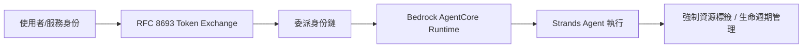
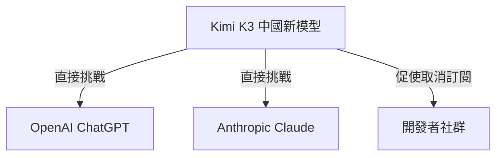

# AI Daily Digest — 2026-07-21

<!-- pipeline-generated:begin -->

## 🔥 今日 TOP 3
### 1. AWS Loom：企業級 Agent 治理開源平台
AWS Labs 發布開源平台 Loom，鎖定企業規模 AI agent 治理，基於 Strands Agents 與 Bedrock AgentCore Runtime 構建，並實作 RFC 8693 token exchange 機制以支援身份委派鏈傳播。

大規模部署 agent 時，身份與權限管理向來是企業最大痛點；Loom 採配置驅動部署、免除運行時程式碼生成，並用強制資源標籤機制解決 agent 生命週期與成本追蹤問題，降低維運複雜度。

AWS 明確定位 Loom 為參考實現而非受管服務，企業需自行整合部署。下一步觀察重點：其他雲端業者是否跟進推出對應治理框架，以及 RFC 8693 token exchange 是否成為 agent 身份標準。

📖 [閱讀完整 insight](../10-insights/2026-07-20/inbox_91391201.md) · 🔗 [原文連結](https://www.infoq.com/news/2026/07/loom-aws-agent-platform/?utm_campaign=infoq_content&utm_source=infoq&utm_medium=feed&utm_term=global)
### 2. Altman 洩密信曝光開源真實動機
2022 年 10 月，Sam Altman 致信 OpenAI 董事會，提議搶先發布可在消費級硬體本地運行、約當 GPT-3 能力的語言模型，目的是搶在 Stability AI 等對手之前推出。這封信於 2026 年 Musk v. Altman 訴訟中首度曝光。

信中明確寫道，此舉是為了「阻止他人發布同等強大的開源模型，並讓新創更難融資」，直接戳破 OpenAI 長期以「民主化 AI」包裝開源策略的說法，暴露背後真正的競爭抑制動機。

下一步觀察重點：此爆料是否影響訴訟走向與 OpenAI 公眾形象，以及是否促使外界對「開源即公益」的敘事更謹慎審視；讀者可用此案例，檢視科技巨頭開源公告背後的真實商業動機。

📖 [閱讀完整 insight](../10-insights/2026-07-20/inbox_d08dc20a.md) · 🔗 [原文連結](https://simonwillison.net/2026/Jul/20/sam-altman/#atom-everything)
### 3. Kimi K3 掀開放模型挑戰閉源龍頭
中國 AI 新模型 Kimi K3 被定位為直接挑戰 ChatGPT 與 Claude 等封閉式商業模型，已有開發者聲稱試用後取消原本的付費訂閱。

這代表非美系、可能開源或低價的模型已達到足以取代主流訂閱服務的實用門檻，對依賴訂閱營收的 OpenAI、Anthropic 構成實質競爭壓力，也呼應近期中國廠商加速開源競爭的趨勢。

值得追蹤的是 Kimi K3 的實際 benchmark 表現與定價策略是否經得起檢驗，而非僅止於個別開發者的主觀評價；建議在實際導入前先自行測試，避免僅憑單一報導轉換工具鏈。

📖 [閱讀完整 insight](../10-insights/2026-07-20/inbox_cf70d194.md) · 🔗 [原文連結](https://medium.com/@ClawHeroAI/kimi-k3-is-the-new-kid-on-the-block-and-its-coming-for-closed-ai-49af133596a2?source=rss------claude-5)

## 📖 好文章 / 影片精選

_過去 30 天經 traffic 沉澱的高品質內容，按興趣領域分類。每篇只在 column 出現一次。_
### 🛠 工具版本追蹤 / Release
- **ruflo** · **[v3.32.9 — Statusline accuracy + memory/SQLite integrity fixes](../10-insights/2026-07-20/inbox_5a02bdca.md)**
  Ruflo v3.32.9 patch 修復 statusline 準確性和 SQLite 完整性的多個關鍵問題。修復 statusline CLI 子命令硬編碼 model name 為 'Opus 4.6 (1M context)'，現改為從 stdin 讀取，確保顯示實際使用的模型。修復 getPkgVersion() 在 linked git wor
  _+ 1 個近期版本（v3.32.8，僅顯示最新）_
- **claude-code** · **[v2.1.216](../10-insights/2026-07-20/inbox_1a23f61c.md)**
  Claude Code v2.1.216 發布，包含 40+ 項重要修復和改進。其中最關鍵的是修復 message normalization 在長會話中的二次方複雜度問題（O(n²)），導致多秒卡頓和慢恢復。修復 OAuth token 過期/輪換後 auto mode 拒絕命令的 HTTP 401 錯誤。新增 sandbox.filesystem.dis
- **hermes-agent** · **[Hermes Agent v0.19.0 (2026.7.20) — The Quicksilver Release](../10-insights/2026-07-20/inbox_d770a39a.md)**
  Hermes Agent v0.19.0（v2026.7.20）發布「Quicksilver Release」，涵蓋性能、安全及協作功能的重大改進。冷啟動延遲從 4.3 秒大幅下降至 0.9 秒（～80% 改善），跨 CLI、Gateway、Desktop、TUI 生效；Desktop 應用的 Markdown 流式渲染速度提升 14 倍，新增虛擬化 dif
- **repowise** · **[v0.34.0](../10-insights/2026-07-20/inbox_5a2e45a1.md)**
  Repowise v0.34.0 發布，聚焦程式碼缺陷追蹤、知識圖譜視覺化、文件自動化與成本追蹤。新增「缺陷歷史」功能在各層級可見（按檔案、符號、提交；追蹤至引入 bug 的提交）；UI 標記「缺陷磁鐵」（頻繁修復的檔案/符號）供目標化重構。可縮放知識圖譜新增每節點程式碼健康度，文件簡報模式提供投影片及導引式對談，架構圖確定性生成。成本追蹤按操作標記支出、本
  _+ 1 個近期版本（v0.5.0，僅顯示最新）_
### 📚 AI 知識管理
- **infoq-main** · **[Pinecone Introduces Nexus Engine for Compiling Business Context into Structured Data for AI Agents](../10-insights/2026-07-18/inbox_d50bab1d.md)**
  Pinecone 於 2026 年 7 月發佈 Nexus Engine 知識引擎，已正式 GA。該系統將非結構化的企業數據轉換為結構化知識層，使 AI agents 能夠直接查詢，無需重複擷取相同的業務背景。通過一次性擷取及策劃企業的業務上下文，團隊可跨多個 agents 重複使用該知識層，大幅減少 token 消耗成本並提高 agent 決策準確性。這個
### 🏢 企業導入 AI / 團隊實踐
- **infoq-main** · **[AWS Releases Loom, an Open-Source Reference Platform for Governing AI Agents at Enterprise Scale](../10-insights/2026-07-20/inbox_91391201.md)**
  AWS Labs 發布 Loom，一個用於企業規模 AI agent 管理的開源參考平台。該平台基於 Strands Agents 和 Bedrock AgentCore Runtime 構建。為解決身份管理問題，Loom 實現了 RFC 8693 token exchange 機制，支持通過委託身份鏈進行身份傳播。部署方面採用配置驅動的方式，無需在運行時生
- **infoq-main** · **[Google&#39;s AlphaEvolve Reaches General Availability with Evolutionary Code Optimization as a Service](../10-insights/2026-07-19/inbox_01bfda90.md)**
  Google 的 AlphaEvolve 在 Gemini Enterprise Agent Platform 達成正式版發布，將 DeepMind 的研究項目轉變為商業化的進化型代碼優化服務。該服務的評估器在客戶端執行，確保客戶代碼不離開其基礎設施。Klarna 等早期使用者已報告 ML 訓練吞吐量翻倍的明顯成果。實踐者指出該服務存在實務限制：只在存在明確
- **infoq-main** · **[AWS Previews FinOps Agent for Cost Analysis and Optimization](../10-insights/2026-06-28/inbox_a5827d65.md)**
  亞馬遜公開預覽 AWS FinOps Agent 託管服務，自動化 FinOps 工作流程。該代理可檢測成本異常、關聯支出變化與 AWS 活動資料，並整合 Slack 與 Jira 將發現路由給資源擁有者。此服務旨在降低雲成本管理的手動工作量，將發現與團隊協作工具連接。AWS FinOps Agent 代表了基礎設施成本控制領域由人工驅動轉向自動化代理的趨勢
### 🎓 AI 使用技巧 / 心法
- **infoq-architecture** · **[Article: Understanding ML Model Poisoning: How It Happens and How to Detect It](../10-insights/2026-06-22/inbox_e53abef1.md)**
  本文深入探討數據毒化（data poisoning）對機器學習系統的威脅，介紹標籤翻轉、後門注入、清標籤毒化與梯度操縱等四類主要攻擊技術。文章回顧真實案例，討論毒化數據的檢測困難——許多攻擊可在無異常特徵的情況下隱形進行。提出多層防禦策略包括數據驗證、異常檢測、魯棒性測試、離線隔離訓練等實踐建議，強調 ML 訓練管道安全性與數據源驗證的關鍵重要性。
- **medium-tag-llm** · **[Should we be polite to ChatGPT?](../10-insights/2026-06-22/inbox_2816a3f4.md)**
  本文探討人與 ChatGPT 互動時的禮儀問題。作者觀察到，用戶在日常對話中往往對 ChatGPT 態度粗魯，原因是將其視為「純程式碼編譯物」而非互動夥伴。文章反思這種互動模式背後的心理假設，以及禮貌語言是否會通過 prompt 微調效應影響模型回應質量，進而提出人機互動中值得關注的社會與技術問題。
- **medium-tag-claude** · **[How to Use Claude Code to Build Features Without Losing Control of Your Codebase](../10-insights/2026-06-22/inbox_fb0fb7a9.md)**
  Medium 文章討論在使用 Claude Code 進行功能開發時，如何有效保持代碼庫的控制權和品質標準。文章針對 AI coding tool 可能帶來的代碼混亂問題提供解決方案。題目暗示作者分享了具體的最佳實踐和指導原則。目標受眾是希望利用 AI 加速開發但又不願犧牲代碼品質的開發者。由於原始內容未完整提供，上述摘要主要基於標題推斷。更多細節需要查閱完
- **medium-tag-claude** · **[Spec Driven Development: How I Ship Side Projects Faster with AI](../10-insights/2026-06-22/inbox_6b962214.md)**
  文章作者為產品經理，分享其使用「規格驅動開發」方法結合 AI 工具來加速 side project 交付的個人實踐。標題子句「PM 對『vibe coding』螺旋的誠實看法」暗示文章批判了無計畫、感覺驅動的開發方式。規格驅動開發強調先寫規格、後進行實現，這與感覺驅動的「vibe coding」形成鮮明對比。文章可能分享了具體的方法論和實踐成果。由於原始內容
- **substack-lennys-newsletter** · **[🎙️ How I AI: How to write AI agent loops in Claude Code and Codex + How Claude Mythos found a 15-year-old bug in Mozilla Firefox](../10-insights/2026-06-22/inbox_fed9b40a.md)**
  Lenny's Podcast Network 的『How I AI』節目近期發佈，介紹了兩個主題：(1) 如何在 Claude Code 和 Codex 中編寫 AI agent loops；(2) Claude Mythos 發現 Mozilla Firefox 的 15 年舊 bug。第一個主題涉及 agent loops 的編寫方法和最佳實踐，對軟體
### 🛤️ AI Flow 導入心得 / 技術分享
- **infoq-main** · **[Podcast: Strands Agents with Clare Liguori](../10-insights/2026-07-20/inbox_133d945e.md)**
  Strands Agents 開源 SDK 的技術主管 Clare Liguori 在播客中分享了該框架的發展歷程。該 SDK 從初期的 Python 實現演進為支持生產環境的完整 agent harness。在規模化構建 agents 的過程中，團隊面臨了多項技術挑戰。為適應快速迭代的 LLM 能力，他們決定採用模型驅動架構（model-driven ar

## 💡 今日 Takeaway

_讀完今日所有內容後，可帶走的知識點_
### 1. 代理降低失敗成本，使 ROI 計算逆轉
Coding agent 讓逆向工程等專案的失敗成本與重做成本大幅下降，使原本因維護負擔過重而不划算的專案變得可行。評估是否啟動一個專案時，應同時考慮技術可行性與新的經濟門檻，而非僅以過去的成本假設判斷。

_類型：framework_

**參考來源**：
- [Reverse-engineering is cheap now](../10-insights/2026-07-20/inbox_ba1871c1.md) · [原文](https://simonwillison.net/2026/Jul/20/cheap-reverse-engineering/#atom-everything)
### 2. 模型驅動架構讓 agent 框架跟上 LLM 演進
當 LLM 能力快速迭代時，若 agent 框架架構綁定特定模型行為，會頻繁需要重構；改採模型驅動架構（以模型能力為抽象核心）可讓系統隨 LLM 進步自然演進，減少重寫成本。此原則適用於任何長期維護的 agent SDK 或 orchestration 框架設計決策。

_類型：pattern_

**參考來源**：
- [Podcast: Strands Agents with Clare Liguori](../10-insights/2026-07-20/inbox_133d945e.md) · [原文](https://www.infoq.com/podcasts/strands-agents/?utm_campaign=infoq_content&utm_source=infoq&utm_medium=feed&utm_term=global)
### 3. 長會話狀態管理避免 O(n²) 複雜度陷阱
若每次 turn 都重新序列化全部歷史訊息而非增量更新，效能會隨會話長度呈平方級衰退，造成多秒卡頓。設計任何具備長期 context 或歷史記錄的系統時，應優先檢查是否存在隱藏的全量重算路徑，改用增量更新機制。

_類型：pattern_

**參考來源**：
- [v2.1.216](../10-insights/2026-07-20/inbox_1a23f61c.md) · [原文](https://github.com/anthropics/claude-code/releases/tag/v2.1.216)
### 4. 信心度應由接地品質校準，非檢索數量
在 RAG 或知識檢索系統中，回應信心分數若只依賴檢索到的資料量或多樣性（檢索形狀），容易產生虛假信心；應改以來源材質的品質與接地程度（grounding quality）作為校準基準，才能真實反映答案可靠度。

_類型：framework_

**參考來源**：
- [v0.34.0](../10-insights/2026-07-20/inbox_5a2e45a1.md) · [原文](https://github.com/repowise-dev/repowise/releases/tag/v0.34.0)
### 5. 獨立評估每條指令可降低審批疲勞
面對需要人工核准的高風險操作，用 LLM 針對每一條 flagged command 單獨判斷風險，而非批次概括核准，能有效降低使用者因重複核准而產生的疲勞與誤放行風險。此模式適用於任何需要人機協作把關的自動化流程。

_類型：pattern_

**參考來源**：
- [Hermes Agent v0.19.0 (2026.7.20) — The Quicksilver Release](../10-insights/2026-07-20/inbox_d770a39a.md) · [原文](https://github.com/NousResearch/hermes-agent/releases/tag/v2026.7.20)
## ⏳ 待處理 (3 筆)

<!-- pipeline-generated:end -->

<!-- user-notes -->
<!-- Write your own notes below; pipeline never touches this section. -->