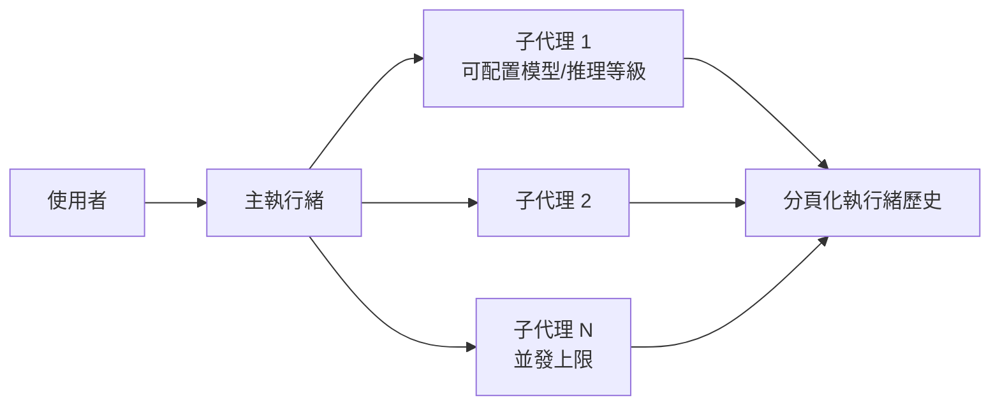
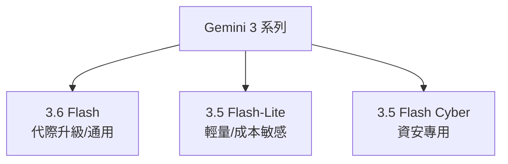

# AI Daily Digest — 2026-07-22

<!-- pipeline-generated:begin -->

## 🔥 今日 TOP 3
### 1. Codex 0.145 強化多代理與執行緒歷史
OpenAI 發布 Codex 0.145.0，新增分頁化執行緒歷史、擴展 /import 支援跨工具遷移，並穩定化多代理 V2 架構，可設定子代理模型與並發數。

此更新代表編碼代理工具從單一助手轉向可配置多代理協作系統，直接對標 Claude Code，加劇 agentic coding 工具間的功能競爭。

建議關注 Bedrock 與即時音訊整合對企業場景的擴張，並評估分頁化執行緒歷史是否能改善長任務的可維護性。

📖 [閱讀完整 insight](../10-insights/2026-07-21/inbox_e90f94e4.md) · 🔗 [原文連結](https://github.com/openai/codex/releases/tag/rust-v0.145.0)
### 2. Google 發布三款新 Gemini 3 模型
Google 於 7 月發布三款新 Gemini 模型：代際升級的 Gemini 3.6 Flash、針對輕量與成本敏感場景的 3.5 Flash-Lite，以及專攻資安漏洞偵測與修補的 3.5 Flash Cyber。

三款模型分別鎖定效能、成本與垂直安全領域，顯示 Google 正把 Gemini 系列拆分為場景化產品線，而非單一通用模型，尤其 Flash Cyber 直接切入資安專業市場。

後續應留意各版本的實際效能基準、定價與 Agent Platform 整合細節；若團隊需要成本敏感或資安專用場景，可優先評估 Flash-Lite 與 Flash Cyber 是否已開放存取。

📖 [閱讀完整 insight](../10-insights/2026-07-21/inbox_7284b682.md) · 🔗 [原文連結](https://blog.google/innovation-and-ai/models-and-research/gemini-models/gemini-3-6-flash-3-5-flash-lite-3-5-flash-cyber/)
### 3. OpenAI 暫停長程規劃模型部署
OpenAI 主動暫停一個長期規劃模型的部署，原因指向該類架構在安全防護欄設計上存在根本缺陷：現行 guardrails 多半只檢查中間步驟是否合規，而非監測最終目標方向是否正確。

這揭露了「每一步都對，但終點是錯的」典型失敗模式，對所有採用多步驟自主決策的 agentic 系統都是警訊，不只 OpenAI 適用。

實務上可檢視現有 AI 系統的防護欄設計是否只驗證單步合規，建議加入目標對齊層級的監測機制。（今日另有 3 則項目因內容不完整尚待人工複核。）

📖 [閱讀完整 insight](../10-insights/2026-07-21/inbox_b1780a1d.md) · 🔗 [原文連結](https://kubestellar.medium.com/when-each-step-is-fine-but-the-destination-isnt-fb466b557d8d?source=rss------large_language_models-5)

## 📖 好文章 / 影片精選

_過去 30 天經 traffic 沉澱的高品質內容，按興趣領域分類。每篇只在 column 出現一次。_
### 🛠 工具版本追蹤 / Release
- **claude-code** · **[v2.1.217](../10-insights/2026-07-21/inbox_94e6f06a.md)**
  Claude Code v2.1.217 發布多項穩定性和安全改進。新增 emoji 快速輸入功能（輸入 :heart: 自動轉換為 ❤️）、修復記憶體洩漏問題（MCP 工具輸出截斷時保留完整結果導致洩漏）、修復 Windows 自動更新失敗後遺留 claude.exe 缺失的問題。此版本也修復企業環境設定（mTLS、TLS-verify、OAuth sco
### 📚 AI 知識管理
- **medium-tag-llm** · **[RAG mi, Fine-Tuning mi? Büyük Dil Modellerini Geliştirmenin İki Farklı Yaklaşımı](../10-insights/2026-07-17/inbox_d5671163.md)**
  文章比較 RAG（檢索增強生成）和 Fine-Tuning 兩種增強大型語言模型效能的方法。RAG 通過動態檢索外部知識庫補充 LLM 上下文，無需重新訓練模型，適合知識密集且頻繁變化的任務。Fine-Tuning 則在特定領域數據上持續訓練，改進模型參數以適應特定風格和專業知識，長期效果更穩定。兩種方法各有優劣：RAG 成本低、靈活性高但可能增加延遲，Fi
- **medium-towards-data-science** · **[Loop Engineering for RAG Question Parsing: The Small Loop That Runs Before Retrieval](../10-insights/2026-07-19/inbox_e62782b6.md)**
  文章介紹 RAG 系統中的環回工程（Loop Engineering）概念，聚焦問題解析階段在檢索前運作的小環迴圈。提出漸進式改進的三層策略：Prompt 工程、上下文工程、環回工程。其中環回迴圈設計為讀文檔、發問缺漏、重新解析的三步循環，直接應用於企業文檔智能場景。
- **medium-towards-data-science** · **[Prompt Engineering Isn’t Enough: How Four Bricks of Context Engineering Stop RAG Hallucinations](../10-insights/2026-07-21/inbox_897db7a1.md)**
  Medium 文章核心論點：「你的 RAG 系統不是在幻覺，而是在忠實回答錯誤的上下文」。文章提出「四磚」（four bricks）上下文工程框架，用於阻止 RAG 系統的幻覺輸出。每塊磚代表 RAG 管線中的不同層面，磚失效會導致特定類型的問題。框架提供「合約」（contract）機制來防止問題級聯。作者以 NIST 與世界銀行公開文件作為測試案例。此視角
### 🏢 企業導入 AI / 團隊實踐
- **substack-lennys-newsletter** · **[Building the most AI-pilled engineering team in the world | Fiona Fung (Manager of the Claude Code and Cowork Teams)](../10-insights/2026-06-21/inbox_fe4e0ab6.md)**
  Fiona Fung 領導 Claude Code 與 Cowork 團隊，接受 Lenny's Newsletter 訪問討論如何建設「最 AI-native」的工程團隊。內容涵蓋在角色模糊、agents 普遍化時代如何維持團隊文化。
- **openai-blog** · **[Samsung Electronics brings ChatGPT and Codex to employees](../10-insights/2026-06-21/inbox_1160a4ba.md)**
  Samsung Electronics 在全球範圍內向員工部署 ChatGPT Enterprise 和 Codex。此舉是 OpenAI 最大規模的企業 AI 部署案例之一，涵蓋編碼助手（Codex）和對話 AI（ChatGPT Enterprise）兩個工具。標誌著大型科技製造業對 AI 工具的重度採用和信任。
- **simon-willison** · **[sqlite-utils 4.0rc1 adds migrations and nested transactions](../10-insights/2026-06-21/inbox_4120b419.md)**
  sqlite-utils 4.0rc1 發布，Python 版本支援升級至 3.13，移除 3.8 支援。新增 migrations 功能：基於 decorator 的遷移系統，支援 Python 和 CLI 兩種執行方式，無逆向遷移支援（錯誤通過新遷移修復）。新增 db.atomic() 上下文管理器：利用 SQLite savepoints 實現原生 n
- **simon-willison** · **[Temporary Cloudflare Accounts for AI agents](../10-insights/2026-06-21/inbox_4a213d37.md)**
  Cloudflare 推出臨時帳戶功能，允許透過 `npx wrangler deploy --temporary` 無需建立正式帳戶即可部署 Workers 應用。自動生成 60 分鐘有效的臨時部署鏈結，適合原型開發和短期測試。部署後提供領取頁面，用戶可選擇升級為永久專案。該特性對 AI agent 短期任務部署和開發測試尤為實用。文章作者用 LLM 快速
- **medium-tag-claude** · **[Google Paid $2.4B for Windsurf. Why Did Musk Pay $60B for Cursor?](../10-insights/2026-06-21/inbox_f069b5c6.md)**
  Google 以 24 億美元收購 AI IDE Windsurf，而 Elon Musk 對 Cursor 的投資額達 60 億美元，兩者估值相差 25 倍。儘管兩款 IDE 都內嵌 AI 模型，文章的核心論點是：選用 Claude 還是 GPT 並非決定 IDE 估值的關鍵因素。軟件架構的優雅度、開發者體驗的流暢性，以及平台對用戶的粘性才是真正的價值驅動
### 🎓 AI 使用技巧 / 心法
- **infoq-main** · **[Presentation: The Time It Wasn&#39;t DNS](../10-insights/2026-06-23/inbox_4203ae3f.md)**
  Sean Klein 在 InfoQ 演講中探討「人為錯誤」在複雜系統中的危害，分享 Azure 2023 年全球廣域網絡中斷的案例研究。演講批評傳統的「五個為什麼」分析方法過於簡化，強調現代事故分析需超越單純的責備文化，深入挖掘系統層級的問題。核心論點包括：(1) 人為錯誤是一個危險的迷思，會阻礙真正的系統改進，(2) 工程領導者應改善標準操作程序（SOP
- **medium-tag-claude** · **[Everyone is creating agents. Nobody knows how to manage them.](../10-insights/2026-06-23/inbox_411549e0.md)**
  文章指出当前市场上人人都在创建 AI agents，但大多数企业缺乏成熟的 agent 管理框架和最佳实践。对于用 agents 构建产品的创业者，文章暗示存在许多未被公开讨论的陷阱和挑战。虽然标题提出了问题，但摘要中未披露具体的 agent 管理方法论、常见失败案例或解决方案。
- **medium-tag-claude** · **[Claude Isn’t the Problem. Your Context Is. Here’s How to Fix It.](../10-insights/2026-06-23/inbox_b80e4d11.md)**
  文章主張 Claude 輸出品質不佳的根源多半是使用者提供的上下文不足，而非模型本身的限制。作者用新員工需要公司規範和期望說明的類比，強調 Claude 由於缺乏跨對話記憶，使用者必須主動提供相關背景資訊來填補知識差距。文章提出六種增強上下文的方法，詳細介紹系統提示詞（system prompt）技巧，並提及 Thinking Mode 和 Plan Mod
- **medium-tag-claude** · **[How to Run Claude Cowork Tasks From Your Phone](../10-insights/2026-06-23/inbox_a8e14166.md)**
  Claude Cowork 推出新功能 Dispatch，允許使用者在手機上透過文字遠程觸發桌面電腦上的任務，任務在電腦上執行，用戶可在外（如健身房）返回後繼續工作。功能解決了過往 Cowork 使用需要桌前操作的限制。文章承諾涵蓋 Dispatch 的安裝步驟（手機和桌面）、使用指南，以及與技能和任務系統的整合方法以「解鎖 Dispatch 的全部潛能」，
- **medium-tag-claude** · **[How I Use Claude AI in My Daily Design Workflow (And What It’s Actually Changed)](../10-insights/2026-06-23/inbox_c345f2ff.md)**
  設計師分享 Claude 在日常設計工作流中的實踐應用。Claude 超越單純自動化工具，作為戰略思考夥伴：當面對複雜工程需求文件時，問 \"我在設計前該問哪些問題？\" Claude 提出了超越設計師直覺的關鍵提問角度（使用者環境、壓力因子）。在文案層面，Claude 處理介面文案（按鈕標籤、錯誤訊息、上線引導）從 20 分鐘縮至數分鐘。用戶溝通上，Cla
### 💳 支付 / Fintech
- **medium-tag-llm** · **[When each step is fine but the destination isn’t](../10-insights/2026-07-21/inbox_b1780a1d.md)**
  OpenAI 暫停了某個長期規劃模型的部署。文章揭示 AI 安全防護的根本誤區：業界習慣在系統中堆砌更多防護欄（guardrails），但實際問題是防護欄本身的監測目標設定錯誤。防護欄應該監看最終目標方向是否正確，而非只檢查中間步驟是否合規——「每一步都對，但終點是錯的」正是這類系統的典型失敗模式。
### 🔐 AI 安全 / 濫用
- **infoq-main** · **[GitLab 19.2 Puts AI Agents to Work on the Security Backlog](../10-insights/2026-07-21/inbox_2488139d.md)**
  GitLab 於 2026 年 7 月 16 日發布版本 19.2，引入代理自動化功能直指 DevSecOps 安全與程式碼審查工作積壓。此問題源於 AI 編碼工具（如 GitHub Copilot）生成程式碼速度遠超人工審查能力。新版本推出四項功能：依賴掃描自動修復（Dependency Scanning Auto-Remediation）、安全審查流程（
### 🛤️ AI Flow 導入心得 / 技術分享
- **simon-willison** · **[A Fireside Chat with Cat and Thariq from the Claude Code team](../10-insights/2026-07-21/inbox_805f60b8.md)**
  Anthropic Claude Code 團隊在 AI Engineer World's Fair 座談會中分享編碼代理工作流程的演進。Claude Tag（新 Slack 協作工具）已在內部落地 65% 的產品工程 PR，具備多人協作、主動監控、團隊記憶功能。重大發現：現代模型（Fable 5、Opus 4.8）不再受益於 system prompt 中

## 💡 今日 Takeaway

_讀完今日所有內容後，可帶走的知識點_
### 1. 現代模型免用 System Prompt 範例
現代旗艦模型已不再需要在 system prompt 中放入 few-shot 範例，Claude Code 因此把 prompt 長度砍了 80%。同時應避免「禁止做 X」型的負面指令列表，改用正向、簡潔的指示更能提升模型遵從度。

_類型：pattern_

**參考來源**：
- [A Fireside Chat with Cat and Thariq from the Claude Code team](../10-insights/2026-07-21/inbox_805f60b8.md) · [原文](https://simonwillison.net/2026/Jul/21/cat-and-thariq/#atom-everything)
### 2. 防護欄應監測目標而非合規步驟
多步驟 AI 決策系統常見失敗模式是「每一步都對，但終點是錯的」，因為防護欄只檢查中間步驟合規，卻沒監測最終目標方向。設計 agentic 系統的安全機制時，應優先加入目標對齊層級的監測，而非只堆疊步驟規則。

_類型：pattern_

**參考來源**：
- [When each step is fine but the destination isn’t](../10-insights/2026-07-21/inbox_b1780a1d.md) · [原文](https://kubestellar.medium.com/when-each-step-is-fine-but-the-destination-isnt-fb466b557d8d?source=rss------large_language_models-5)
### 3. RAG 幻覺根源在上下文而非模型
RAG 系統的錯誤輸出多半不是模型幻覺，而是忠實回答了錯誤的上下文；用「四磚」框架分層檢查儲存、檢索、組裝、生成各環節並設 contract 機制，能防止問題級聯。遇到 RAG 品質問題應先排查上下文選擇，而非急著換模型。

_類型：framework_

**參考來源**：
- [Prompt Engineering Isn’t Enough: How Four Bricks of Context Engineering Stop RAG Hallucinations](../10-insights/2026-07-21/inbox_897db7a1.md) · [原文](https://towardsdatascience.com/prompt-engineering-isnt-enough-how-four-bricks-of-context-engineering-stop-rag-hallucinations/)
### 4. 並發子代理需設上限防止失控
多代理系統若不限制並發數，單一訊息可能無限 fan-out 導致資源失控；設定合理並發上限（如預設 20）並讓子代理預設不再嵌套生成，可有效控制系統複雜度與成本。這是設計任何多代理架構都該內建的防護機制。

_類型：technique_

**參考來源**：
- [v2.1.217](../10-insights/2026-07-21/inbox_94e6f06a.md) · [原文](https://github.com/anthropics/claude-code/releases/tag/v2.1.217)
### 5. AI 加速編碼後審查成新瓶頸
當 AI 編碼工具讓程式碼產出速度大增，人工審查能力跟不上就會成為新瓶頸；解法是部署代理自動化承接安全掃描與審查流程，此模式已跨 GitHub Copilot、GitLab Duo、Claude 等多廠商重複出現。評估 AI 導入時應同步規劃審查產能。

_類型：pattern_

**參考來源**：
- [GitLab 19.2 Puts AI Agents to Work on the Security Backlog](../10-insights/2026-07-21/inbox_2488139d.md) · [原文](https://www.infoq.com/news/2026/07/gitlab-19-2-ai-agents/?utm_campaign=infoq_content&utm_source=infoq&utm_medium=feed&utm_term=global)
## ⏳ 待處理 (3 筆)

<!-- pipeline-generated:end -->

<!-- user-notes -->
<!-- Write your own notes below; pipeline never touches this section. -->