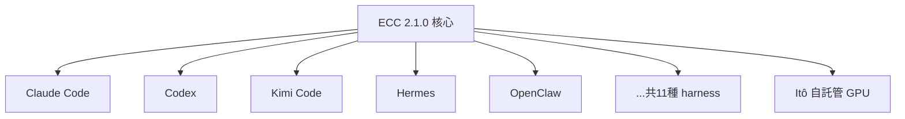
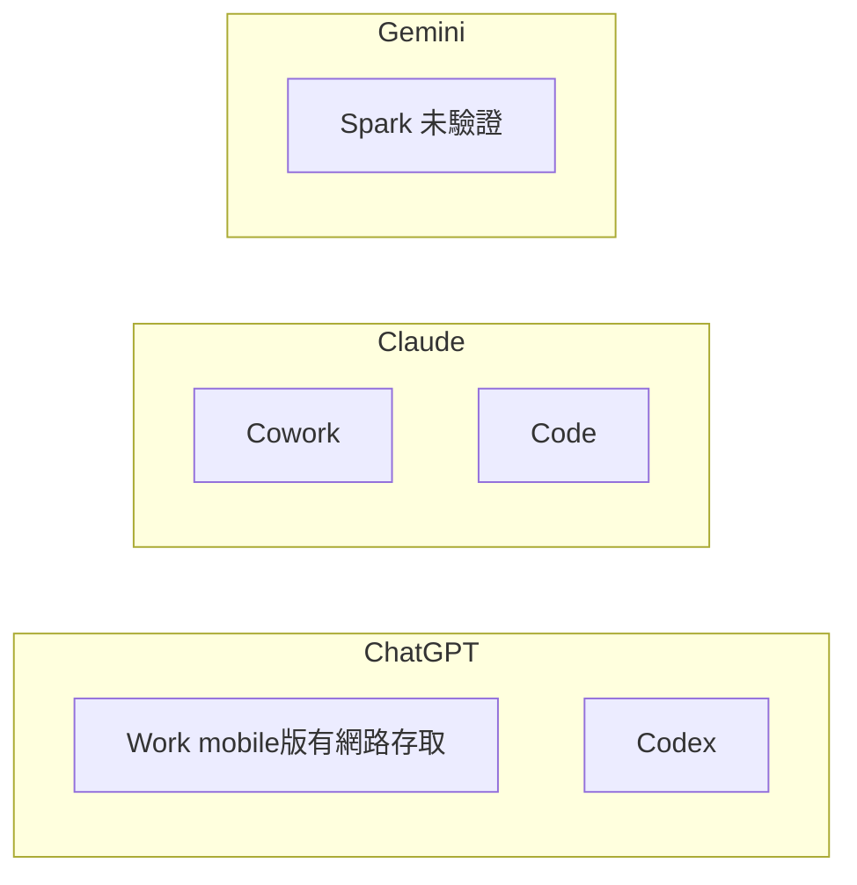

# AI Daily Digest — 2026-07-28

<!-- pipeline-generated:begin -->

## 🔥 今日 TOP 3
### 1. ECC 2.1.0：Agent 與模型徹底解耦
ECC 2.1.0 推出 Plan Canvas、Kimi 整合、Itô 自託管運算三大功能，可視覺化審核 agent 規劃，並讓同一套 agent 定義部署到 11 種 harness（Claude Code、Codex、Kimi、Hermes、OpenClaw 等）。

這是 agent 首次真正與底層模型脫鉤：同一份 AGENTS.md／skills 可跨 lab 執行環境切換，不必為每個模型重寫流程；技能庫擴至 281 個、貢獻者破 50，生態系加速成熟。

觀察重點是 Itô 唯讀端點能否防堵 GPU 供應鏈風險，以及其他 lab 是否跟進 harness-agnostic 標準；已用 ECC 的團隊可先評估以 Plan Canvas 取代文字審核。

📖 [閱讀完整 insight](../10-insights/2026-07-27/inbox_f434fbb3.md) · 🔗 [原文連結](https://github.com/affaan-m/ECC/releases/tag/v2.1.0)
### 2. Kimi K3 開放權重：2.8 兆參數上線
Moonshot 於 7/27 公開發布 Kimi K3 權重，參數達 2.8 兆、檔案 1.56TB，已上架 Hugging Face，OpenRouter 亦串接 7 家服務商提供推論。

K3 商用條款比 K2 更嚴格：MaaS 業者年收逾 2,000 萬美元須另簽協議，產品逾 1 億 MAU 或月收 2,000 萬美元須在 UI 標註『Kimi K2』；官方也改稱『open weight』而非『open source』，顯示開放策略轉趨保守。

定價維持 $3/M input、$15/M output；後續觀察『開放權重但商業受限』是否成為新常態，企業導入前應先確認 MAU／營收是否觸及簽約門檻。

📖 [閱讀完整 insight](../10-insights/2026-07-27/inbox_f0b772f1.md) · 🔗 [原文連結](https://simonwillison.net/2026/Jul/27/kimi-k3/#atom-everything)
### 3. AI 工具典範轉移：從 Chat 到 Agent
Simon Willison 解讀 Ethan Mollick 最新版工具指南，指出評比重心已從 chat 模式轉向 agent 模式——ChatGPT 分 Work／Codex、Claude 分 Cowork／Code。

決策標準正從『模型多聰明』轉為『agent 執行力多強』；差異甚至藏在同產品內，如 ChatGPT mobile 版 Work 才有網路存取、桌面版沒有。Google 缺乏對標 agent 產品（Spark 未驗證），此輪掉隊。

挑工具時應先確認是否為 agent 模式、再核對 mobile／desktop 差異；企業選型也該把 agent 執行能力列為第一層篩選條件。

📖 [閱讀完整 insight](../10-insights/2026-07-27/inbox_38fd3c23.md) · 🔗 [原文連結](https://simonwillison.net/2026/Jul/27/an-opinionated-guide-to-which-ai-to-use-to-do-stuff/#atom-everything)

## 📖 好文章 / 影片精選

_過去 30 天經 traffic 沉澱的高品質內容，按興趣領域分類。每篇只在 column 出現一次。_
### 🛠 工具版本追蹤 / Release
- **ecc** · **[ECC 2.1.0: Plan Canvas, Kimi Harness, and Self-Hosted Compute](../10-insights/2026-07-27/inbox_f434fbb3.md)**
  ECC 2.1.0 發布三大功能升級，實現 agent 與基礎模型解耦的架構。**Plan Canvas** 讓使用者在瀏覽器中視覺化審視 agent 規劃，透過指點標註取代文字重複輸入，支援 Mermaid 圖表與任務列表即時渲染；side-rail chat 支援實時反饋迴圈，/plan 確認門檔直接映射至 Approve/Request changes
- **ruflo** · **[v3.32.22 — CI-green hotfix: ADR-125 CLI-flag precedence for RUFLO_MEMORY_SCAN_ON_WRITE (#2794)](../10-insights/2026-07-27/inbox_d7a3714d.md)**
  ruflo v3.32.22 修復 v3.32.17 MemPoison 環境變數配置問題，恢復 CI 綠燈狀態（CI 因此問題紅燈約 5 小時，從 2026-07-27 03:04 UTC 開始）。主要修復：RUFLO_MEMORY_SCAN_ON_WRITE 環境變數讀取改用 nullish coalescing（ctx.flags.scanConten
  _+ 8 個近期版本（v3.32.21 → v3.32.14，僅顯示最新）_
### 📚 AI 知識管理
- **medium-towards-data-science** · **[How I Reproduced BM25, Dense Retrieval, and SPLADE on a 16GB MacBook](../10-insights/2026-07-27/inbox_edd0cfec.md)**
  文章實踐性地重現了三種檢索演算法（BM25、Dense Retrieval、SPLADE）在 16GB MacBook 上的實現。記錄開發過程中遇到的記憶體崩潰、修復方案及性能分數驗證步驟，為構建本地 RAG 系統的開發者提供了務實參考。展示如何透過最佳化在消費級硬體上部署多種檢索方法，對降低 RAG 系統開發成本有指導意義。
### 🏢 企業導入 AI / 團隊實踐
- **infoq-main** · **[Article: An Evolutionary Architecture Pattern for Managing AI’s Pace of Change](../10-insights/2026-07-27/inbox_759a440b.md)**
  傳統 API 網關設計假設服務行為確定且 schema 簡單，此假設在代理型 AI（agentic AI）時代被打破。agentic AI 系統呈現不可預測的流程和複雜的生成式內容，超出傳統網關的控制能力。企業工程領導者正採納 AI Gateway 作為新型架構接縫。AI Gateway 在單一控制平面集中管理 guardrails（安全邊界）、model 
- **infoq-main** · **[Presentation: Autonomous Data Products for the Autonomous Era: Rethinking Data Architecture for GenAI](../10-insights/2026-07-24/inbox_25126d9f.md)**
  Jörg Schad 在演講中提出「自主資料產品」架構框架以應對 GenAI 時代的複雜資料管理挑戰。自主資料產品如容器般封裝管道、結構定義和元資料，透過 MCP 等協議進行漸進式工具發現，以實施治理政策、避免上下文衰退並確保可靠的多模式資料存取。此框架思想為構建可擴展、安全的 AI 系統提供明確的架構指引。
### 🎓 AI 使用技巧 / 心法
- **simon-willison** · **[An opinionated guide to which AI to use to do stuff](../10-insights/2026-07-27/inbox_38fd3c23.md)**
  Simon Willison 剖析 Ethan Mollick 《AI 工具選擇指南》的演變：過去主焦 chat 模式（ChatGPT、Claude、Gemini），今轉向 agent 模式。ChatGPT 提供 Work 與 Codex 雙 agent 模式，Claude 提供 Cowork 與 Code；命名混亂且功能差異大——ChatGPT mobil
- **substack-bytebytego** · **[Best Practices for Building AI Agents That Work in Production](../10-insights/2026-07-22/inbox_38716faa.md)**
  ByteByteGo 發表 AI Agent 生產環境最佳實踐指南，核心思想是將業界集體思考系統化，強調每項實踐背後的推理邏輯而非教條式列表編制。這種框架化方法幫助工程師深入理解設計原理而非機械複製做法，適用於正在部署或優化 Agent 系統的技術團隊。文章將分散的實踐經驗整合成一套可遷移的方法論，提升 Agent 系統設計決策質量。
- **medium-towards-data-science** · **[Stop Ranking Agent Configs by Average Score](../10-insights/2026-07-06/inbox_f2f9077c.md)**
  本文批判傳統「用平均分數排名代理配置」的做法。作者提出三個更強大的替代方案：最佳-最差比較法（Best-Worst Comparison）、MaxDiff 判斷風格，以及 Plackett-Luce 效用分數模型。這套方法能幫代理團隊更精準地判斷哪些配置應上線、裁切或路由至下一輪測試。相比平均分只能告訴你「平均表現」，MaxDiff 與 Plackett-L
### 🔐 AI 安全 / 濫用
- **medium-towards-data-science** · **[Detecting Vulnerabilities in Agent Skills with SkillSpector: From Green Checkmark to Real Security Judgment](../10-insights/2026-07-22/inbox_386e9a92.md)**
  SkillSpector 工具用於偵測 AI Agent 技能中的安全漏洞。關鍵發現是靜態分析會同時出現誤報（將良好技能標記為惡意）與漏報（遺漏真正的惡意代碼），說明單靠自動化工具不夠，必須引入人類判斷來彌補工具的盲點。這為 Agent 系統的安全驗證流程提供了重要的設計啟示。
- **infoq-main** · **[AI-Enabled Security Researchers Discover How a Crafted Video Can Provide Attackers Access to Your PC](../10-insights/2026-07-26/inbox_3a407863.md)**
  JFrog 安全研究團隊發現 FFmpeg 媒體框架中的「PixelSmash」漏洞，潛伏 16 年之久，影響採用 MagicYUV 解碼器的眾多應用。攻擊者僅需製作一個特殊的媒體檔案即可觸發遠端程式碼執行（RCE）或拒絕服務（DoS）攻擊。建議使用者檢查是否受影響、立即應用補丁或禁用該解碼器。此漏洞因 FFmpeg 的廣泛應用而具有重大威脅。
- **medium-tag-llm** · **[Model and Data Supply Chain Security: When the Poison Isn’t in the Prompt](../10-insights/2026-07-27/inbox_b59cf7fb.md)**
  無法完整總結：提供的內容僅為標題「模型與數據供應鏈安全：當毒物不在提示中時」和「AI Security Deep Dives, Part 6」。標題暗示本文重點在供應鏈層面的威脅（非提示注入層），涵蓋模型訓練、數據集、部署前的安全風險。完整內容未提供，無法確認具體攻擊向量、案例、防禦措施或產業影響。
- **medium-tag-llm** · **[Signatures to Behavior](../10-insights/2026-07-27/inbox_3736323f.md)**
  無法完整總結：提供的內容僅為標題「從簽名到行為」和「Part 1: Why Signature-Based Security Is Failing」。推測本文為系列文章首篇，主要討論簽名型安全檢測（signature-based security）在 AI 或網路安全領域的失效原因。完整內容未提供，無法確認針對何種簽名檢測、具體失敗場景、替代方案或對 LLM
### 🛤️ AI Flow 導入心得 / 技術分享
- **infoq-main** · **[Netflix Details Its In-House LLM Serving Platform with Triton and vLLM](../10-insights/2026-07-27/inbox_5e95123d.md)**
  Netflix 分享了其內部 LLM inference serving platform 的生產教訓。該平台採用 NVIDIA Triton 和 vLLM 作為核心推理引擎。主要工程挑戰來自多個方面。首先是支援多種模型大小，從小型模型到大型模型的異質需求。其次是滿足多樣化硬體配置，包括 GPU、CPU 等不同加速器。第三是應對推理引擎的快速迭代。此案例展示

## 💡 今日 Takeaway

_讀完今日所有內容後，可帶走的知識點_
### 1. 數值/環境變數配置用 nullish coalescing，不用 ||
當合法值包含 0 或 false 時，`||` 會誤判它們為空值而套用預設值；改用 `??`（nullish coalescing）只在 null/undefined 時才 fallback，可避免『threshold=0 被吃掉』這類隱藏 bug。同一原則也適用於 CLI flag 與環境變數的優先權判斷。

_類型：technique_

**參考來源**：
- [v3.32.21 — fix(memory/embeddings): --type keyword|hybrid + --threshold 0 (#2790)](../10-insights/2026-07-27/inbox_cfc24661.md) · [原文](https://github.com/ruvnet/ruflo/releases/tag/v3.32.21)
- [v3.32.22 — CI-green hotfix: ADR-125 CLI-flag precedence for RUFLO_MEMORY_SCAN_ON_WRITE (#2794)](../10-insights/2026-07-27/inbox_d7a3714d.md) · [原文](https://github.com/ruvnet/ruflo/releases/tag/v3.32.22)
### 2. 共用掃描特徵目錄，一次更新強化多層防護
把注入短語／攻擊簽名等偵測邏輯抽成單一共用目錄，讓多個掃描器同時受益，新增一條規則就能同步升級所有防線。搭配『population cap』統計假設（攻擊碎片通常只出現在少數工具中）可大幅降低誤報，實測誤報數下降 92 倍。

_類型：pattern_

**參考來源**：
- [v3.32.15 — MCP Composition Inspector (#2783 dream — cross-tool prompt-injection scan)](../10-insights/2026-07-27/inbox_40bb3859.md) · [原文](https://github.com/ruvnet/ruflo/releases/tag/v3.32.15)
- [v3.32.17 — PlanFlip + MemPoison gates (#2752 dream-cycle)](../10-insights/2026-07-27/inbox_77a63b43.md) · [原文](https://github.com/ruvnet/ruflo/releases/tag/v3.32.17)
- [v3.32.16 — ChannelGuard companion (#2783 dream-cycle pair complete)](../10-insights/2026-07-27/inbox_a9f9cac5.md) · [原文](https://github.com/ruvnet/ruflo/releases/tag/v3.32.16)
### 3. 壓縮文本前先標記『不可丟片段』
在做任何摘要或壓縮前，先框出 code block、URL、檔案路徑等承載關鍵資訊的片段強制保留，再用密度評分填充剩餘預算，最後按原順序復原。這個作法能在壓縮率超過 50% 的情況下，仍完整保留技術細節不遺失。

_類型：technique_

**參考來源**：
- [v3.32.20 — Inter-agent message compressor, IB+VQ MVP (#2727 dream — bundle complete)](../10-insights/2026-07-27/inbox_5e3781a9.md) · [原文](https://github.com/ruvnet/ruflo/releases/tag/v3.32.20)
### 4. 依預算選『可行內最高保真度』的操作，而非固定策略
當處理選項成本差距可達百倍（如 merge 到 distill），與其固定用同一種方法，不如依當下預算動態挑選可行範圍內保真度最高的選項，預算不足時再降級並自動分批。這套框架適用於任何需在資源限制下最大化資訊品質的系統。

_類型：framework_

**參考來源**：
- [v3.32.19 — OAS operator selector (#2763 dream-cycle)](../10-insights/2026-07-27/inbox_58663a7f.md) · [原文](https://github.com/ruvnet/ruflo/releases/tag/v3.32.19)
### 5. Agentic AI 網關要管五件事：防護、路由、身份、策略、審計
傳統 API 網關假設服務行為確定、schema 簡單，但 agent 流程不可預測、內容更複雜，因此需在單一控制平面集中處理 guardrails、model routing、agent identity、action policy、semantic audit 五大控制點。這是評估任何 agent 基礎設施是否『生產就緒』的實用檢查清單。

_類型：framework_

**參考來源**：
- [Article: An Evolutionary Architecture Pattern for Managing AI’s Pace of Change](../10-insights/2026-07-27/inbox_759a440b.md) · [原文](https://www.infoq.com/articles/evolutionary-architecture-pattern/?utm_campaign=infoq_content&utm_source=infoq&utm_medium=feed&utm_term=global)

<!-- pipeline-generated:end -->

<!-- user-notes -->
<!-- Write your own notes below; pipeline never touches this section. -->