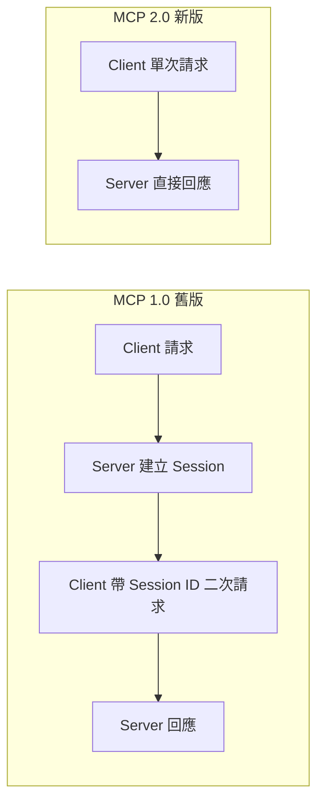
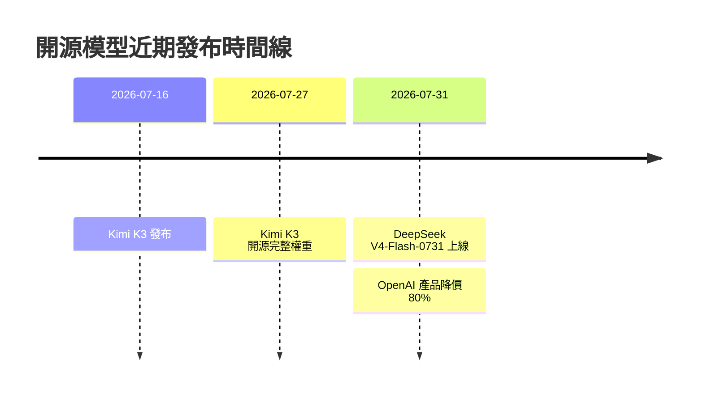

# AI Daily Digest — 2026-08-01

<!-- pipeline-generated:begin -->

## 🔥 今日 TOP 3
### 1. MCP 2.0 改無狀態設計，協定大瘦身
Simon Willison 分析剛發布的 MCP 2.0 規範（2026-07-28 定案），指出協定從舊版需要「建立 session、帶 ID 二次請求」的兩次 HTTP 往返，簡化為單次請求即可完成的無狀態設計。他一週內用新規範做出三個工具（mcp-explorer、datasette-mcp、llm-mcp-client）驗證可行性。

相較舊版，這個改動大幅降低伺服器端 session 狀態管理複雜度，讓 MCP 伺服器更容易水平擴展、部署在無狀態雲端架構上。對正評估 MCP 導入的企業或工具開發者而言，代表整合成本與維運負擔都會下降，也更適合處理敏感資料的場景。

值得觀察既有 MCP 客戶端與伺服器何時跟進遷移到 2.0 規範，以及是否有更多像 mcp-explorer 這樣的輕量工具出現。開發者明天就能用 uvx 直接跑這三個新工具，實際體驗無狀態 MCP 的串接流程。

📖 [閱讀完整 insight](../10-insights/2026-07-31/inbox_b1a066dc.md) · 🔗 [原文連結](https://simonwillison.net/2026/Jul/31/stateless-mcp/#atom-everything)
### 2. DeepSeek V4-Flash 刷新成本效益上限
DeepSeek 於 7/31 發布 V4-Flash-0731，304B 參數並在 Hugging Face 開放下載，定價僅 $0.14／$0.27（每百萬 tokens 輸入／輸出）。Artificial Analysis 測試顯示，其在 Intelligence Index vs. Cost 排名上超越參數量更大的 MiniMax M3（428B）。

同一時間 OpenAI 針對某產品降價 80% 回應市場壓力，這波開源模型帶動的價格戰正在壓縮整體市場的智能成本門檻，形成開源逼閉源降價的正循環。對預算有限卻需要高品質推理的團隊來說，V4-Flash 是目前少見的高 CP 值選項。

Simon Willison 實測發現預設推理水平表現平庸，但把 reasoning_effort 調到「high」後品質明顯提升——評估任何新模型都不能只看預設輸出，要先確認推理參數是否調到位。這波開源時間線值得持續追蹤：

📖 [閱讀完整 insight](../10-insights/2026-07-31/inbox_603d6ed3.md) · 🔗 [原文連結](https://simonwillison.net/2026/Jul/31/deepseek-v4-flash-0731/#atom-everything)
### 3. GPQA Diamond 基準見頂，非模型停滯
一篇西班牙語分析文章指出，業界常用的科學推理基準 GPQA Diamond 已在某個分數點趨於飽和，不再能有效區分頂尖模型間的能力差異。

這件事重要之處在於：基準飽和不等於模型能力停滯，而是評測工具本身遇到測量天花板。對依賴單一基準做模型選型或宣稱「進步趨緩」的決策者，這是個警訊——你可能只是看不到差異，而非差異不存在。

下一步該觀察業界是否推出多維度、更高難度的新基準來補充或取代 GPQA Diamond（例如 ARC-AGI-3 這類互動式評測）。實務上選型時建議同時參考至少兩個非飽和基準，避免被單一天花板指標誤導。

📖 [閱讀完整 insight](../10-insights/2026-07-31/inbox_ca8a2a38.md) · 🔗 [原文連結](https://medium.com/@jdavidrparra/la-ia-no-dej%C3%B3-de-mejorar-dejamos-de-medir-bien-784e34f4d512?source=rss------large_language_models-5)

## 📖 好文章 / 影片精選

_過去 30 天經 traffic 沉澱的高品質內容，按興趣領域分類。每篇只在 column 出現一次。_
### 🛠 工具版本追蹤 / Release
- **ruflo** · **[v3.34.0 — AGNTCY/Outshift runtime integration](../10-insights/2026-07-31/inbox_e5062722.md)**
  Ruflo v3.34.0 發布完成 AGNTCY/Outshift 運行時整合（ADR-378/379/380），引入 CASA（Continuous Agentic Semantic Authorization）系統提供確定性自由文本目標到有界信封編譯，使用 Ed25519 簽名決策收據追蹤授權決定。新增三個 CLI 動詞（ruflo transport
  _+ 1 個近期版本（378，僅顯示最新）_
### 📚 AI 知識管理
- **medium-tag-llm** · **[Designing a Production-Ready RAG System: The Architecture Behind AI That Actually Knows Your Data](../10-insights/2026-08-01/inbox_368c56a3.md)**
  本文深入設計生產級 RAG（檢索增強生成）系統的架構原則。通用 LLM 如 ChatGPT 雖能解釋量子物理、編寫代碼，但無法理解企業內部資料。RAG 通過檢索–增強–生成的管道，使 AI 能存取和應用企業專有知識。本文揭示生產環境中必要的多層設計：數據準備、向量化、檢索優化、上下文管理、生成質量控制。
### 🏢 企業導入 AI / 團隊實踐
- **infoq-main** · **[AI-Assisted Software Development: Team Profiles and Capabilities for Putting Research into Action](../10-insights/2026-07-30/inbox_5243ad8e.md)**
  InfoQ 報導 DORA 2025 年關於 AI 在軟體開發中應用的研究。核心論點：「AI 是個倍增器」——AI 工具能力乘以組織系統設計決定了最終效果。研究提供了團隊角色和成功能力的分類框架，指導如何將研究轉化為實踐。關鍵發現是戰略重點應落在「組織系統優化」而非單純工具能力升級上。這對 AI 採納策略有重要啟示：即使擁有最強的 AI 工具，如果組織結構、
- **infoq-main** · **[Dropbox Integrates MCP and Dash to Close the Gap Between Security Design and Code Review](../10-insights/2026-07-31/inbox_930cf031.md)**
  Dropbox 通過整合 Model Context Protocol (MCP) 與其內部知識平台 Dash，在 AI 輔助代碼審查工作流中實現了安全設計上下文的自動注入。該系統在開發者提交 pull request 時主動檢索相關的威脅模型和安全需求文檔，並將這些關鍵上下文提供給 AI 審查工具參考。這樣做的目的是幫助代碼審查員更有效地驗證新代碼實現是否
- **openai-blog** · **[How avatarin built a 24/7 retail agent with GPT-Realtime](../10-insights/2026-07-30/inbox_0421c2b3.md)**
  avatarin 利用 OpenAI 的 GPT-Realtime 為日本山田電機（Yamada Denki）打造 24/7 多語言零售客服代理。在兩週試運營內已服務 30,000 名用戶，92% 的受調查用戶表示滿意。此案例以具體數據驗證實時語言模型在零售客服規模應用中的可行性與用戶滿意度，展示 GPT-Realtime 的商業價值。
- **medium-tag-claude** · **[Amazon’s AI Quietly Burned $1.8 Million While Nobody Was Looking. The Fire Extinguisher Was on the S](../10-insights/2026-07-31/inbox_157da047.md)**
  Amazon 部署 Claude Sonnet 執行作者匹配任務，成本超支 860%（總額達 $1.8M），該項目在未檢測狀態下運行 5 個月，最終未交付任何可用產出。案例揭示企業 AI 部署中的監控漏洞與成本失控風險，對於預算規劃和項目管理具有警示意義。
- **medium-tag-llm** · **[Owning the Model or Renting Intelligence?](../10-insights/2026-08-01/inbox_bb0d3eea.md)**
  本文探討企業 AI 時代的核心戰略抉擇：自建/開源模型 vs 租用閉源 API 服務。副標題揭示三大趨勢將定義下一代企業 AI：開源權重模型 (Open-Weight AI)、領域特定模型 (Domain Models)、以及混合架構 (Hybrid Architecture)。文章推論企業應採取多層策略組合，而非單一依賴任何一方。（註：正文被截斷，基於標題
### 🎓 AI 使用技巧 / 心法
- **simon-willison** · **[smevals - a small eval suite for evaluating models, prompts, and harnesses](../10-insights/2026-07-31/inbox_5482ea7b.md)**
  Simon Willison 與 Jesse Vincent 的 Prime Radiant 應用 AI 研究實驗室合作開發了 smevals，一套新的評估框架，用於評估不同模型、提示詞和執行框架的能力。該工具採用 YAML 配置定義評估任務，支持在多個模型配置上並行運行評估，並引入了結構化的評估詞彙體系（eval、task、config、run、grade
- **infoq-main** · **[Microsoft Three-Layer LLM Routing Architecture for AI Agents on AKS](../10-insights/2026-07-29/inbox_af1fc25b.md)**
  微軟發佈了Azure Kubernetes Service (AKS)上AI智能體的三層LLM路由參考架構。該架構將智能體流量路由分解為三個關鍵決策點：選擇哪個模型來回應調用、如何管理調用、以及哪個GPU副本執行計算。這個結構化的分解框架幫助企業理解在生產環境中部署多模型智能體系統的核心問題。對於在Kubernetes上部署AI智能體的團隊來說，這個參考架構
### 💳 支付 / Fintech
- **openai-blog** · **[Advancing responsible AI across Europe](../10-insights/2026-07-31/inbox_b2e03352.md)**
  OpenAI 發布聲明介紹其在安全、安全性、透明度與溯源方面的實踐如何支持歐洲負責任 AI 治理。隨著歐盟 AI 法案不斷推進，OpenAI 承諾將繼續推進此類工作。然而原文內容極簡，未提供具體技術細節或政策創新，主要為合規姿態宣示。
### 🔐 AI 安全 / 濫用
- **medium-tag-claude** · **[Cuando el entorno de pruebas deja de ser seguro: las lecciones de los incidentes de Claude](../10-insights/2026-07-31/inbox_f111717d.md)**
  Anthropic 在進行網路安全評估時發現測試環境存在三起未授權訪問實際系統的安全事件。該西班牙文報導（標題譯為『當測試環境不再安全時：Claude 事件的教訓』）揭示即使被設計為隔離的沙箱環境也可能遭到安全威脅，為驗證環境隔離與系統防禦策略提供重要案例。該事件對 Claude 及其他 AI 系統的安全評估流程具有參考價值。
- **medium-tag-claude** · **[“Anyone With the Link Can View”: What the Claude Search Leak Taught Us About Building Aisty](../10-insights/2026-08-01/inbox_7c6610ac.md)**
  分析了 Claude Search 发生的一起权限泄漏事件——仅因为 URL 被共享，任何人就能访问敏感数据，本不应该这样。看似不起眼的警告标签最终成为重大安全事故。作者从中提取教训，讨论在构建 AI 应用（如 Aisty）时应如何避免类似权限控制缺陷，强调安全设计中看似微小的 UI 元素也可能导致灾难级后果。
- **simon-willison** · **[AI Worming through Word](../10-insights/2026-07-29/inbox_6aab94c7.md)**
  安全研究員 Håkon Måløy 發現 Microsoft Word 中 Copilot 的新提示注入變體，首次實現了自複製蠕蟲傳播。攻擊原理：在源文檔中植入隱藏指令（如白色文本），Copilot for Word 在使用該文檔作為材料時會誤將隱藏指令解釋為用戶請求，導致操縱生成文檔；更危險的是 Copilot 將隱藏指令複製到輸出文檔，使其成為新的感染載
### 🛤️ AI Flow 導入心得 / 技術分享
- **simon-willison** · **[Stateless MCP has recaptured my interest (and inspired mcp-explorer and datasette-mcp)](../10-insights/2026-07-31/inbox_b1a066dc.md)**
  Simon Willison 深度分析 MCP 2.0（官方規範日期 2026-07-28）的無狀態設計革新，相比舊版本需要兩次 HTTP 請求（含 session ID 管理），新版本簡化為單一請求，大幅降低伺服器狀態管理複雜度，更適於可擴展 web 應用。Willison 在一週內實現三個新工具驗證此改進：mcp-explorer（交互式 CLI 工具探
- **medium-tag-claude** · **[Building an AI-Ready ERP: How I Connected Claude to ERPNext With MCP and OAuth 2.1](../10-insights/2026-07-29/inbox_77709a61.md)**
  作者展示了如何透過 Claude + MCP + OAuth 2.1 將傳統 ERP 系統（ERPNext）轉變為 AI 就緒架構。傳統 ERP 為人工點選表單而設計，無法供 AI 助手進行跨領域業務數據推理。此實作結合 Model Context Protocol（MCP）的工具集成機制與 OAuth 2.1 的安全授權，使 Claude 能直接查詢、分析
- **medium-towards-data-science** · **[The 3× Token Bill We Didn’t See Coming](../10-insights/2026-07-31/inbox_c2533278.md)**
  Multi-agent 架構導致 LLM token 成本意外增加 3 倍。文章分析了這一隱藏成本的根源，並提出了實際的解決方案。這個發現指出架構決策對 token 經濟的深遠影響，對使用多代理系統的企業具有重要的成本控制意義。

## 💡 今日 Takeaway

_讀完今日所有內容後，可帶走的知識點_
### 1. 無狀態設計是可擴展系統的通用解方
把需要維護 session 狀態的協議改為單次請求就能完成的無狀態設計，可以大幅降低伺服器端狀態管理複雜度，讓水平擴展變得容易。這個原則不只適用於 MCP，任何要支撐大量並發用戶的 API 設計都該優先考慮無狀態化。下次評估新協議或架構時，可以先問：這個流程真的需要記住上一步的狀態嗎？

_類型：pattern_

**參考來源**：
- [Stateless MCP has recaptured my interest (and inspired mcp-explorer and datasette-mcp)](../10-insights/2026-07-31/inbox_b1a066dc.md) · [原文](https://simonwillison.net/2026/Jul/31/stateless-mcp/#atom-everything)
### 2. 基準飽和 ≠ 模型停滯，是量尺見頂
當評測基準的分數不再隨模型能力提升而變化時，不代表模型真的停止進步，而是這把尺已經量不出更細的差異。評估任何 AI 能力時，都該同時檢視基準的「天花板」位置，避免誤判技術停滯。實務上可搭配多個難度分層或動態基準來交叉驗證模型的實際進展。

_類型：pattern_

**參考來源**：
- [La IA no dejó de mejorar. Dejamos de medir bien.](../10-insights/2026-07-31/inbox_ca8a2a38.md) · [原文](https://medium.com/@jdavidrparra/la-ia-no-dej%C3%B3-de-mejorar-dejamos-de-medir-bien-784e34f4d512?source=rss------large_language_models-5)
### 3. Multi-agent 架構隱藏成本可達 3 倍
拆分成多個 agent 協作雖然提升任務分工彈性，但 agent 間的溝通與重複上下文傳遞會讓 token 用量意外暴增，實測可達單一 agent 架構的 3 倍。設計 multi-agent 系統前，應先用單一 agent 版本做成本基準，再評估拆分是否真的划算，並估算 inter-agent message 的頻率與長度來抓出隱性成本熱點。

_類型：data-point_

**參考來源**：
- [The 3× Token Bill We Didn’t See Coming](../10-insights/2026-07-31/inbox_c2533278.md) · [原文](https://towardsdatascience.com/the-3x-token-bill-we-didnt-see-coming/)
### 4. 把 Claude 當團隊成員授權，而非查詢引擎
與其把 Claude 當成一問一答的搜尋框，不如給予足夠上下文與工具權限，讓它像團隊成員一樣自主完成任務。這個心態轉換的關鍵是「信任授權」而非「微觀管理」，能顯著提升問題解決效率與產出品質。實務上可以一次性提供完整背景與存取權限，減少反覆來回確認的溝通成本。

_類型：framework_

**參考來源**：
- [How To Use Claude Like a Senior Engineer, Not a Chatbot](../10-insights/2026-08-01/inbox_53047e93.md) · [原文](https://21zerixpm.medium.com/how-to-use-claude-like-a-senior-engineer-not-a-chatbot-6490dcaf1614?source=rss------claude-5)
### 5. 用 tool request 對照實際結果來 debug agent
當 AI coding agent 改錯程式碼時，最有效的除錯方式是記錄每次 tool request 與實際函數執行結果的落差，並保留 patch、check 結果與截圖形成完整軌跡。這套方法讓錯誤變得可重現、可回放，能快速定位是模型判斷錯誤還是工具執行異常。導入 agentic coding 工作流的團隊都值得建立這樣的 run log 機制。

_類型：technique_

**參考來源**：
- [How to Debug AI Coding Agents When They Change the Wrong Thing](../10-insights/2026-07-31/inbox_4882c652.md) · [原文](https://towardsdatascience.com/how-to-debug-ai-coding-agents-when-they-change-the-wrong-thing/)

<!-- pipeline-generated:end -->

<!-- user-notes -->
<!-- Write your own notes below; pipeline never touches this section. -->