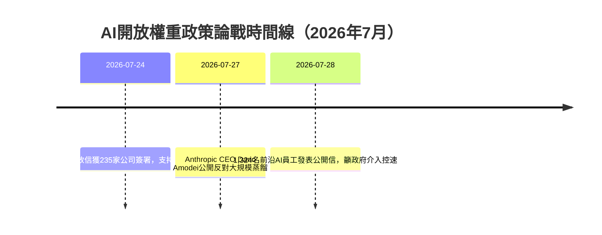

# AI Daily Digest — 2026-08-03

<!-- pipeline-generated:begin -->

## 🔥 今日 TOP 3
### 1. 開放權重論戰：235家公司對上前沿AI員工聯署
Microsoft主導的開放信於7月24日獲235家公司（含NVIDIA、Amazon、OpenAI）簽署，主張開放權重模型與蒸餾技術不應被政府禁止；三天後Anthropic CEO Dario Amodei公開反對大規模蒸餾，7月28日1,324名前沿AI公司員工（含OpenAI與Anthropic高層）再發公開信，籲政府介入控制自動化AI研發加速的速度。

此為AI產業首次出現「開放陣營」與「安全陣營」如此大規模且對立的公開表態，反映Claude Code已生成Anthropic 80%程式碼、OpenAI Sol降低20%成本等自動化加速現象，讓「AI研發AI」的失控風險從理論討論變成政策攻防核心。

值得觀察美國政府後續是否對蒸餾或開放權重立法，以及三方陣營如何在未來數月形成具體監管草案；企業決策者應留意這將如何影響開放模型授權條款與蒸餾服務的合規風險。

📖 [閱讀完整 insight](../10-insights/2026-08-02/inbox_8a6819e5.md) · 🔗 [原文連結](https://simonwillison.net/2026/Aug/2/open-letters/#atom-everything)
### 2. AI工程成本可砍90%：模型路由實測
Product Compass於8月2日發布實測研究，針對10個前沿LLM模型進行14次完整測試、涵蓋105個隱藏軟體缺陷偵測場景，發現透過模型routing與設置優化，可將AI工程月費從$200降至$20。

最反直覺的發現是成本僅$1.80的執行方案效果優於花費$104的方案——便宜58倍卻表現更好，直接推翻「模型越貴越強」的產業慣性假設，對正評估Claude、GPT、Gemini等模型組合的工程團隊有立即的預算影響。

建議工程團隊檢視現有模型選型是否仍以「最強模型」為預設，改以任務難度分層設計routing策略；也可用此研究的105個bug測試場景作為自家系統基準測試的起點。

📖 [閱讀完整 insight](../10-insights/2026-08-02/inbox_358df708.md) · 🔗 [原文連結](https://www.productcompass.pm/p/ai-coding-bill-20-a-month)
### 3. claude-mem新增「敏感資訊」告警分類
claude-mem v13.13.0新增第九種觀察類型「sensitive」，專門標記內部URL、未發布計畫、客戶名稱等敏感資訊洩露風險，並可透過環境變數CLAUDE_MEM_TELEGRAM_TRIGGER_TYPES客製化通知觸發條件；同版本也修正了自四月起讓security_alert/security_note誤報偏低的提示語bug。

此更新對所有在生產環境用AI agent處理內部資料的團隊有直接意義——過去「安全性洩露」與「敏感資訊洩露」被混為一談，容易造成告警疲勞或漏報，現在分層設計讓團隊能依風險等級決定該即時通知還是事後審查。

使用claude-mem的團隊應檢查CLAUDE_MEM_TELEGRAM_TRIGGER_TYPES設定是否已含sensitive類型（舊預設會自動遷移為「security_alert,sensitive」），並藉此機會盤點內部有哪些「不該外流但稱不上資安事件」的資訊類別。

📖 [閱讀完整 insight](../10-insights/2026-08-02/inbox_7af95836.md) · 🔗 [原文連結](https://github.com/thedotmack/claude-mem/releases/tag/v13.13.0)

## 📈 本週 GitHub 飆升 Top 10

_GitHub 本週新增 star 最多的專案_

### 1. [bojieli/ai-agent-book](https://github.com/bojieli/ai-agent-book)
⭐ +9,298 this week · 🧬 Python

這是李博杰撰寫的《深入理解 AI Agent：設計原理與工程實踐》開源倉庫，內容包含完整書稿、編譯好的 PDF，以及每章對應的實作程式碼。本週爆紅可能是因為系統性介紹 AI Agent 設計與工程落地的中文教材本來就不多，這種免費開放又涵蓋理論與實作的完整書籍剛好補上缺口。適合想系統學習 AI Agent 架構與實作的中文讀者，尤其是工程師與正在轉型做 Agent 開發的團隊。
### 2. [block/buzz](https://github.com/block/buzz)
⭐ +8,217 this week · 🧬 Rust

這是 Block 開源的一個「群體智慧」通訊平台，用 Rust 開發，看描述像是設計來讓多個節點或 agent 之間協同溝通、共享資訊的基礎設施。本週會受到關注，可能與近期多 agent 協作、agent 間通訊機制討論度高有關，加上有知名公司背書，容易吸引開發者留意。適合正在打造多 agent 系統、需要節點間通訊機制的團隊參考或評估採用。
### 3. [diegosouzapw/OmniRoute](https://github.com/diegosouzapw/OmniRoute)
⭐ +7,141 this week · 🧬 TypeScript

這是一個免費、MIT 授權的 AI Gateway，用同一個 API endpoint 就能串接 290 多家供應商、500 多種模型（包含 Claude、GPT、Gemini、DeepSeek 等），還支援 Claude Code、Cursor、Copilot 等常見 AI 編碼工具，並提供配額感知自動切換與壓縮技術來省 token。本週爆紅很可能是因為它一次解決了多模型切換、多家 API Key 管理、token 成本這幾個開發者常見痛點，加上號稱有大量貢獻者，社群動能本來就不小。適合需要同時串接多家 LLM、想降低整合成本與 token 花費的工程團隊或個人開發者。
### 4. [microsoft/AI-For-Beginners](https://github.com/microsoft/AI-For-Beginners)
⭐ +5,601 this week · 🧬 Jupyter Notebook

這是微軟推出的免費 AI 入門教材，以 12 週、24 堂課的架構，透過 Jupyter Notebook 帶初學者循序漸進學習 AI 基礎知識。本週會衝上熱門榜，可能是因為微軟的品牌信任度加上完全免費、結構化的學習路徑，正好切中不少人想入門 AI 卻不知從何學起的需求。適合完全沒有 AI 背景、想從零開始有系統學習的初學者或轉職者。
### 5. [ayghri/i-have-adhd](https://github.com/ayghri/i-have-adhd)
⭐ +5,225 this week · 🧬 Python

這是一個給 coding agent 使用的 skill，目的是讓 AI 回答問題時直接講重點，而不是把結論埋在一大串冗長分析或步驟裡，走「ADHD 友善」的精簡輸出風格。本週爆紅可能是因為戳中不少人使用 AI coding agent 時的共同痛點——輸出太囉唆、找不到重點，加上名字幽默貼切，容易引起共鳴。適合任何覺得 AI agent 回答太冗長、希望得到更直接明確結果的開發者。
### 6. [virgiliojr94/book-to-skill](https://github.com/virgiliojr94/book-to-skill)
⭐ +5,223 this week · 🧬 Python

這個工具能把任何技術書籍的 PDF 轉成 Claude Code 的 skill，讓你在寫程式時可以直接呼叫書中的知識當參考資料，等於把一本書變成 AI 隨時能查閱的技能庫。本週爆紅可能跟 Claude Code skill 生態系近期討論度高有關，這類「把既有知識轉成 agent 可用資源」的工具正好符合開發者想快速客製化 AI 助理的需求。適合想把公司內部文件、技術書籍或參考手冊整合進 Claude Code 工作流程的工程師。
### 7. [permissionlesstech/bitchat](https://github.com/permissionlesstech/bitchat)
⭐ +4,942 this week · 🧬 Swift

這是一款透過藍牙網狀網路（mesh）通訊的聊天工具，不需要網路或伺服器，走類似早期 IRC 的簡單風格，用 Swift 開發、看起來鎖定 Apple 平台。本週爆紅的具體原因不太確定，但這類去中心化、不依賴網路基礎設施的通訊方式，一直對重視隱私或需要在無網路環境下通訊的族群有吸引力。適合對去中心化通訊、隱私保護有興趣的開發者與使用者，或想在活動現場、戶外等無網路場合做區域通訊的人。
### 8. [alibaba/open-code-review](https://github.com/alibaba/open-code-review)
⭐ +4,365 this week · 🧬 Go

這是阿里巴巴開源的程式碼審查工具，採用「規則式 pipeline」加「LLM Agent」的混合架構，能針對特定行給出精準評論，內建多語言規則集（如 NPE、執行緒安全、XSS、SQL injection 等常見問題），並相容 OpenAI 與 Anthropic 的模型。本週爆紅可能是因為它號稱在阿里內部大規模場景中驗證過，加上免費開源、AI code review 本身也是近期熱門主題，讓不少團隊想拿來試用。適合想導入自動化程式碼審查、又不想完全只靠純 LLM 判斷（怕誤判太多）的工程團隊。
### 9. [1jehuang/jcode](https://github.com/1jehuang/jcode)
⭐ +3,620 this week · 🧬 Rust

這是一個標榜「最省 RAM」的 agent harness（執行框架），用 Rust 開發，訴求是在跑 coding agent 時降低記憶體開銷。本週受到關注，可能是因為現有的 agent harness 常被抱怨資源消耗大，這種強調效能與資源效率的替代方案容易吸引想在資源有限環境（如筆電、CI）跑 agent 的開發者。適合在意系統資源、想在輕量環境或大量並行任務中執行 agent 的工程師。
### 10. [citrolabs/ego-lite](https://github.com/citrolabs/ego-lite)
⭐ +3,582 this week · 🧬 JavaScript

這是一款專為 AI agent 瀏覽器自動化設計的瀏覽器，主打速度快，而且能讓 Codex、Claude Code 這類 agent 共用你已登入的瀏覽器狀態（例如帳號 session），不需要重新登入，也不會打斷你原本使用中的瀏覽器，號稱零成本、零設定。本週爆紅可能是因為 agent 瀏覽器自動化最大的痛點一直是登入狀態與 session 管理麻煩，這個工具直接處理了這個摩擦點，對正在用 AI agent 操作網頁的人很有吸引力。適合需要讓 AI agent 執行網頁操作（如自動填表、測試、資料收集）又想沿用既有登入狀態的開發者。

## 📖 好文章 / 影片精選

_過去 30 天經 traffic 沉澱的高品質內容，按興趣領域分類。每篇只在 column 出現一次。_
### 🛠 工具版本追蹤 / Release
- **claude-mem** · **[v13.13.0](../10-insights/2026-08-02/inbox_7af95836.md)**
  claude-mem v13.13.0 發布，引入第九種觀察類型「sensitive」用於標記內部資訊洩露風險（內部 URL、未發布計畫、個人細節、商業指標、客戶名稱等）。新類型預設觸發 Telegram 通知，通過環境變數 CLAUDE_MEM_TELEGRAM_TRIGGER_TYPES 設定。本版本同時修正四月以來觀察器提示語中的過時描述，該描述導致 
### 📚 AI 知識管理
- **medium-tag-llm** · **[RAG From First Principles to Enterprise Scale](../10-insights/2026-08-02/inbox_c1cf0b83.md)**
  無法產出摘要 — 文章全文未提供
### 🏢 企業導入 AI / 團隊實踐
- **infoq-ai-ml** · **[Presentation: Fine Tuning the Enterprise: Reinforcement Learning in Practice](../10-insights/2026-07-03/inbox_9e11a207.md)**
  OpenAI 推出 Agent RFT 平台，用於通過實時工具交互和自定義獎勵信號對推理模型進行微調。該平台利用強化學習在上下文窗口內解決複雜的信用分配問題，有效消除長尾 token 迴圈，顯著提升推理效率。演講分享了企業應用成功案例，展示該方法如何驅動極致效率的達成。
- **simon-willison** · **[Quoting Greg Brockman](../10-insights/2026-08-01/inbox_6b964782.md)**
  OpenAI 總裁暨共同創辦人 Greg Brockman 分享在 OpenAI 內部觀察：許多員工將 ChatGPT 連接到 Slack，但發現同事們實際上不喜歡被 AI 自動聯繫，即使他們樂意幫忙。這反映出人們更看重直接的人際關係與相互幫助，期望 AI 應該節省時間、增強共處體驗，而非淪為人與人之間的隔閡層。此觀察深刻揭示了 AI 倫理與企業部署中常被忽
### 🎓 AI 使用技巧 / 心法
- **substack-product-compass** · **[How to Cut Your AI Bill From $200 to $20 a Month](../10-insights/2026-08-02/inbox_358df708.md)**
  Product Compass 發表實測成本優化研究文章，時間為 2026 年 8 月 2 日。文章標題《如何將 AI 工程月度成本從 $200 降至 $20》明確指出成本下降目標（下降 90%）。研究基礎為對 10 個前沿 LLM 模型的 14 次完整運行測試，涵蓋 105 個隱藏軟件缺陷的檢測場景。核心發現打破業界常見假設：成本最低的 $1.80 運行方
- **medium-towards-data-science** · **[How to Debug AI Coding Agents When They Change the Wrong Thing](../10-insights/2026-07-31/inbox_4882c652.md)**
  提供 AI coding agents 的系統化 debug 教程。涵蓋記錄 tool requests、對比實際函數結果、保存 patches 和 checks、截圖記錄、以及完整 run logs。該方法論針對代理執行錯誤的程式碼修改，提供了可重現和可驗證的診斷流程。
- **medium-tag-llm** · **[Token Maxxing Is Dead. Long Live Token Minning.](../10-insights/2026-07-17/inbox_a19d4018.md)**
  大語言模型社群目前的主流做法是擴展上文長度（Context Window），試圖透過更多的輸入 token 來提升模型效能，這被稱為「Token Maxxing」。本文提出反駁，主張「Token Minning」才是正確的優化方向，核心觀點是訊號密度優於上文容量。作者引入物理學原理，闡述連貫性（Coherence）受基礎物理規律制約，因此不會無限隨著上文窗口
- **medium-towards-data-science** · **[How Much Does a Local LLM Actually Cost to Run? I Measured Every Watt on Apple Silicon](../10-insights/2026-07-28/inbox_365504c7.md)**
  該文章實測在 Apple Silicon 上運行五個本地 LLM 模型的真實功耗成本，電價設定為 $0.31/kWh（基於美國平均水準）。透過完整的牆面電力測量，提供了各模型持續生成時的精確成本數據，並指出結果與 RTX-3090 的預測方向一致但幅度更大。這項實測對於考慮在邊緣設備或本地部署 LLM 的開發者和企業具有直接參考價值，能夠精確估算運營成本，並
### 🛤️ AI Flow 導入心得 / 技術分享
- **medium-tag-claude** · **[Your AI Agent Shouldn’t Grade Its Own Homework](../10-insights/2026-08-02/inbox_bdda671c.md)**
  Polymetis Research 發布了 team-mode，一套多代理工程工作流程，已開放為 Claude Code 開源插件供開發者使用。Team-mode 直接解決了 AI 代理自我評分（self-grading）的可靠性問題，通過引入外部驗證機制替代自評，確保多代理協作的輸出品質。該工作流已在 Polymetis 自有生產項目中實戰驗證，證明了其

## 💡 今日 Takeaway

_讀完今日所有內容後，可帶走的知識點_
### 1. 便宜模型不等於效果差
實測顯示成本$1.80的模型組合效果優於$104的方案，成本低58倍卻表現更佳；決策時應以「任務難度 × 模型能力」設計routing策略，而非預設選用最貴或最新旗艦模型。

_類型：data-point_

**參考來源**：
- [How to Cut Your AI Bill From $200 to $20 a Month](../10-insights/2026-08-02/inbox_358df708.md) · [原文](https://www.productcompass.pm/p/ai-coding-bill-20-a-month)
### 2. MCP失效時用CLI備援保住任務
為agent系統設計「強制檢查主要介面＋範圍受限的CLI備援」雙層架構，可在MCP等主要協議層故障時仍完成操作；此降級策略是分散式/agent系統韌性設計的通用模式，值得套用在任何依賴單一協議層的工具鏈。

_類型：pattern_

**參考來源**：
- [rc/797e4ef8f6d426478b8af305369007ce1541265d: fix(ai-context): document CLI graph fallbacks (#2803)](../10-insights/2026-08-02/inbox_53b89563.md) · [原文](https://github.com/abhigyanpatwari/GitNexus/releases/tag/rc%2F797e4ef8f6d426478b8af305369007ce1541265d)
### 3. 吞吐量不是單一數字
評估AI系統效能時，吞吐量、延遲、基準測試結果會因硬體、網路與應用場景大幅波動，單看一個指標容易誤判實際表現；建議benchmark報告至少同時揭露延遲分布與跨場景數據，而非只給平均吞吐量。

_類型：framework_

**參考來源**：
- [I Thought Throughput Was Just One Number. Vision AI Taught Me Otherwise.](../10-insights/2026-08-02/inbox_4822426b.md) · [原文](https://medium.com/womenintechnology/i-thought-throughput-was-just-one-number-vision-ai-taught-me-otherwise-debbfccdea08?source=rss------large_language_models-5)
### 4. HTTP 200不代表真的成功
外部API即使回傳200狀態碼，仍可能發生內容解析失敗的「偽成功」；對這類部分失敗場景加上自動重試與寬容處理，能大幅降低外部服務不穩定造成的連鎖故障，此技巧適用於任何依賴第三方API解析結果的系統。

_類型：technique_

**參考來源**：
- [rc/561f913a32b9cd515f76756c447beb5c721bd424](../10-insights/2026-08-02/inbox_a8bae3e8.md) · [原文](https://github.com/abhigyanpatwari/GitNexus/releases/tag/rc%2F561f913a32b9cd515f76756c447beb5c721bd424)
### 5. 非決定性排序會拖垮快取效率
若系統輸出順序不固定，即使內容相同也會被快取判定為「新結果」，造成重複計算與快取失效；對需要可重現性的自動化/agent系統，應在資料層強制確定性排序，這是提升系統穩定與節省算力的低成本高回報做法。

_類型：technique_

**參考來源**：
- [rc/990d79ba8c606b7f4df7671ab0df65f5d169e2b8](../10-insights/2026-08-02/inbox_90b81076.md) · [原文](https://github.com/abhigyanpatwari/GitNexus/releases/tag/rc%2F990d79ba8c606b7f4df7671ab0df65f5d169e2b8)

<!-- pipeline-generated:end -->

<!-- user-notes -->
<!-- Write your own notes below; pipeline never touches this section. -->