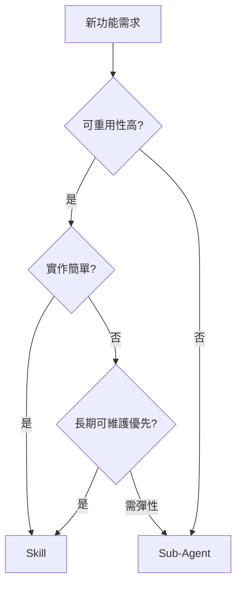

# AI Daily Digest — 2026-08-04

<!-- pipeline-generated:begin -->

## 🔥 今日 TOP 3
### 1. 微軟公布代理架構決策框架
Microsoft Azure 架構主管 Kishorekumar Pattabiraman 發布官方指南，提出以可重用性、簡單性、長期可維護性三個維度，判斷 AI 系統功能該做成 Skill 還是 Sub-Agent，並基於 Azure 生產環境經驗驗證。

這填補了業界長期缺乏標準化判準的空白——過去團隊多半憑直覺決定架構，導致代理系統臃腫難維護；此框架讓正在建構混合式代理系統的工程團隊，能用一致邏輯做決策，尤其適合企業規模的複雜系統。

下一步可觀察其他雲端供應商是否跟進提出類似框架，也可實際檢視自己專案裡的功能，看看有多少「該是 Skill 卻做成 Sub-Agent」的過度工程案例，作為重構依據。

📖 [閱讀完整 insight](../10-insights/2026-08-03/inbox_08f1d3f4.md) · 🔗 [原文連結](https://www.infoq.com/news/2026/08/choosing-between-subagent-skills/?utm_campaign=infoq_content&utm_source=infoq&utm_medium=feed&utm_term=global)
### 2. 企業代理運算層架構成形
Arun Joseph 以 Deutsche Telekom 的 LMOS 為案例，指出企業要發揮 AI agent 價值需建立「Agentic Compute」平台層：統一工具/記憶體/審計/權限的核心抽象、短生命週期代理(ephemeral agents)，以及標準化的代理定義語言(ADL)。

這與單純聊天機器人不同，能解決企業長期存在的工具散亂與組織孤島問題；對正評估自建代理平台的高度組織化產業（電信、金融）特別關鍵，代表 agent 落地正從對話介面走向跨部門操作智能。

值得追蹤 ADL 是否會出現類似 Terraform 之於 IaC 的產業標準版本，以及是否有電信外的產業跟進短生命週期代理模式，這將是觀察企業代理架構成熟度的指標。

📖 [閱讀完整 insight](../10-insights/2026-08-03/inbox_3849db14.md) · 🔗 [原文連結](https://www.infoq.com/presentations/agentic-compute/?utm_campaign=infoq_content&utm_source=infoq&utm_medium=feed&utm_term=global)
### 3. TS 7.0 Go 編譯器提速 8-12 倍
Microsoft 發布 TypeScript 7.0，最大改動是把編譯器從 JavaScript 改寫為 Go 語言原生實作，實測大型商業程式碼庫的建置速度提升 8 到 12 倍；穩定的程式化 API 要等 7.1 才推出，7.0 使用者需先靠相容性包銜接既有工具鏈。

對維運大型 TypeScript 專案的團隊而言，這代表開發迴圈（build-test-iterate）時間大幅縮短，在 monorepo 或 CI 環境效益最明顯；這也是近年少見「把編譯器整個換語言重寫」換來數量級效能提升的案例，而非單純漸進優化。

若團隊維運大型 TS 專案，可先評估相容性包是否涵蓋現有工具鏈（lint、IDE 外掛等），並留意 7.1 程式化 API 穩定後對自訂建置工具整合的影響，再決定升級時程。

📖 [閱讀完整 insight](../10-insights/2026-08-03/inbox_b16ceb36.md) · 🔗 [原文連結](https://www.infoq.com/news/2026/08/typescript-7-released/?utm_campaign=infoq_content&utm_source=infoq&utm_medium=feed&utm_term=global)

## 📖 好文章 / 影片精選

_過去 30 天經 traffic 沉澱的高品質內容，按興趣領域分類。每篇只在 column 出現一次。_
### 🛠 工具版本追蹤 / Release
- **claude-code** · **[v2.1.221](../10-insights/2026-08-04/inbox_f1500c33.md)**
  Claude Code v2.1.221 釋出 40+ 項功能改進和修復，涵蓋 UI 增強、安全改進和效能最佳化。新增 Focus view（Ctrl+Alt+F 快捷鍵）隱藏工具活動摘要，支援在 Linux/WSL 上對沙箱憑證檔案進行遮蔽（mask 模式，讀取哨兵副本，代理替換真實值）。修復 Bash 工具權限檢查繞過、PowerShell 路徑引號問題
- **claude-mem** · **[v13.13.1](../10-insights/2026-08-03/inbox_86e37235.md)**
  claude-mem 發布 v13.13.1，新增 /mode-creator 互動工作流根據使用者領域與筆記需求自動生成客製模式。工作流指導捕捉類型與標籤設計，並提供特化建議；客製模式儲存於持久性使用者儲存空間，啟動時報告作用中模式配置。新版支援選用的標籤觸發 Telegram 通知機制，含引導式機器人配置與驗證流程。此補丁版本包含完整的模式編寫參考、Te
- **hermes-agent** · **[Hermes Agent v0.20.0 (2026.8.3)](../10-insights/2026-08-03/inbox_4a5cd795.md)**
  Hermes Agent v0.20.0「Herald Release」整合了 3,650 次提交、1,400 個合併 PR，關閉 1,200 個議題。核心創新涵蓋實時流式語音對話搭配中斷能力（barge-in）與忙碌感知靜默檢測，開放詞彙喚醒詞與跨平台語音支援（WhatsApp、Feishu、DingTalk、LINE、QQ 等）。代理間通訊協議 A2A 
### 📚 AI 知識管理
- **medium-towards-data-science** · **[Prompt, Context, Loop: The Three Engineering Layers Every RAG System Is Built On](../10-insights/2026-08-03/inbox_b2a17b1f.md)**
  文章提出了理解和建構檢索增強生成（RAG）系統的三層心智模型。三層分別是：提示詞層（LLM 呼叫本身）、上下文層（填充模型上下文窗口的內容）和循環層（何時觸發下一次呼叫以及何時停止迭代）。文章強調理解當前所在層級對於有效建構和除錯 RAG 系統至關重要。此框架幫助工程師將複雜 RAG 問題分解為可管理元件，便於故障排查和優化。掌握三層模型提升從業者在企業 R
- **medium-tag-llm** · **[Long Context Didn’t Kill RAG — It Just Hid the Retrieval Problem Inside the Model](../10-insights/2026-08-03/inbox_41311782.md)**
  核心論點：長文本視窗未消滅 RAG，只是將檢索問題從系統外移到模型內。文章暗示探討了此遷移的機制、測量和權衡，但完整內容未呈現。本質洞察：無論外部或內部檢索，模型都面臨「海量資料中找相關信息」的根本問題。
- **medium-tag-llm** · **[Your AI Agent Has a Bigger Warehouse. It Still Needs a Librarian.](../10-insights/2026-08-03/inbox_1701c1c1.md)**
  用倉庫與館員的隱喻：AI 智能體有更大的文本容量（更大倉庫），但仍需檢索和組織機制（館員）才能真正利用。長文本容量本身不等於檢索能力；系統仍需解決信息發現和優先級排序。隱喻質疑「長文本 = 萬靈丹」的假設。
- **latent-space** · **[Ontologies Are So Back: Why AI Agents Are Reviving the Semantic Web](../10-insights/2026-07-30/inbox_5fd2602f.md)**
  Latent Space 報導指出 AI 工程師正在重新發現本體論（Ontologies）作為制約機制。核心問題：機率型智能體（LLM 驅動）本質上是非確定性的，但生產系統需要確定性邊界和邏輯保證。解決方案是用結構化本體論定義知識圖譜和決策規則，將智能體的推理限制在預定義的邏輯框架內。這是古典語義網路思想（自 2000 年代中期式微）在當代代理系統中的復興，
### 🏢 企業導入 AI / 團隊實踐
- **infoq-main** · **[Presentation: Architecting AI Systems for the Messy Reality of Enterprises: Why Agentic Compute is the Missing Layer](../10-insights/2026-08-03/inbox_3849db14.md)**
  Arun Joseph 分析企業級代理平台架構，以 Deutsche Telekom 的 LMOS 為實例。核心洞見是「Agentic Compute」是被忽視的企業 AI 層次——簡單聊天機器人無法適應複雜的組織現實。企業需通過三個層面打破工具散亂和組織孤島：(1)核心平台抽象替代點對點工具集成，(2)短生命週期代理(ephemeral agents)實現
- **openai-blog** · **[Circles powers telco personalization with OpenAI technology](../10-insights/2026-08-03/inbox_06f3d9eb.md)**
  Circles 運用 OpenAI API 和 Codex 驅動電信業 AI 原生服務，實現顯著商業成效：年度經常性收入（ARPU）增加 22%，客戶流失率降低 9%，同時開發效率大幅提升。此案例展示大語言模型在電信客戶個人化領域的實際應用價值與投資報酬率，涵蓋營收成長、留存改善和工程生產力三大商業指標。
### 🎓 AI 使用技巧 / 心法
- **infoq-main** · **[Azure and Community Guidelines on Choosing Between a Skill or a Sub-Agent](../10-insights/2026-08-03/inbox_08f1d3f4.md)**
  微軟 Azure 架構主管 Kishorekumar Pattabiraman 發布官方指南，系統化闡述 AI 系統開發中 Skills 與 Sub-Agents 的選擇標準。指南提出三維決策框架：可重用性（系統功能是否需跨多場景複用）、簡單性（實現複雜度和認知負擔）、長期可維護性（隨業務演進的適應性）。該框架基於 Azure 生產環境經驗，為開發者提供結構
- **simon-willison** · **[Devtools must be open source (exe.dev)](../10-insights/2026-08-03/inbox_769649d5.md)**
  Simon Willison 評論指出大型語言模型根本改變了開源軟體檢查與修改的實務可行性。在 AI 出現前，研究陌生程式碼的門檻極高：需手動編譯、理解架構、投入數小時；開發者常因摩擦成本過高而放棄深入。如今 Willison 可直接提示 Claude 或 Codex「複製 X 並解釋 Y 如何運作」，編譯摩擦已縮減為「零時間投資挑戰」——AI 在十分鐘內完
### ⛓️ 區塊鏈 / Web3
- **infoq-main** · **[HashiCorp Ships Public Beta of Vault Kubernetes Key Management](../10-insights/2026-08-03/inbox_d7d171a3.md)**
  HashiCorp 推出 Vault Kubernetes 金鑰管理公開測試版。該外掛實現 KMS v2 相容性，允許 Kubernetes API server 將 etcd 資料的信封加密委派給 Vault Enterprise。最關鍵改進是將保護 etcd 的金鑰加密金鑰(KEK)從 Kubernetes 集群內移出，置入由 Vault 單獨治理的信任
### 🔐 AI 安全 / 濫用
- **medium-towards-data-science** · **[The AI Was the Easy Part: What Is a Forward-Deployed Engineer in a Supply Chain?](../10-insights/2026-08-03/inbox_130a26fb.md)**
  文章透過實際案例研究探討前置部署工程師（Forward-Deployed Engineer）在供應鏈中的角色與職責。前置部署工程師嵌入業務單位內部以實施 AI 解決方案，而非僅提供技術諮詢。文章標題「AI 是簡單的部分」強調供應鏈 AI 實施成功需要遠超純粹 ML 模型—它需要理解領域問題、組織結構與部署挑戰。組織和運營障礙往往成為 AI 項目主要瓶頸。此觀
- **substack-bytebytego** · **[LLM Security Basics: The Full Threat Model](../10-insights/2026-08-03/inbox_f8052f19.md)**
  ByteByteGo 發布文章探討 LLM 安全威脅模型全景，試圖系統性地列舉影響 LLM 系統的各類攻擊面。
### 🛤️ AI Flow 導入心得 / 技術分享
- **medium-tag-claude** · **[Hacking the CalBar with AI: A Claude Skill for Law Students, Lawyers, and Wannabes](../10-insights/2026-08-03/inbox_0a6d76ba.md)**
  文章分享如何使用 Claude skill 大幅加速加州律師執照考試（CalBar）準備。作者透過該 skill 將原本耗時四個月的考試準備縮短至一週半，實現了顯著的時間節省效果。該案例涉及 Ontario, CA 相關準備地點。Claude skill 在法律教育和專業認證領域的應用展示了 AI 對高難度、高風險考試準備的實務價值。文章提供了完整的配置指南

## 💡 今日 Takeaway

_讀完今日所有內容後，可帶走的知識點_
### 1. Skill vs Sub-Agent 三維判準
面對簡單、單一職責、可跨場景重複使用的功能（如 API 呼叫、資料擷取、記錄），優先設計成 Skill；面對複雜、多步驟且需跨領域決策的任務，才交給 Sub-Agent。判斷順序為可重用性 → 簡單性 → 長期可維護性，可套用在任何正在設計混合式代理系統的團隊。

_類型：framework_

**參考來源**：
- [Azure and Community Guidelines on Choosing Between a Skill or a Sub-Agent](../10-insights/2026-08-03/inbox_08f1d3f4.md) · [原文](https://www.infoq.com/news/2026/08/choosing-between-subagent-skills/?utm_campaign=infoq_content&utm_source=infoq&utm_medium=feed&utm_term=global)
### 2. 企業代理平台需三層抽象設計
企業級代理平台應建立核心抽象層統一工具、記憶體、審計與權限，而非逐一串接 SDK；短生命週期(ephemeral)代理比長駐程序更適合動態工作流，能降低狀態管理複雜度；並可用代理定義語言(ADL)像 IaC 一樣標準化代理行為，方便重用與稽核。此框架可套用在任何要跨部門自動化任務協調的場景。

_類型：framework_

**參考來源**：
- [Presentation: Architecting AI Systems for the Messy Reality of Enterprises: Why Agentic Compute is the Missing Layer](../10-insights/2026-08-03/inbox_3849db14.md) · [原文](https://www.infoq.com/presentations/agentic-compute/?utm_campaign=infoq_content&utm_source=infoq&utm_medium=feed&utm_term=global)
### 3. 長文本不能取代檢索與組織機制
無論是外部向量檢索還是模型內部的 attention 機制，本質上都要解決「在海量資料中找到相關資訊」的同一問題——把 RAG 拆解成 Prompt（呼叫本身）、Context（窗口內容）、Loop（何時再呼叫、何時停止）三層，能讓工程師精準定位除錯或優化的層級。倉庫變大不代表館員（組織與優先排序機制）就不需要了。

_類型：framework_

**參考來源**：
- [Prompt, Context, Loop: The Three Engineering Layers Every RAG System Is Built On](../10-insights/2026-08-03/inbox_b2a17b1f.md) · [原文](https://towardsdatascience.com/prompt-context-loop-the-three-engineering-layers-every-rag-system-is-built-on/)
- [Long Context Didn’t Kill RAG — It Just Hid the Retrieval Problem Inside the Model](../10-insights/2026-08-03/inbox_41311782.md) · [原文](https://medium.com/@wasowski.jarek/long-context-didnt-kill-rag-it-just-hid-the-retrieval-problem-inside-the-model-0abc9e6ca9c2?source=rss------large_language_models-5)
- [Your AI Agent Has a Bigger Warehouse. It Still Needs a Librarian.](../10-insights/2026-08-03/inbox_1701c1c1.md) · [原文](https://medium.com/@joshua-nwachinemere/your-ai-agent-has-a-bigger-warehouse-it-still-needs-a-librarian-36138f848226?source=rss------large_language_models-5)
### 4. AI 讓程式碼理解摩擦趨近於零
過去要真正檢查或修改陌生程式碼，得手動編譯、讀懂架構、投入數小時，門檻高到多數人選擇放棄；現在只要請 AI「複製並解釋這段邏輯」，十分鐘內就能完成同等工作。評估一個工具是否真的開放時，可以用「摩擦成本」而非授權條款作為新標準。

_類型：framework_

**參考來源**：
- [Devtools must be open source (exe.dev)](../10-insights/2026-08-03/inbox_769649d5.md) · [原文](https://simonwillison.net/2026/Aug/3/devtools-must-be-open-source-exedev/#atom-everything)
### 5. AI 輸出需經批判評估再引用
「肉類代理」(meat proxy) 指沒有思考、直接複製貼上 AI 輸出轉發給同事的行為，這種做法讓 AI 該帶來的效率提升變得毫無意義，甚至可能傳遞未經驗證的錯誤。正確流程是把 AI 輸出當初稿：閱讀、理解、驗證，再用自己的話重述——這個批判性評估過程才是專業價值的真正來源。

_類型：framework_

**參考來源**：
- [Don&#39;t be a meat proxy](../10-insights/2026-08-03/inbox_48727216.md) · [原文](https://simonwillison.net/2026/Aug/3/dont-be-a-meat-proxy/#atom-everything)

<!-- pipeline-generated:end -->

<!-- user-notes -->
<!-- Write your own notes below; pipeline never touches this section. -->