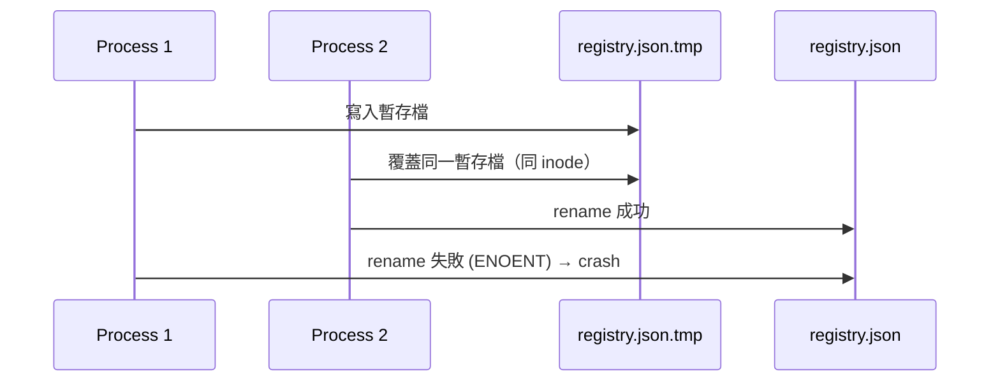
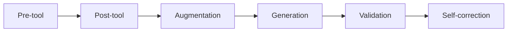

# AI Daily Digest — 2026-08-11

<!-- pipeline-generated:begin -->

## 🔥 今日 TOP 3
### 1. GitNexus 修復並發寫入崩潰漏洞
GitNexus 修復一個嚴重的並發 race condition：多個進程同時寫入同一個 registry 暫存檔案並互相覆蓋，導致部分進程崩潰、拖垮整個 MCP server。實測顯示 12 進程並發下曾有 4 個進程崩潰。

此類 bug 在讓多個 AI agent 同時存取共享狀態的基礎設施中極為常見，一個進程崩潰就可能讓整個服務不可用，影響所有依賴該 MCP server 的下游工具與使用者。

修復方案統一為 writeFileAtomic 函式：隨機暫存檔名、原子 rename、嚴格權限與失敗清理，將 24 進程並發下的崩潰率從 4/12 降至 0/12，是可直接複製到其他並發寫入場景的作法。

📖 [閱讀完整 insight](../10-insights/2026-08-10/inbox_a767e42f.md) · 🔗 [原文連結](https://github.com/abhigyanpatwari/GitNexus/releases/tag/rc%2F414c1a569307f93db1d43770b4c9df1e6e269eb2)
### 2. Claude Opus 5 上線，Prompt 仍是關鍵
Anthropic 發布旗艦模型 Claude Opus 5，官方宣稱相比前代降低 80% 的指示負擔以簡化使用。但實測顯示，要發揮最佳性能仍需精心設計的 prompt 策略，評測者因此整理出 8 個提示框架（blocks）。

這打破「模型越強、prompt 越不重要」的迷思——即便模型能力大幅提升，人機協作的複雜度並未同步下降，對重度依賴 API 的開發者與企業而言，換新模型不能取代 prompt engineering 投入。

建議實際導入 Opus 5 的團隊優先研究這 8 個提示框架的具體內容，並對既有 prompt 做 A/B 測試，而非假設新模型「開箱即用」就能維持輸出品質。

📖 [閱讀完整 insight](../10-insights/2026-08-10/inbox_20a99906.md) · 🔗 [原文連結](https://www.productcompass.pm/p/claude-opus-5-the-best-opus-yet-once)
### 3. 系統理解力應列為可度量架構指標
一篇架構文章主張，系統理解度（system comprehension）應被視為可度量的架構特性；AI 代碼生成氾濫正導致人類對系統理解力衰退，形成難以量化的「cognitive debt」。

隨著愈來愈多程式碼由 AI agent 生成，團隊對系統設計意圖的掌握度正被稀釋，威脅長期架構演進安全——沒人真正理解系統時，重大重構或除錯風險會急速上升，衝擊所有導入 AI coding agent 的團隊。

文章提供可行的 socio-technical 指標與設計檢查點，工程主管可據此在導入 AI 代碼生成工具的同時，建立「理解度」量測機制，而非只追蹤程式碼產出速度。

📖 [閱讀完整 insight](../10-insights/2026-08-10/inbox_da8767a2.md) · 🔗 [原文連結](https://www.infoq.com/articles/system-comprehension-evolutionary-architecture/?utm_campaign=infoq_content&utm_source=infoq&utm_medium=feed&utm_term=global)

## 📖 好文章 / 影片精選

_過去 30 天經 traffic 沉澱的高品質內容，按興趣領域分類。每篇只在 column 出現一次。_
### 📚 AI 知識管理
- **medium-tag-claude** · **[Part 2: RAG Is More Than Retrieval, Mapping the Engineering Layer Across Agent Frameworks](../10-insights/2026-08-10/inbox_fa00fbc2.md)**
  這是深度技術系列第二部分，詳細對比 OpenAI、Anthropic、LangChain 等主流 agent 框架中 RAG（檢索增強生成）的工程層實現。文章將 RAG 管道分解為六個邊界層次：pre-tool、post-tool、augmentation、generation、validation、self-correction，並說明各框架在這些層次中的
- **medium-towards-data-science** · **[Building an Agent-Ready Data Warehouse: What Traditional Architectures Do Wrong](../10-insights/2026-08-10/inbox_a00440d9.md)**
  傳統資料倉儲架構不天生適配 AI agent。關鍵挑戰不在於存取權限，而在於教導 agent 理解資料含義、判斷資料可靠性。真正的 agent-ready 架構需建立語義層、信任度評估機制與動態文件系統，使 agent 能辨別何時應信任資料、何時應拒用，進而提升決策品質。
### 🏢 企業導入 AI / 團隊實踐
- **medium-tag-llm** · **[You already trust this AI loop for your models. Now run it for your hiring.](../10-insights/2026-08-10/inbox_bcd60a9b.md)**
  本文從模型 eval harness（評估框架）的成熟實踐出發，提出將其方法論應用到招聘流程的觀點。核心洞察為：最優的招聘管道與 prompt 優化循環具有結構相似性——都是反覆測試、評分、迭代的過程。在指標確定後逐步改進結果。這個類比為 AI 時代的人力資源帶來新的組織範式。
- **infoq-main** · **[Beyond Consensus: The Fragmentation of AI Policy Across the Linux Ecosystem](../10-insights/2026-08-10/inbox_a86999b5.md)**
  Linux 生態中 AI 政策呈現高度異質性：GCC 採取限制主義、Linux kernel 採務實主義、Kubernetes 採開放揭露模式。從核心基礎設施到高層編排，各路徑反映不同組織規模與成熟度特性，但共同核心是確保人類維護者仍為代碼最終守護者。此分化凸顯 open source 社群對 AI 工具的分層且謹慎態度。
### 🎓 AI 使用技巧 / 心法
- **substack-product-compass** · **[Claude Opus 5: The Best Opus Yet, Once You Heal It](../10-insights/2026-08-10/inbox_20a99906.md)**
  Claude Opus 5 是 Anthropic 最新旗艦模型。官方聲稱相比前代移除了 80% 的指示負擔，以提升使用者體驗。然而根據評測，Opus 5 實際使用時仍需精心設計的 prompt 策略才能發揮最佳性能。評測者提出了 8 個具體的提示框架（blocks）來優化 Opus 5 表現。這暗示即使模型能力提升，有效的人機協作仍需微調和技巧。因此 pr
- **medium-tag-claude** · **[Examples Fix The Format And Break The Reasoning](../10-insights/2026-08-10/inbox_31ea3512.md)**
  文章深入探討在 prompt 中加入範例（in-context examples）的雙面效果。增加範例確實能快速修正輸出格式（正確標籤、預期長度等），但同時會削弱模型的推理能力與邏輯嚴謹性。作者指出這是經典的 trade-off：為了格式一致而犧牲推理深度。文章提示開發者在設計 prompt 時需明確權衡格式約束與推理質量之間的衝突，而非盲目追求格式完美。對
### ⛓️ 區塊鏈 / Web3
- **substack-likecoin** · **[Farewell to POAP’s Geek Ethos: The Sunset of Web3 Check-in](../10-insights/2026-08-10/inbox_df8ea91b.md)**
  不適用。POAP 是區塊鏈專案（Proof of Attendance Protocol），與 AI 產業新知無關。
### 🔐 AI 安全 / 濫用
- **medium-tag-llm** · **[Trajectory Aware Safety Engineering for Conversational AI: Designing for Risk Across Multi-Turn...](../10-insights/2026-08-10/inbox_67050e2d.md)**
  本文提出「軌跡感知安全工程」（Trajectory Aware Safety Engineering）框架，針對對話式 AI 系統的安全評估提出新的視角。傳統方法通常逐次評估每個回應的安全性，但這種單轉評估忽略了多轉對話中累積的風險與上下文依賴。作者論證在多轉對話中，早期無害的回應組合可能導致後續的不安全行為，因此需要設計一套評估系統考慮整個對話軌跡的風險演
- **openai-blog** · **[Expanding Daybreak as the Cyber Defense Window Narrows](../10-insights/2026-08-10/inbox_e94d3cbf.md)**
  OpenAI 推出 GPT-5.6-Cyber，一款為網路安全優化的專用模型，透過 Daybreak Red 平台向授權使用者提供，支持漏洞研究、利用代碼驗證與安全測試等受管控的網路安全工作。此模型擴展了 Daybreak 在網路防禦領域的應用，在網路防禦時窗縮短的背景下提升企業回應能力。
### 🛤️ AI Flow 導入心得 / 技術分享
- **substack-byte-sized-design** · **[Linear Skipped the Agent Frameworks and Wrote Their Own Harness](../10-insights/2026-08-10/inbox_621f69f9.md)**
  Linear 在構建 AI agent 功能時選擇了自建 harness，而非依賴現成 agent 框架。其設計哲學的核心在於三個理念。首先是淺層工具集（shallow tools）—— 保持工具輕簡而非大而全。其次是即時技能（just-in-time skills）—— 按需動態載入能力，避免預載所有功能。再次是可辯護的自建策略 —— 論證為何自建優於現成
- **infoq-main** · **[Pods as Workers, Not Agents: Rethinking the Deployment Unit for AI Agents on Kubernetes](../10-insights/2026-08-06/inbox_95d6da6b.md)**
  Kubernetes 部署 AI agents 的关键问题是是否应该一个 Pod 对应一个 agent。kagent 项目主张不应该——因为 agents 具有突发性、生命周期短、可生成子 agents、需等待人工审批的特性，一 Pod 一 agent 的模式过度浪费资源。Agent-substrate 通过引入控制平面，将逻辑 \"Actors\" 调度到
- **medium-tag-llm** · **[I Thought Context Was the Product. I Was Wrong.](../10-insights/2026-08-10/inbox_7bec4f43.md)**
  本文挑戰常見假設「更好的 context 就是產品價值」，指出 AI 工程的真正難點在於理解不同模型如何與 context 互動。在多模型並行調用的時代，這個觀點對產品設計和系統架構有重要啟示，強調應關注「模型 × context」的交互效果而非單純的 context 質量。

## 💡 今日 Takeaway

_讀完今日所有內容後，可帶走的知識點_
### 1. 原子寫入模式可解決並發 registry race condition
多進程同時對同一暫存路徑寫入再 rename 時，會因 inode 競爭產生 TOCTOU race condition，導致寫入失敗甚至服務崩潰。解法是為每次寫入產生隨機後綴的暫存檔名，搭配原子 rename、嚴格檔案權限（0o600）與失敗時清理，此模式可套用在任何「先寫暫存檔、再 rename 覆蓋」的並發場景。

_類型：technique_

**參考來源**：
- [rc/414c1a569307f93db1d43770b4c9df1e6e269eb2: fix(storage): give every registry write its own tmp path (#2888) (#2920)](../10-insights/2026-08-10/inbox_a767e42f.md) · [原文](https://github.com/abhigyanpatwari/GitNexus/releases/tag/rc%2F414c1a569307f93db1d43770b4c9df1e6e269eb2)
### 2. 範例雖修正格式，卻會削弱模型推理
在 prompt 中加入 in-context 範例能快速修正輸出格式（如標籤、長度），但範例數量增加時，模型的推理深度和邏輯嚴謹性會下降，這是格式一致性與推理品質的經典 trade-off。設計複雜邏輯任務的 prompt 時，應謹慎使用範例，必要時改用明確規則描述取代大量少樣本範例。

_類型：pattern_

**參考來源**：
- [Examples Fix The Format And Break The Reasoning](../10-insights/2026-08-10/inbox_31ea3512.md) · [原文](https://learn-ai-prompting.medium.com/examples-fix-the-format-and-break-the-reasoning-42f932a9e960?source=rss------claude-5)
### 3. Shallow tools + 即時技能優於預載式 agent 框架
與其為 agent 預先載入龐大的工具集和能力，不如保持工具集精簡（shallow tools），並讓技能依任務需求動態載入（just-in-time skills）。這種設計能降低 context 負擔、提升 agent 反應速度，也讓 harness 更容易針對特定產品需求客製化，而非硬套一體化框架。

_類型：framework_

**參考來源**：
- [Linear Skipped the Agent Frameworks and Wrote Their Own Harness](../10-insights/2026-08-10/inbox_621f69f9.md) · [原文](https://read.bytesizeddesign.com/p/linear-skipped-agent-frameworks-custom-harness)
### 4. RAG 應拆解為六層工程邊界，而非單一檢索動作
完整的 RAG pipeline 可拆分為 pre-tool、post-tool、augmentation、generation、validation、self-correction 六個邊界層次，不同框架（OpenAI、Anthropic、LangChain）在每層的實作策略各有差異。設計 RAG agent 時，應逐層檢視工具放置時機與驗證邏輯，而非只關注「檢索」這一個環節。

_類型：framework_

**參考來源**：
- [Part 2: RAG Is More Than Retrieval, Mapping the Engineering Layer Across Agent Frameworks](../10-insights/2026-08-10/inbox_fa00fbc2.md) · [原文](https://medium.com/@sanjay1909/part-2-rag-is-more-than-retrieval-mapping-the-engineering-layer-across-agent-frameworks-80cb75fbfc6e?source=rss------claude-5)
### 5. 多輪對話安全需評估整體軌跡，非單一回應
傳統安全評估逐次檢查單一回應是否無害，卻忽略了多輪對話中風險會累積、早期無害回應組合可能導向後續不安全行為。設計 conversational AI 系統時，應在架構階段就納入「軌跡感知」的風險評估機制，而非僅在事後逐輪把關。

_類型：framework_

**參考來源**：
- [Trajectory Aware Safety Engineering for Conversational AI: Designing for Risk Across Multi-Turn...](../10-insights/2026-08-10/inbox_67050e2d.md) · [原文](https://medium.com/@wallace.adam13/trajectory-aware-safety-engineering-for-conversational-ai-designing-for-risk-across-multi-turn-931c62de9dfa?source=rss------large_language_models-5)

<!-- pipeline-generated:end -->

<!-- user-notes -->
<!-- Write your own notes below; pipeline never touches this section. -->